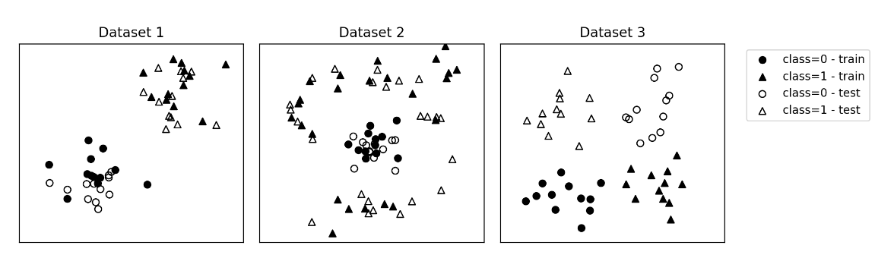

# Written questions : 

**Q1.** (MCQ) Considering logistic regression, select all of the correct statements below.
1. The cross-entropy loss is non convex with respect to the weight $\mathbf{w}$.
2. Logistic regression is generally more robust to outliers than linear regression for classification.
3. Logistic regression can be used to predict the value of someone's weight (in kilograms) based on their height (in meters).
4. For a binary classification problem, the value of $\sigma(\mathbf{x}^\top \mathbf{w})$, with $\sigma$ the sigmoid function, can be interpreted as the probability that $\mathbf{x}$ belongs to class $1$.

**A1.**

1. F
2. T
3. F
4. T

**Q2.** Considering gradient descent on the cross-entropy $E(\mathbf{w})$ for logistic regression:   
a) Recall what is the formula to update the value of $\mathbf{w}$ using the gradient $\nabla E(\mathbf{w})$ without looking above.   
b) Generally speaking, what is gradient descent used for?   
c) What is the impact of $\eta$, the learning rate (too small or too large)?

**A2.** 

w = w - learning rate * gradient 

find minimum of a function 

small

**Q3.** You have the following datasets with data points $\mathbf{x}\in\mathbb{R}^2$ and labels $y\in\{0,1\}$. The points of class $0$ are the circles, while points of class $1$ are the triangles. The filled points represent the train set while the empty ones are the test set.

For each dataset, how well do you expect logistic regression to perform on the test data? Why?

**A3.** 

Good ; same distribution ; linearly seperable 

Bad not linearly seperable

Maybe good maybe bad 

**Q4.** (MCQ) Recall that the cross-entropy loss, used for multi-class logistic   regression, is defined as:
$$\begin{align}
    E(\mathbf{W}) = -\sum_{i=1}^N \sum_{k=1}^C t^{(k)}_i \ln y^{(k)}(\mathbf{x}_i),
\end{align}$$

where $N$ is the number of samples, $C$ is the number of classes, $\mathbf{x}_i$ is a data sample, $\mathbf{t}_i$ is a label (one-hot encoded) and $y^{(k)}(\mathbf{x}_i)$ is the predicted probability of sample $\mathbf{x}_i$ belonging to class $k$.

Which of the following statements are true for the cross-entropy loss?

1. The prediction $y(\mathbf{x}_i)$ is found by applying the softmax function to the output of a linear model $\mathbf{W}\mathbf{x}_i$. T
2. It is not a differentiable loss function, therefore we cannot use gradient descent. F
3. Since it does not have a closed form solution, we have to use an iterative optimization method such as gradient descent. T
4. The loss is $0$ for samples where the label $t^{(k)}$ and the prediction $y^{(k)}$ are the same.f
5. If sample $i$ belongs to class $2$, the loss is higher when the prediction is $\mathbf{y}_i = \begin{bmatrix}0&0&0&0&1\end{bmatrix}$(predicted as class $4$) than when the prediction is $\begin{bmatrix}0&1&0&0&0\end{bmatrix}$ (predicted as class $1$).NO
6. $\sum_{k=1}^C y^{(k)}(\mathbf{x}_i)=1$ YEs 

**A4.** 

