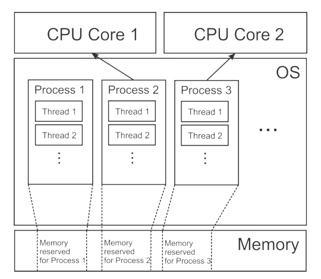
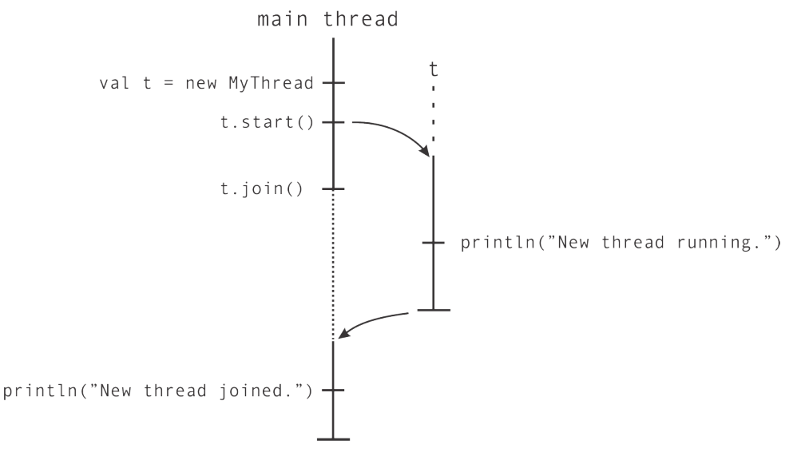
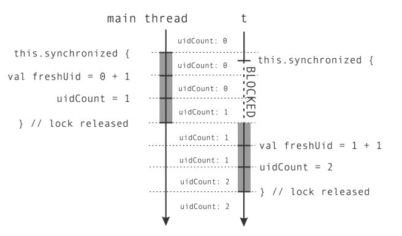
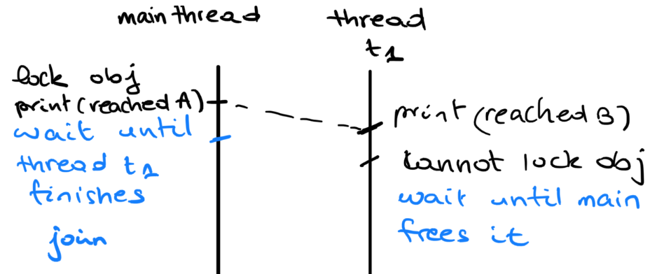

# Concurrency

[TOC]


**Concurrency : ** concurrent computing consists of process *lifetimes* overlapping, but execution need not happen at the same instant.( process 1 then process 2 then process 1 again ... )

## Week 5:



The OS schedules **threads** to run on **cores**.

 ```scala
def thread(b: => Unit) = {
    val t = new Thread {
    	override def run() = b
    }
    t.start()
    t
}
 ```

To start a thread on scala: 

1. inherit from `java.lang.Thread` and redefine the `run` method 
2. create an instance of the class 
3. run it using `.start`

The call `t.join()` lets the calling thread wait until thread `t` has terminated.

> Creating a thread is *expensive* in terms of resources. 

First example : 

```scala
val t = thread { println(s”New thread running”) }
t.join()
println(s”New thread joined”)
```



**Non-deterministic behavior : **

```scala
val t = thread {
println(”New thread running”)
}
println(”...”)
println(”...”)
t.join()  					
println(”New thread joined”)
```

Sometimes "New threadrunning , .... ,.... " is printed , other times "....,New threadrunning,...." is printed. 

Instructions are *interleaved* this makes a lot of valid sequential programs invalid with concurrency. 

Consider the following piece of code that returns a unique id. 

```scala
object ThreadsGetUID extends App {
    var uidCount = 0
    def getUniqueId() = {
        val freshUID = uidCount + 1
        uidCount = freshUID
        freshUID
	}
}					    
```

we test it *concurrently* with : 

```scala
// test it with : 
def printUniqueIds(n: Int): Unit = {
	val uids = for (i <- 0 until n) yield getUniqueId()
	println(s”Generated uids: $uids”)
}

val t = thread { printUniqueIds(5) } // one call on seperate thread 
printUniqueIds(5)					// one call on the main thread 
t.join()

//> ThreadsGetUID // first run of the code 
//[53:thread] Generated uids: Vector(2, 5, 7, 9, 10)
//[1:main] Generated uids: Vector(1, 3, 4, 6, 8)

//> ThreadsGetUID // second run of the code 
//[1:main] Generated uids: Vector(1, 2, 3, 4, 5)
//[55:thread] Generated uids: Vector(5, 6, 7, 8, 9) // 5 is repeated 
```

1. non-deterministic behavior 

2. Ids are not unique. 

   

### Synchronization and Atomic execution 

The problem above is that we use a shared variable `uidCount` that is *not synchronized* properly.

We want to the instructions of `getUniqueId` to be run sequentially without interleaving with another thread. That's what we call **atomic execution**. To do that : 

```scala
object GetUID:
	var uidCount = 0
    def getUniqueId() = synchronized {
        val freshUID = uidCount + 1
        uidCount = freshUID
        freshUID
	}
```

It means that only one thread can run the block inside `synchronized` at at time. 



Two possible syntax : 

* `synchronized{block}`

* `obj.synchronized{block}`  where `obj` is a an instance of `anyRef`
  * this one puts a lock on `obj` : any thread that wants to use it should wait until the thread that has the lock on it is done. 


#### Ledger example

```scala
object Ledger:
import scala.collection._

private val transfers = mutable.ArrayBuffer[String]()
    
def logTransfer(name: String, n: Int) = transfers.synchronized {
		transfers += s"transfer to account $name = $n"
}// notice that synchronized here is necessary 

def getlog = transfers

class Account(val name: String, var initialBalance: Int):
    private var myBalance = initialBalance
    private var uid = getUID
    def balance: Int = this.synchronized { myBalance } // synchronized here is optional 

    def add(n: Int): Unit = this.synchronized {
        myBalance += n
        // Log only if more than 10 CHF is transferred
        if n > 10 then logTransfer(name, n)
	}
```

#### Deadlock  

Let's make a function to transfer money 

```scala
def transfer(from: Account, to: Account, n: Int) =
    from.synchronized {
        to.synchronized {
            from.add(-n)
            to.add(n)
        }
	}
```

suppose we launch the following program : 

```scala
val jane = new Account("Jane", 1000)
val john = new Account("John", 2000)
log("started...")
val t1 = thread { for i <- 0 until 100 do transfer(jane, john, 1) }
val t2 = thread { for i <- 0 until 100 do transfer(john, jane, 1) }
```

1. `t1` locks `jane` and `t2` locks `john` 
2. `t1` tries to lock `john` but cannot because `t2` has it so it waits
3. `t2` tries to lock `jane` but cannot because `t1` has it so it waits 

**Solution : ** **One approach is to always acquire resources in the same order**

````scala
def transfer(from: Account, to: Account, n: Int) =
    def adjust() { to.add(n); from.add(-n) }
    if from.getUID < to.getUID then
    	from.synchronized { to.synchronized { adjust() } }
    else
    	to.synchronized { from.synchronized { adjust() } }
````

Another deadlock example : 

```scala
val obj = AnyRef
obj.synchronized {
    println("Reached A")
    thread {
        println("Reached B")
        obj.synchronized {
        	println("Reached C")
        }
    }.join
    println("Reached D")
}
```

This will not halt. 



```scala
// one solution 
val lock = AnyRef
lock.synchronized {
println("Reached A")
}
thread {
    println("Reached B")
    lock.synchronized {
    	println("Reached C")
    }
}.join
println("Reached D")
```

#### Consumer/Producer model 

When using a one place buffer. We distinguish two thread roles :

1. <u>consumers :</u> take element from buffer 

   if thread is empty consumers must wait 

2. <u>producers</u> : put elements in buffer 

   if thread is full producers have to wait 

3. at most one element can be in the buffer at any one time

```scala
def put(e: Elem) = synchronized {
    while bufferIsFull do {}
        putElementInTheBuffer(e)
        bufferIsFull = true
    }
def get(): Elem = synchronized {
    while !bufferIsFull do {}
        elem = getElementFromTheBuffer()
        bufferIsFull = false
        elem
    }
// DEAD LOCK SITUATION 
```

Solution: Hold the lock for a short duration and release it after checking the buffer is full (for producers) empty (for consumers). Repeat the operation without always holding the lock. 

```scala
// SOLUTION 
class TempObj[Elem]:
    var e:Elem = uninitialized
    class OnePlaceBuffer[Elem]:
    private var elem: Elem = uninitialized
    private var bufferIsFull: Boolean = false
    
	def put(e: Elem) =
        while !tryToPut(e) do {}
        def tryToPut(e: Elem): Boolean = this.synchronized {
        	if bufferIsFull then false
        	else { elem = e; bufferIsFull = true; true }
        }
    def get(): Elem =
        var temp = new TempObj[Elem]
        var bufferIsEmpty: Boolean = true
        while bufferIsEmpty do
            this.synchronized {
                if bufferIsFull then
                bufferIsFull = false; temp.e = elem; bufferIsEmpty = false
            }
        return temp.e

```

#### The classical example of the dining philosophers 

There are N philosphers sitting around a circular table eating spaghetti and discussing philosphy. The problem is that each philosopher needs 2 forks to eat, and there are only N forks, one between each 2 philosophers


```scala
def philosophersDining(n: Int) =
    val forks = new Array[Fork](n)
    val philosophers = new Array[Thread](n)
    val waiter = new Waiter
    for p <- 0 to n - 1 do
    	forks(p) = new Fork()
    for p <- 0 to n-1 do
    	philosophers(p) = thread{
    		while (!philosopherTurn(w, forks(p%n), forks((p+1)%n))) {}
    	}
    for p <- 0 to n - 1 do
	philosophers(p).join()

def philosopherTurn(w: Waiter, left: Fork, right: Fork): Boolean =
    Thread.sleep(100) // wait for some time
    w.synchronized {
        if !left.inUse && !right.inUse then
            left.inUse = true
            right.inUse = true
        }
        else
            false
    }
    Thread.sleep(1000) // eating
    w.synchronized {
        left.inUse = false
        right.inUse = false
    }
	
	true
```


## Future 

A `Future` is a more powerful version of `task` that we saw earlier in this course. 

An example use where we do something we used to do with `task`, `Await.result( , duration):` is the equivalent of `.join` for a `task`

```scala
val dur = Duration(100, MILLISECONDS)
val av = Future { a(x) }
val bv = Future { b(x) }
val res = f(Await.result(av, dur), Await.result(bv, dur))
```

### map on Futures  

`map` on future gives something to the `Future` to do after it completes 

```scala
def g(x:Int): Int = x + 10 
val af: Future[Int] = Future { Thread.sleep(800); 42 }
val resF: Future[Int] = af.map(g)
// NOTICE THAT THE RESULT OF MAP IS STILL A FUTURE 
```

What would we do if we have two futures `xf` and `yf` and want a future with their sum 

```scala
xf.map( x => yf.map(x+y) ) // this will give Future[Future[Int]]
xf.map( x => yf.map(x+y) ).flatten // so we use flatten 
```

 given that we have `flatten` and `map` , we can also have  `flatMap`

```scala
xf.map(g).flatten = xf.flatMap(g)
```

### The comeback of the for comprehension 

As we all know `flatMap + map => for comprenhension`

```scala
def fc(xf: Future[Int], yf: Future[Int]): Future[Int] =
    for x ← xf // x : Int 
    	y ← yf // y : Int 
    yield x + y   // Future[Int]
// instead of xf.flatMap((x: Int) ⇒ yf.map((y: Int) ⇒ x + y))
```

This is the way to go if we way to combine `Futures`

**OnComplete**

`Future`s have a `onComplete` method , that does something when the value is ready 

```scala
f.onComplete { t ⇒
    println("execution finished")
}
```

Its exact signature : `def onComplete[U](f: Try[T] ⇒ U): Unit` 

Notice that it takes a `Try[T]` instead of a type `T` (`Int` for example), that is because the computation of the future may fail. 

```scala
f.onComplete { t ⇒
	case Failure(e) ⇒ println("Failure ya hlili") // e is an Exception 
	case Success(res) ⇒ println(s"Execution finished. Result = $res"  ) 
}
```

The amazing for comprehension can also be used on `Try`

```scala
def increment( t : Try[Int] ) = 
	for 
		x <- t // if Success(x) then we have x otherwise the wholse for will 
	yield x + 1  // give Failure(e)
	
// equivalent to the uglier  
	t match 
		case Success(x) => x +  1
		case Failure(e) => Failure(e)
```

 **transform**

on `Try[T]` gives you a scenario to execute on `Success` and on `Failure`: 

```scala
def transform[U](handleSuccess: T ⇒ Try[U], handleFailure: Throwable ⇒ Try[U]): Try[U] = this match
    case Success(v) ⇒ handleSuccess(v)
    case Failure(e) ⇒ handleFailure(e)
```

summary of `Future` 

```scala
trait Future[+T]:
    def value: Option[Try[T]] // None if not completed yet; polling instead of Await
    def flatMap[S](f: T ⇒ Future[S]): Future[S] // monadic operation
    def map[S](f: T ⇒ S): Future[S]
    def transform[S](f: Try[T] ⇒ Try[S]): Future[S] // transform failures as well
    def zip[U](that: Future[U]): Future[(T, U)] // running ‘this‘ in parallel with ‘that‘
    
// intended to use with side−effecting operations:
    def foreach[U](f: T ⇒ U): Unit // map(f);() − result of f ignored
	def onComplete[U](f: Try[T] ⇒ U): Unit // transform with the result of f ignored
```

**Future Quizz**

Sequential or parallel 

```scala
for
    av ← Future(a)
	bv ← Future(b)
yield bv // sequential 

val af = Future(a)
val bf = Future(b)
val f = for
            av ← af
            bv ← bf
    	yield bv // parallel 

for
	(av,bv) ← Future(a) zip Future(b)
yield bv // parallel 
```


### Promises 

Promise is an object which can be completed with a value or failed with an exception.

It is like a `Future` but that does have a computation executing. At some point we will give our `Promise` a value ( or an exception) at that point it becomes a `Future`

```scala
def success(value: T): Promise.this.type // Completes the promise with a value.
// its Future will be Success(value)
def failure(cause: Throwable): Promise.this.type // Completes the promise with an exception. ( its Future will contain Failure(cause))

def complete(result: Try[T]): Promise.this.type
// Completes the promise with either an exception or a value.
```

 

## Memory Models 

### Sequential consistency  

>The results of any execution is the same as if the operations of all the processors were executed in some **sequential order**, and the operations of each individual processor appear in this sequence **in the order specified by its program**. 

SC = Program order (PO) + arbitrary interleaving

In this model reads and writes are atomic.

### Java Memory Model 

#### Intra Thread Consistency 

What happens to the operations in one single thread ? 

In the general case : 

```Scala
val t2 = thread {
	answer = 42	// (1)
	ready = true// (2)
}
```

​	Operation (2) can be executed before operation (1). 

If we are reading and writing to the same *field* (`foo` in the example below) 

```Scala
var foo = 0
SingleThreadedMethod(): Unit =
    foo = 1 // Write action          (1)
    assert(foo == 1) // Read action  (2)
```

Then program order will be maintained between (1) and (2). 

> *When we read from a field , in a single thread, all the writes that happened before to that same field will be observed.* 

Note : This does **not** mean that the field was updated in the main memory . 

> In a **single thread** program order is guaranteed ,  that means that "you always observe write that happened before where you are "

#### Inter Thread consistency  

```scala
class DataRace:
	var ready = false
	var answer = 0
    
    def DataRaceMethod(): Unit =
        val t1 = thread {
            while(!ready) do {}
			assert(answer == 42)
        }
        val t2 = thread {
            answer = 42
            ready = true
        }
```

Question: Is this a correctly synchronized program? NO. 

Two reasons : 

1. This program may never halt, `ready=true` may stay in the cache of thread 1 and not be pushed to main memory 
2. `answer = 42` and `ready=true` may be reordered and therefore the assert will crash the program. This means that the **java memory model does <u>not</u> guarantee ordering between threads** 

If now we make ready `volatile` : 

1. `ready = true` will be pushed to main memory 

2. when `ready=true` , `answer = 42` will also be pushed to main memory. 

   By the following principle : 

   > *When a thread writes to a volatile variable, all of its previous writes are guaranteed to be visible to another thread when that thread is reading the same value.*

**Synchronized: **

reads in synchronized blocks are also flushed to the main memory. 

 

## Actors 

Actors are object that communicate with each other *only* with messages. 

The most important method of an actor is the `receive` method. It returns a `PartialFunction[Any, Unit]`  that describes what an actor should do we he receives a message. A message can be of any type (so it takes type `Any`) 

```scala
type Receive = PartialFunction[Any, Unit]
trait Actor {
    def receive: Receive // 
    ...
}

// simplest actor possible 
class Counter extends Actor {
	var count = 0
	def receive = {
		case ”incr” => count += 1
	}// think of receive as a function that maps messages to corresponding 			behaviors 
}
```

Actors send each other messages using the following syntax ` destination ! message`. 

```scala
trait Actor {
implicit val self: ActorRef
def sender(): ActorRef
...
}
abstract class ActorRef {
	def !(msg: Any)(implicit sender: ActorRef = Actor.noSender): Unit
    // note that the sender is passed to this function but implicitly 
	def tell(msg: Any, sender: ActorRef) = this.!(msg)(sender)
}
```

**Context :**

an actor can change state its state by modifying its `receive` method using `context.become`

```scala
class someActor extends Actor {
    var value = 0 
    def send : Receive = {
    	case ("get",requester) => 
        	requester ! val 
        	context.become(wait)
    }
    
    def wait : Receive = {
        case "confirm" => 
        	context.become(send)
    }
	def receive = send
}
// there's also this somewhat confusing example 

class Counter extends Actor {
    def counter(n: Int): Receive = {
        case ”incr” => context.become(counter(n + 1))
        case ”get”  => sender() ! n
    }
    def receive = counter(0)
}
```


> Messages between two actors *in Akka* are **guaranteed** to be received in the order they were sent.
