# Data intensive systems

[TOC]


## SQL 

The main components of an SQL query are : 

* `FROM` Compute cross-product of tables (e.g., Students and Enrolled).
* `WHERE` Check for a condition. 
* `SELECT` Delete unwanted files. 
* `DISTINCT` Iliminate duplicates. 

Example 1: All students of age 18. 

```SQL
SELECT *
FROM Students S
Where S.age = 18 
```

An SQL table like the following is also called a *relation* :

 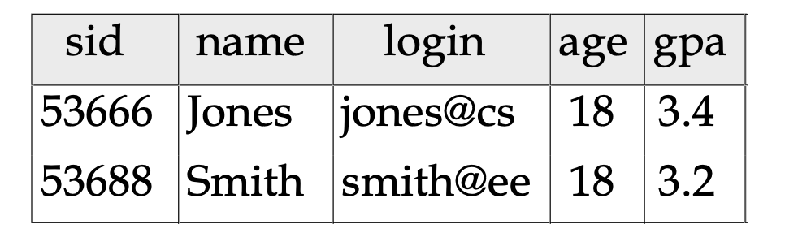

**Querying Multiple Relations:**

Name and course id of a student and a course where the student got a grade of "B" at this course. 

```sql
SELECT S.name, E.cid
FROM Students S, Enrolled E
WHERE S.sid=E.sid AND E.grade=‘B'
```

**Query evaluation**

1. First the cross product is computed : all combinations of a row from first table and a row from second table are computed. 
2. WHERE is applied ot filter. 

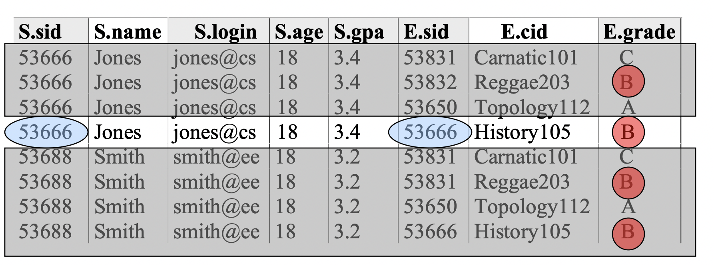

**Problem: **Average `age` of sailors whose `rating` is 10 

**Solution: Aggregate operators**

```sql
COUNT (*)
COUNT ( [DISTINCT] A)
SUM ( [DISTINCT] A) # add distinct to remove duplicates. 
AVG ( [DISTINCT] A)
MAX (A)
MIN (A)	
```

Example : 

```sql
SELECT AVG (S.age)
FROM Sailors S
WHERE S.rating=10
```

**Problem:**  Find the age of the youngest sailor for each rating level


**Solution: Group By**

```sql
SELECT MIN(S.age), S.rating
FROM Sailors S
GROUP BY S.rating
```

How is this query evaluated ? 

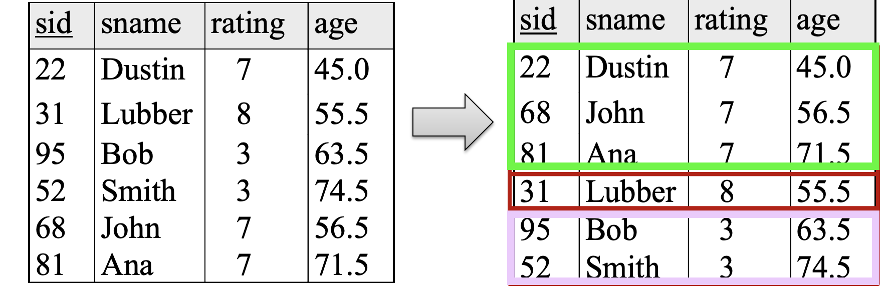

​                                                                                                  			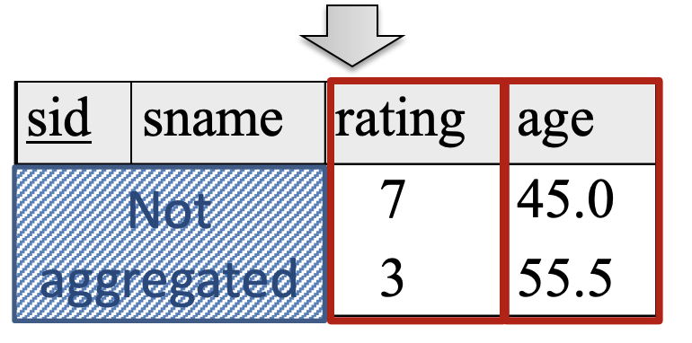

**Modifications**

Creating a table: 

```sql
CREATE TABLE Enrolled(sid CHAR(20),cid CHAR(20),grade CHAR(2)) 
```

Adding row:

```sql
INSERT INTO Students (sid, name, login, age, gpa)
VALUES (‘53688’, ‘Smith’, ‘smith@cs’, 18, 3.2)
```

Deleting rows: 

```sql
DELETE
FROM Students S
WHERE S.name = ‘Smith’
```

**Nested queries:** Names of sailors who have reserved boat #103. 

Using `IN` : 

```sql
SELECT S.sname
FROM Sailors S
WHERE S.sid IN (SELECT R.sid 
                FROM Reserves R
                WHERE R.bid=103)
```

We can do the same thing using `EXISTS` : 

```sql
SELECT S.sname
FROM Sailors S
WHERE EXISTS (SELECT *
 FROM Reserves R
 WHERE R.bid=103 AND S.sid=R.sid)
```

To find sailors who’ve not reserved #103 – `NOT IN` or `NOT EXISTS`. 

**Expressions**

We can do arithmetic in `SELECT` : 

```sql
SELECT S.age, S.age-5 AS age1, 2*S.age AS age2
FROM Sailors S
WHERE S.sname = ‘dustin’
```

Also possible in `WHERE` : 

```sql
SELECT S1.sname AS name1, S2.sname AS name2
FROM Sailors S1, Sailors S2
WHERE 2*S1.rating = S2.rating - 1
```

**Strings:** 

`%` stands for 0 or more arbitrary characters. `_` stands for any one character. So for example "one" satisfies `o_e`. 

```sql
SELECT S.age, age1=S.age-5, 2*S.age AS age2
FROM Sailors S
WHERE S.sname LIKE ‘B_%b’
```

**More operatiosn: **

* `UNION` : sailors who reserved red or green boat. 

* `INTERSECT`: sailors who reserved red **and** green boats. 
  More useful than `UNION`. 

  E.g: without `INTERSECT`:

  ```sql
  SELECT R1.sid
  FROM Boats B1, Reserves R1,
   Boats B2, Reserves R2
  WHERE R1.sid=R2.sid
   AND R1.bid=B1.bid
   AND R2.bid=B2.bid
   AND (B1.color=‘red’ AND B2.color=‘green’)
  ```

  With : 

  ```sql
  SELECT S.sid
  FROM Sailors S, Boats B,
  Reserves R
  WHERE S.sid=R.sid AND R.bid=B.bid AND B.color=‘red’
  
  INTERSECT
  
  SELECT S.sid FROM Sailors S, Boats B,
  Reserves R
  WHERE S.sid=R.sid AND R.bid=B.bid AND B.color=‘green’
  ```

* `EXCEPT`: Set difference. 

* `ANY` : Find sailors whose rating is greater than that of some sailor called Horatio. 

  ```sql
  SELECT *
  FROM Sailors S 
  WHERE S.rating > ANY (SELECT S2.rating 
                        FROM Sailors S2
                        WHERE S2.sname=‘Horatio’) 
  ```

  

 

## Week1 : ER model  

Database design layers

1. **Conceptual design:** High level description (often done with ER model)

   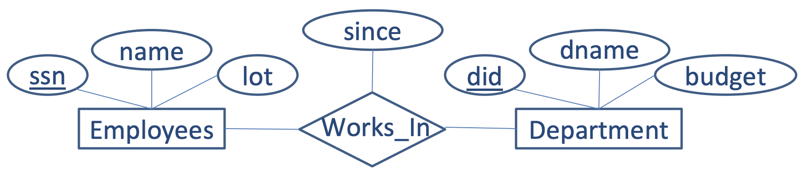 

2. **Logical design:** Translate ER into DBMS data model (like the relational model)

   relational data model = **Relation** (Table with rows and columns) + **Schema**: columns of a relation

   **Schema: **

   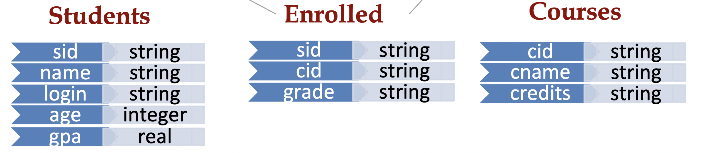

3. other layers to be seen later : Disk layout... 

**Entity-Relation(ER) model**

Entity: a subject like student, courses, employee... 

Relationship: Association among two or more entities. 

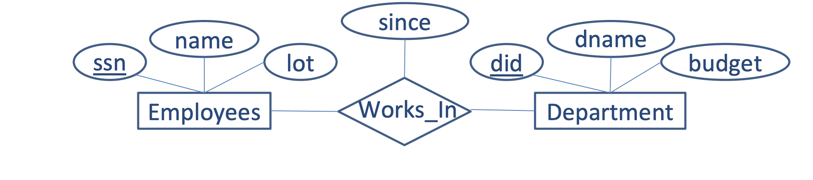


**Arrow or not arrow :** 

A --> B means that A has a relationship with at most a B. 

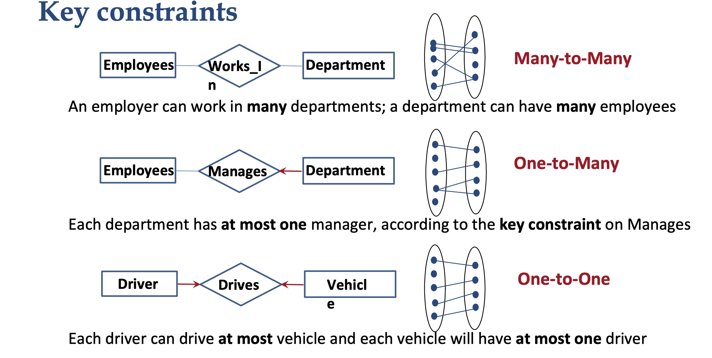

**Thick or not Thick :**

A **----** B (as opposed to A---B) means that A is in relation with at least a B. 

1. Total participation : each entity needs to participate in a relationship 

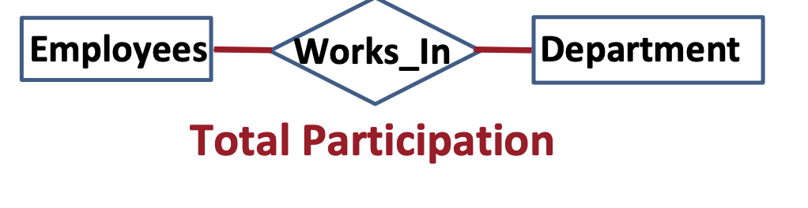

2. Each department has one employee. Each employee can manage at at most one department. 

   ​                                                                                 

3. Partial partitipation 

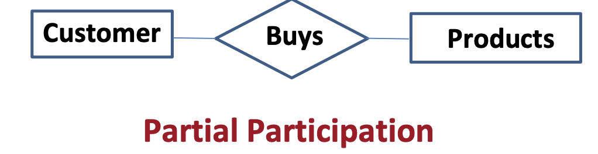

**Weak entities**

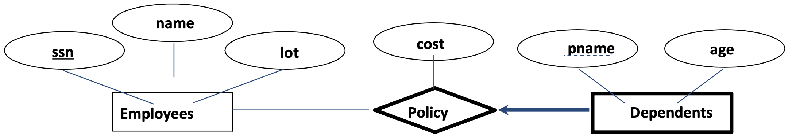


An entity whose existence depends on its relationship with another entity. 

An employee can or not have an insurance *policy* (relation) for a closed one (a *Dependent*). A dependent (in our model) only exists if there is an employee has has them if their policy. 

**ISA relation**

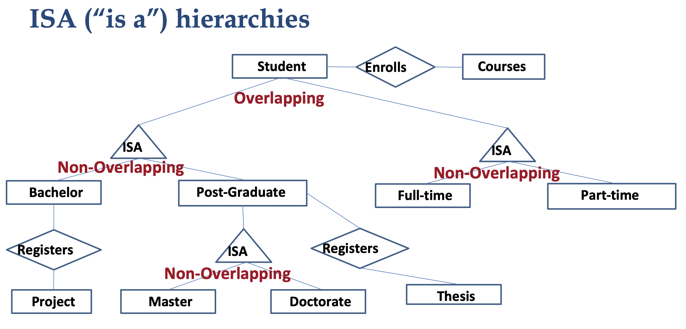

An isa relation can be **overlapping** or **non-overlapping**. 

## Week 2: Relational data model 

After completing our conceptual design using the ER model, we need to model the data so we can then store it and query it. Many data models exist: relational, object oriented data model, network data model... 

We focus on the **relational data** model for its simplicity. 

* **Relation(table):** set of named attributes(colums)

* **Tuple(row):**  a value for each attribute. 

* Each attribute has a type(domain). 

It is important to seperate two concepts, the schema(design) and the instance(actual content)

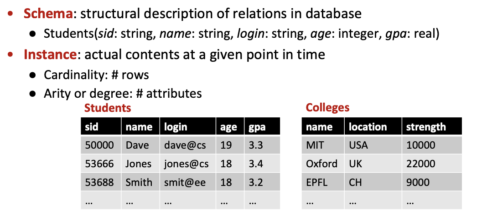

We can have special value for “unknown” or “undefined” : `NULL`. 

**Question: **If we query for GPA > 3. 3 and have NULL for some user. If not do we get it in GPA>=3.3 ? (We should get it in one for union consistency)

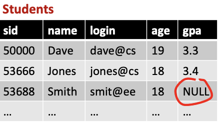

**SuperKey: **attribute unique to each tuple(row). It also can be a set of attributes that are unique. (e.g colleges below)

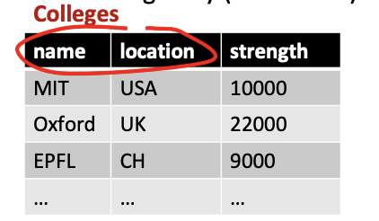

**Key: ** A superkey that is minimal. 

Suppose we chose name,location and strenght to be our superkey, it is indeed a superkey but not a key(not minimal). 

**Candidate key:** If there are multiple possible keys each of them is referred to as a candidate key. 

**Primary Key: **A key chosen by *us*. 

**Foreign keys: **Set of fields in one relation that is used to `refer’ to a tuple in another relation. 

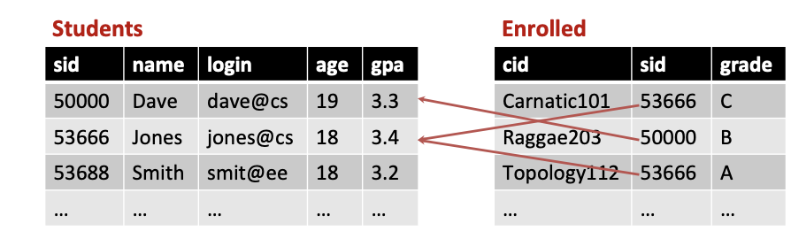

**Integrity constraints(IC):**

**Def** condition that must be true for any instance of the database; e.g., domain constraints 

*  ICs are specified when schema is defined 
*  ICs are checked when relations are modified

**⚠️ Careful about integrity constraints**

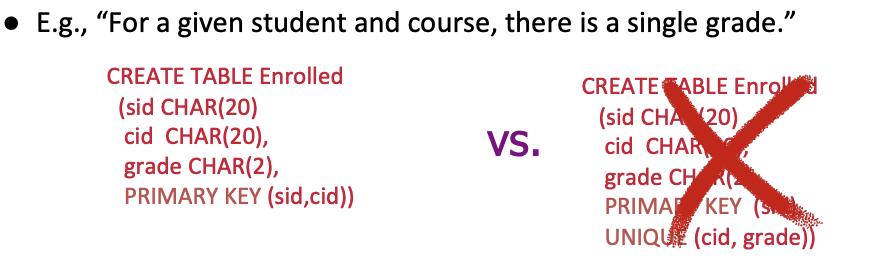

The right side code makes a student only able to have one course. 

### Relational algebra 

Five basic operations: 

* **Selection** ($\sigma$​): Selects a subset of rows from relation (horizontal).

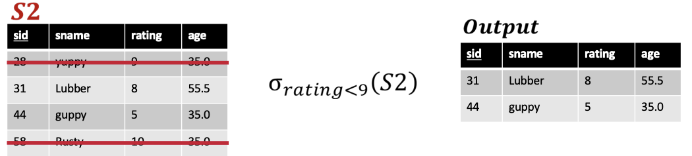

* **Project** ($\pi$​): Retains only wanted columns from relation (vertical). 

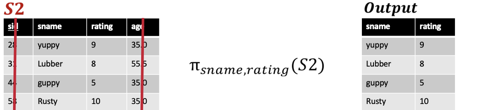

⚠️ Selection($\sigma$) choses rows.  SELECT in SQL is to select colums, it refers to  Project ($\pi$) in relational algebra. 

* **Set-difference** (–): Tuples in r1, but not in r2. 

* **Union**(∪): Tuples in r1 and/or in r2. 

* **Cross-product**(✕): Allows us to combine two relations. Each row of s1 with each row of s2. 

* **Rename**($\rho$​): Renames the list of attributes specified in the form of oldname → newname or position → newname. Renane is usefull to get a coherent cross product. 

  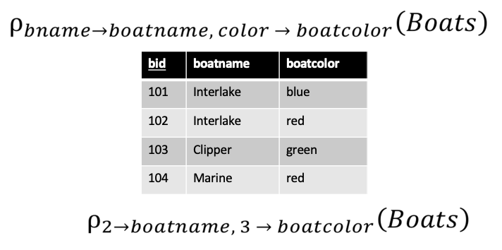

**Remark:**

These operations output sets: 

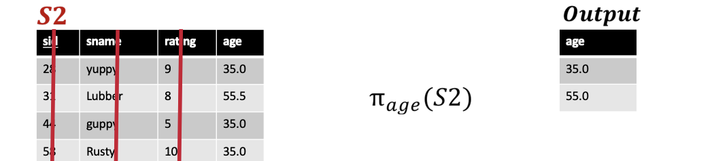

**Composition**

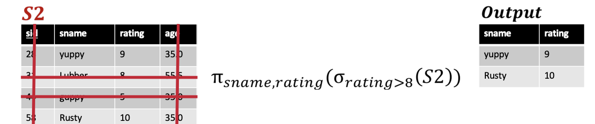

in SQL it would be `SELECT sname,rating FROM S2 WHERE rating > 8`. 

**More relations (compositions of basic relations): **

* (natural)**Join ⋈: **  compute RXS, select rows where attributes(usually key) have same values, project. $\pi (\sigma (R \times S))$ 

  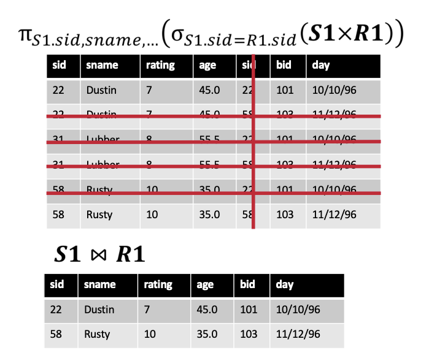

* **Condition join** $⋈_c$​​

  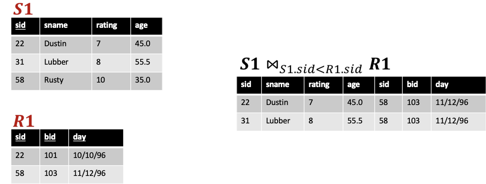

* **Division /: **Find all sailors who have reserved **all** boats. 
  A/B attributes of B are subset of attributes of A. A/B are the "entities" of a that are in a relationship with all elements of B. (this is not an accurate description). 
  E.g : a table A with attributes student_id, course_id and a table B containing courses. A/B would give the students who took all the courses. 
  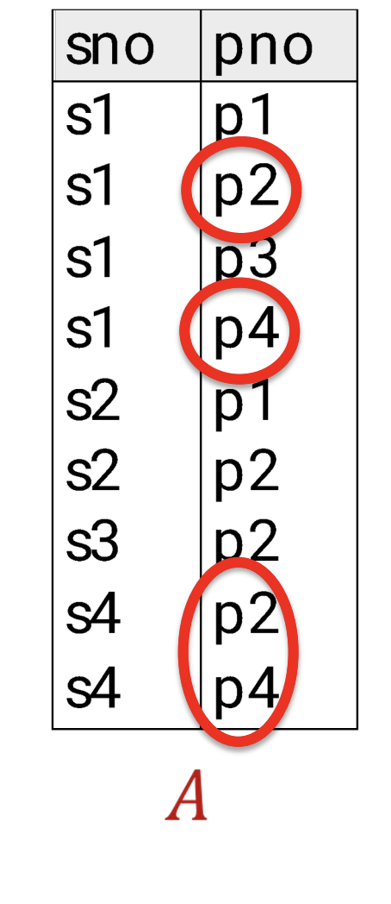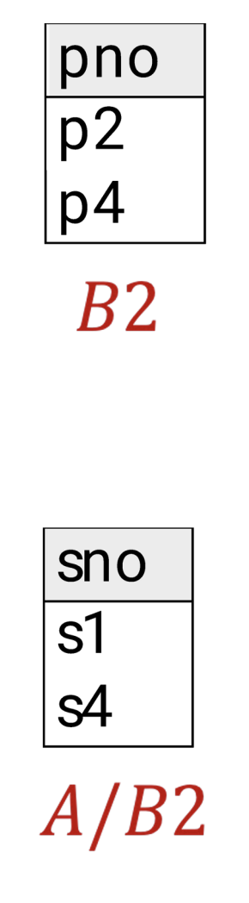

  

**Remark:** Equivalent formulas can express the same output and some are more efficient. (e.g second one below)

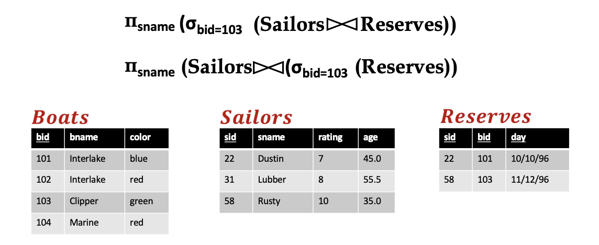

 
