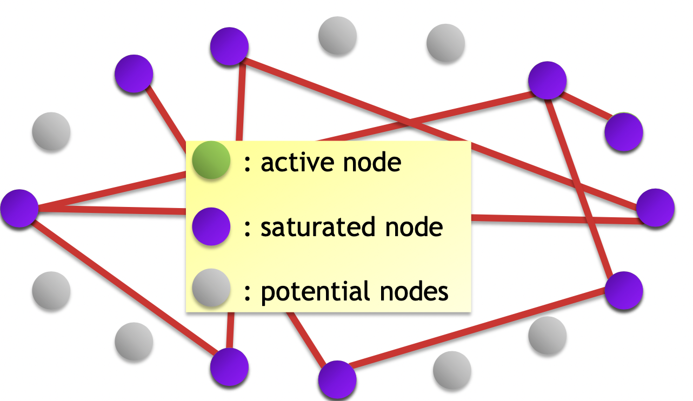
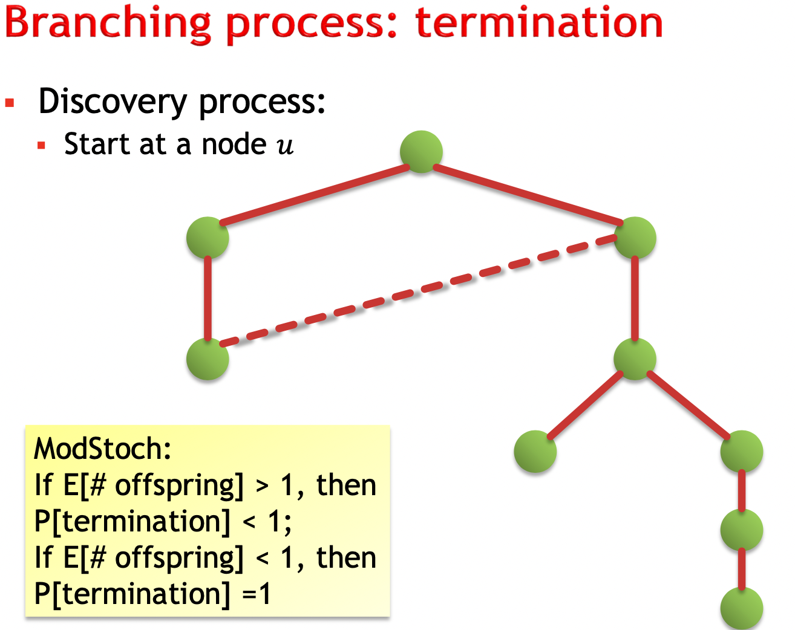
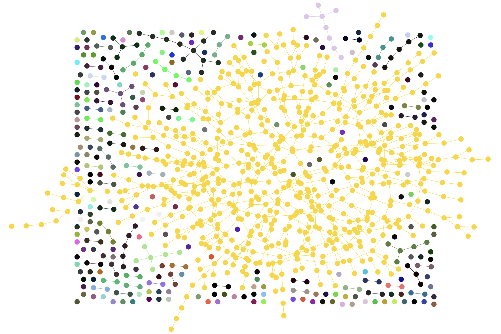
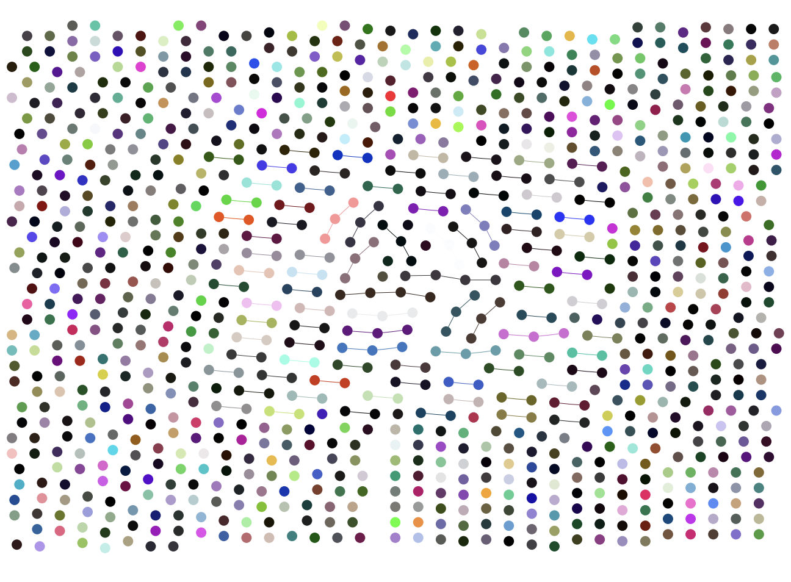
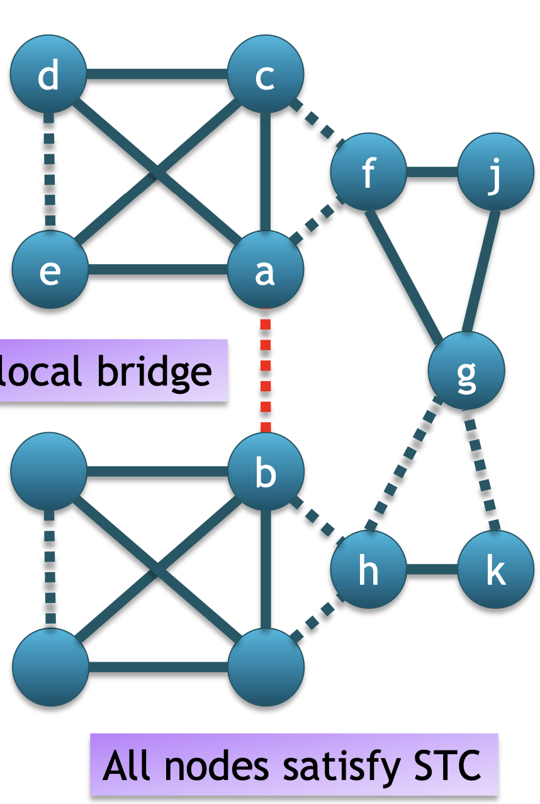

# Internet Analytics 

[TOC]

## Prerequisites 

**Almost sure convergence**

**Def** A sequence of random variables $X_n$ converges to a random variable $X$ *almost surely* if 

 $\mathbb{P}\left(\lim_{n\to\infty}X_n=X\right)=1$ , We denote it as : $X_n\xrightarrow{\mathrm{a.s.}}X$ . 

 If we see a random variable as a function from space of events $\Omega$ to $\mathbb{R}$ then we can see it as 

$\mathbb{P}\left(\omega\in\Omega:\lim_{n\to\infty}X_n(\omega)=X(\omega)\right)=1$ 

## Week 1 : Social and information Networks 

Networks appear everywhere in the internet age. Major sources of network data include: Webpages(link each other), wikipedia(reference to related concepts), scientific literature (citations) or dictionaries(explaining a term in terms of other terms). 

These share common features: 

* Unconstrained: Any link can exist a-priori

* No rules or centralized design : Local decisions and incentives drive network formation
* Nobody has global information : Every actor typically knows its “neighborhood” only
* An element of chance : This suggests random models

These common features give rise to common properties ! 

**Property 1: Giant component** Connected component that is: 

1. much larger than other connected components
2. significant fraction of whole network i.e there is a contastant alpha $\alpha$ such that this component has $\geq \alpha n$  nodes. Where $n$ is the number of nodes of the graph. 

**Erdos graph**  $𝐺(𝑛, 𝑝)$  model:

* $n$ vertices (usually very large)
* Every edge $(𝑢, 𝑣)$  exists independently with prob. $p$ 

$\mathbb E[degree] = c = (n-1)p$  approx $np$ for big $n$. 

**Giant component in G(n,p)**

Let's expolore the random graph. 

* choose a vertex. It is active. 
* At the $k$​ -th step:
  * random choose edges and mark the new verteses as active. 
  * mark the current vertex as saturated. 

At the 𝑘-th step: $A_k$ = # active, $k$ = # saturated, $𝑛 − 𝑘 − 𝐴_𝑘$ : #potential 

Number of new active nodes from old active node: $X_k$ ~$Binom(𝑛−𝑘−𝐴_k,𝑝)$ 

If we accept the assumptions $k$ and $A_k$<< $n$  : $Binom(𝑛−𝑘−𝐴_k,𝑝)= Binom(n,p)$ 

So we can assume that each step is a step in a branching process. 

Meaning $\mathbb E[degree] = c = (n-1)p = 1$ is a phase transition. 

Set $𝑝 = 𝑐/𝑛$

* $c$ : average degree
* Number of offspring ~ $Binom(𝑛, 𝑐) → Poisson(𝑐)$​​

> **Theorem**
>
> ▪ If $𝑐 > 1$ , then $𝐺(𝑛, 𝑝)$  has a single component of size $\Theta(𝑛)$ asymptotically almost surely; all other components are small (of size $𝑜(𝑛)$, in fact they are $\Theta (log(n))$ a.a.s)
>
> ▪ If $𝑐 < 1$, then $𝐺(𝑛, 𝑝)$ has only small components. 

Left picture below is for $c=1.5$ , while the right picture is for $c=0.2$ 

**Connectivity in G(n,p)**

There another phase transition, this time in the connectivity of G(n,p)

Let $t(n)=\frac{\log n}n$ 

> **Theorem:**
>  ▪ If $𝑝(𝑛)/𝑡(𝑛) \to \infty $ → ∞ then $𝐺(𝑛, 𝑝)$ is connected (a.a.s.)
>  ▪ If $𝑝(𝑛)/t(𝑛)\to0$, then $𝐺(𝑛, 𝑝)$  is not connected (a.a.s.) 
>
> ▪ Gap between these two → harder to analyze

Intuition: 

To show this we study the coupon collector problem: how many balls to fill n bins if bins are selected uniformly at random. 

$X_i\thicksim Geom\left(\frac{n-i}n\right)$​  : \# balls to go from 𝑖 to 𝑖 + 1 filled bins 

$Z_n$ : \# balls to fill all 𝑛 bins

$E[Z_n]=E[X_0]+E[X_1]+\cdots+E[X_{n-1}] = \frac{n}{n}+\frac{n}{n-1}+\frac{n}{n-2}+\cdots+\frac{n}{1}= n\left(1+\frac{1}{2}+\frac{1}{3}+\cdots+\frac{1}{n}\right)=\theta(n\log n)$ 

Expected number of edges is $p(n) n(n-1)/2$ .  $\frac {p(n) n(n-1) }{n \log(n)}\approx \frac {p(n)}{t(n)}$ 

**Property 2. strong and weak ties**

▪ Granovetter 1974: “The Strength of Weak Ties” 

Observation from a survey:

* Classify your social ties as either “strong” (close friends, family,...) or “weak” (acquaintances, professional colleagues,...)

* If you found your last job through word-of-mouth, who told you?

  **Surprising result:** job information came predominantly through weak ties!

  

**Bridge (𝑎, 𝑏):** Removing (𝑎, 𝑏) disconnects network. 

**Local bridge (𝑎, 𝑏):**Removing $(𝑎, 𝑏)$ makes $𝑑(𝑎,𝑏) >2$​ 

**Strong Triadic Closure (STC)** A node $𝑎$ violates STC if there are two **strong** edges $(𝑎, 𝑏)$ and $(𝑎, 𝑐)$, but there is no edge $(𝑏, 𝑐)$. 

> **Lemma:**
>  If a node 𝑎 satisfies STC (and has at least two strong ties), then any local bridge (𝑎, 𝑏) is weak.

**proof:** suppose the edge (a,b) is a strong edge, and (a,c) is the second strong edge then edge (b,c) exists therefore if we delete (a,b) it is possible to go from a to b with through c therefore d(a,b)=2 so (a,b) is not a local bridge. 

Other look: In presence of STC(which is reasonable to assume: close people to us are somehow connected) then if there is a local bridge (a connection who is "far" from you) is a weak connection. In fact, this means that strong connections are close and "clustered". 

**Clustering**

The clustering coefficient of a single node $C_u=\frac{|\{(v,w)\in E:(u,v)\in E,(u,w)\in E\}|}{\binom{d_u}2}$

For $G(n,p)$ which is completely random , $\mathbb E (C_u) = p$  so we consider a coefficient of clustering  >>$p$ to be high. 

For a whole graph :  $c_G=\frac1n\sum_uc_u$ . 
