# Introduction to Machine Learning  

[TOC]

## General ML concepts :

* *supervised learning* : we are given data and its true labels. 
* *unsupervised learning* : The training set is not annotated and the system must also learn the classes.
* *loss function* : $l(\hat y_i,y_i)$computes an error value between the prediction and the true value. *examples* : 
  * single dimension : $\ell(\hat y_i,y_i) = (\hat y_i,y_i)^2$
  * multiple dimensions : $\begin{aligned}\ell(\hat{\textbf{y}}_i,\textbf{y}_i)=\|\hat{\textbf{y}}_i-\textbf{y}_i\|^2\end{aligned}$ 
  * L1 loss function : $\begin{aligned}\ell(\hat y_i,y_i)=|\hat y_i-y_i|\end{aligned}$ 
  
* *Empirical risk :* combination loss function of multiple data-points $R(\{\mathbf{x}_i\},\{y_i\},\mathbf{w})=\dfrac{1}{N}\sum_{i=1}^N\ell(\hat{y}_i,y_i)$    

* *Overfitting*  : general phenomenon where we get a very low training error , and a large test error. usually happens when  the mode is too *complex*.                           

  ​                                   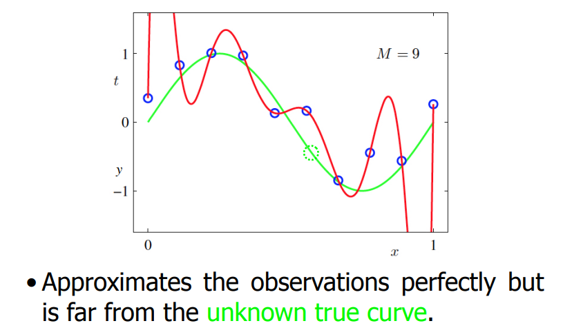                                                                                                                                                                                                                                                                                                                                                                                                                                                                     

* *Underfitting :* low training and testing error.  

  

## I- K-Nearest Neighbors 

We want to classify our data in classes. For example our data is in $\mathbb{R}^2$ and we have  2 classes (say dogs and cats). 

In red we have the **decision boundary** 

### 1-Nearest Neighbors 

Simplest algorithm: 

* Given a new x to be classified, find the *nearest* neighbor in the training set. 
*  Classify the point according to the label of this nearest neighbor. 

The result will depend on our choice of *distance measure* : 

Problem : the results may be very sensitive to outliers. 

Solution : use multiple neighbors. 

​									 

### K-nearest neighbor Classifier:  

---

Improved algorithm: 

• Given a new x to be classified, find its k nearest neighbors in the training set. 

• Classify the point according to the **majority** of labels of its **k** nearest neighbors.

---

 

​		$\implies$ predict yellow

**Key assumption in K-NN :**

* The training set and the test set are drawn from the same statistical distribution. Otherwise, there is no reason for a decision boundary learned on the training set to be useful on the test set.

**Overfitting :** Sometimes the model overfits : works very well for the training test but not on the test set. 

A solution maybe to vary **k** ( increase up to a certain point ).This may increase training error but may at the same time decrease test error.  

​																					red : training , green : validation

Model complexity increases when we decrease **k**. 

**Cross validation : **

* split training test to a real training set and a validation set. 
* choose **k** that minimizes error the validation set. 

Remember that we cannot use test data in training. 

**Trouble at the border : **

K-NN is prone to misclassifying points in the border.   

​								         

**Unbalanced traning set : **( More reds than blues )

The better represented class is unduly favored.

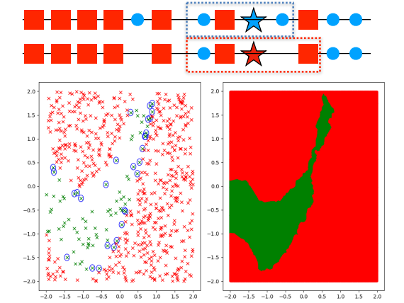

**Data reduction : ** 

* In K-NN we have to compare the data point to the whole dataset then take **k** best. 
*  Sometimes we do not need the whole dataset.

### Condensed Nearest Neighbors : 

---

Let **X** be the set of training samples and **P** the set of prototypes:

* Initialize 
* Repeat : 
  1. Look for **x** in **X** such that its nearest prototype in **P** has a different label than itself. 
  2. Remove **x** from **X** and add it to **P**.

---

               

​																										condensed 1NN works well 

We only have to search for Nearest neighbor in **P**. Huge time improvement 

### Curse of dimensionality :

High dimensional are very dense and so we need a lot of samples to cover them uniformly. 

Hopefully most of the time the data we are interesting in leaves on a (small) subspace of the containing space. 

Example with MNIST : We do not care about all 28x28 images , but only those who represent numbers. 

​		               

​																		this is an image that does not intereset us 

  So we can use dimensionality reduction techniques seen later. 

## II- K-means Clustering : 

This is an *unsupervised* learning algorithm. Group dataset in clusters without having their labels. 

* Cluster $k$ is formed by the points $\{\textbf{x}_{i_1^k},...,\textbf{x}_{i_n^k}\}$ 

* $\mu_k$ is the *center of gravity* of cluster $k$ , $\mu_k=\frac{1}{N}\sum_{j=1}^N\textbf{x}_{ { i_j } ^k},\mu\in\mathbb{R}^D$ : vectorial mean of elements of the cluster. 

* We want points in the same cluster to be the closest possible to each other , 

  so we want to minimize : 

  ​				$$\sum_{k=1}^{K}\sum_{j=1}^{n^{k}}(\mathbf{x}_{i_{j}^{k}}-\mu_{k})^{2}$$             

  * that's a hard problem 

We propose the following algorithm that is guaranteed to converge but not to find the optimal solution  :

---

1. Initialize $\{\mu_1,\text{...},\mu_K\}$ randomly if need be. 
2. Until convergence 
   1. Assign each point $x_i$ to the nearest center $\mu_k$ 
   2. Update each center  $\mu_k$ given the points assigned to it

---

The solution does **heavily** rely on the initialization. 

**Heuristic for choosing K : ** choose **k** where the drop of within cluster distances become less significant. 

### Inhomogeneous data and normalization : 

The Euclidean distance is most appropriate for data with homogeneous dimensions:

* In the 2D toy data, both dimensions are of commensurate magnitude. 
* In the color image, each dimension represents a color channel and varies in the range [0,255]. 

In practice, this is not always the case: 

* Different data dimensions may have different magnitudes. 
* They can encode different types of information.

Suppose this is our 13-D data : 

we can see that the last dimension have large values , and thus contributes largely to the euclidean distance. 

**Solution : **

* Scale each dimension by subtracting the smallest value and scaling the result to be between 0 and 1. 

* Use a different metric such as the Manhattan distance we saw earlier.

### Compactness and graphs 

Given K-means clustering utilizes the notion of compactness, it has struggles in the following example : 

What to do ? What to do ? 

We will try to favor **connectivity** rather than compactness : 

We will transform our dataset in a graph : 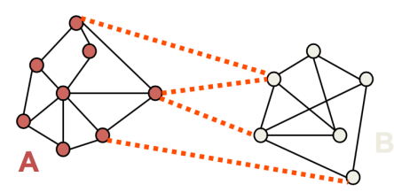

Similar data-points will have strong edges and different data points will have strong edges. this is how we will define **similarity** : $W_{ij}=\exp\left(\dfrac{-\|\mathbf{x}_i-\mathbf{x}_j\|^2}{\sigma^2}\right)$ 

$ W$ ( on the right in the image below ) will be the similarity matrix of our graph . 

let's define a cut in the graph : $cut(A,B)=\sum\limits_{i\in A,j\in B}W_{ij}$ , be try to find a min cut. 

a problem we can encounter is very unbalanced cuts. to balance it we will minimize :  where $\begin{aligned}vol(A)=\sum_{i\in A}d_i\end{aligned}$ 

Lots of mathematics later this leads to the following problem : 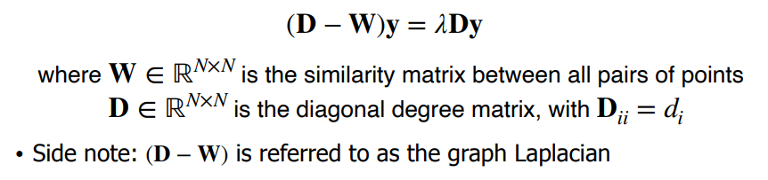

 The solution is then obtained by the eigenvector with the second smallest eigenvalue ! 

## III- Linear regression : 

Given pairs of elements $(x_i,y_i)$ and another input $x$ we want to predict $\hat{y}$ that is as close as possible from $y$. 

So we will fit a line parametrized with weights $w_0,w_1$ : $y=w^{(0)}+w^{(1)}$  between our points $(x_i,y_i)$. 

**How to choose the weights ? **

The weights must be st that minimize the distance between $\hat{y_i}$ and $y_i$ (prediction and real data ) where $\hat{y}_i=w^{(0)}+w^{(1)} x_i$. 

So the metric to minimize is $\begin{aligned}\frac{1}{N}\sum_{i=1}^N (\hat y_i-y_i)^2\end{aligned}$  : *loss function* 

**In higher dimensions : **

* Our line become a plane. 

  

  ​															example for  $x\in \mathbb{R}^2 $  

* Our input $x \in \text{$\mathbb{R}$} $ becomes a vector $x \in {\text{$\mathbb{R}$}}^D$. 

* Our prediction becomes $\hat y =  w^{(0)}+w^{(1)}x^{(1)}+w^{(2)}x^{(2)}+\ldots+w^{(D)}x^{(D)}=\mathbf{w}^{T}\left[\begin{matrix}{1}\\ {x^{(1)}}\\ {x^{(2)}}\\ {\vdots}\\ {x^{(D)}}\\ \end{matrix}\right] = w^T \tilde{x} $

  where $\tilde{x} \in {\text{$\mathbb{R}$}}^{D+1}$  is the $x$ extended to account to bias.

* Weights are  $w = argmin( \frac{1}{N}\sum_{i=1}^N(\textbf{x}_i^T\textbf{w}-y_i)^2 )$ where $w \in \mathbb{R}^{D+1}$ . 

* This is a least squares problem. 

  

  ## Derivates and gradients : 

  

  * The gradient $\nabla_{\textbf{w}}R(\textbf{w})=\begin{bmatrix}\frac{\partial R}{\partial w^{(1)}}\\ \frac{\partial R}{\partial w^{(2)}}\\ \vdots\\ \frac{\partial R}{\partial w^{(D)}}\end{bmatrix}\in\mathbb{R}^D$ 

  The derivative vanishes ($ \:\nabla_{\textbf{w}}R(\textbf{w})=\textbf{0}\:$) at the stationary points: 

  * Minima 

  * Maxima 

  * Saddle points (orange). 

  

   

**Computation of gradient** : 

1. Given that $ R(\textbf{w}) $ is an average we can focus on : $ \:\nabla_{\textbf{w}}(\textbf{x}_i^T\textbf{w}-y_i)^2\:$ 

2. Chain rule : 

   1. the function $(\textbf{x}_i^T\textbf{w}-y_i)^2$  has the form $f(g(\textbf{x}))$ with $f(g) = g^2 $ . 
   2. the gradient is $ \frac{df(g)}{dg}\nabla_{\textbf{w}}g(\textbf{w})$ 

   

3.  $\nabla_{\textbf{w}}R&=\frac{1}{N}\sum_{i=1}^N\frac{\partial(g^2)}{\partial g} ( \textbf{x}_i^T\textbf{w}-y_i)\cdot\frac{\partial(\textbf{x}_i^T\textbf{w}-y_i)}{\partial\textbf{w}}\\$ 

   

   ​				$=\frac{2}{N}\sum_{i=1}^N(\textbf{x}_i^T\textbf{w}-y_i)\cdot\textbf{x}_i$ 

​	

**Solution ** 

We will find $w^*$ by solving the following problem  : $\begin{aligned}\nabla_{\textbf{w}}R(\textbf{w}*)=\frac{2}{N}\sum_{i=1}^N\textbf{x}_i(\textbf{x}_i^T\textbf{w}^*-y_i)=\textbf{0}\end{aligned}$ 

$\implies \text{(}\sum_{i=1}^N\mathbf{x}_i\mathbf{x}_i^T)\mathbf{w}^*=\sum_{i=1}^N(\mathbf{x}_i y_i\text{)}$ 

on the left hand side we have $XX^T$ and on the right hand side we have a vector matrix multiplication $X^T  \textbf{y}$ .

where $X$ and $\textbf{y}$ are : 

$ \mathbf{X}=\begin{bmatrix}\mathbf{x}_1^T\\ \mathbf{x}_2^T\\ \vdots\\ \mathbf{x}_N^T\end{bmatrix}=\begin{bmatrix}1&x_1^{(1)}&x_1^{(2)}&\cdots&x_1^{(D)}\\ 1&x_2^{(1)}&x_2^{(2)}&\cdots&x_2^{(D)}\\ \vdots&\vdots&\vdots&\vdots&\vdots\\ 1&x_N^{(1)}&x_N^{(2)}&\cdots&x_N^{(D)}\end{bmatrix}\in\mathbb{R}^{D\times(D+1)}$ and $\textbf{y}=\begin{bmatrix}y_1\\ y_2\\ \vdots\\ y_N\end{bmatrix}\in\mathbb{R}^N$ 

so we solve : 

$ \:\textbf{X}^T\textbf{X}\textbf{w}^*=\textbf{X}^T\textbf{y}\: \implies \:\textbf{w}^*=\left(\textbf{X}^T\textbf{X}\right)^{-1}\textbf{X}^T\textbf{y}=\textbf{X}^\dagger\textbf{y}\: $ 

This is a closed form form formula were $ X^{\dagger} $ is  *Moore-Penrose pseudo-inverse*. 

### Model evaluation : 

* Once an ML model is trained, one would typically understand how well it performs on unseen test data. 
  *  At this stage, the parameters of the model are fixed 
  * Recall that the training and testing data must be separated!
*  During this evaluation, one compares the predictions of the model with the true annotations of the test data
* The evaluation criteria is sometimes the loss function but It can we different:
  * **Mean Squared Error : **$ \begin{aligned}MSE=\frac{1}{N_t}\sum_{i=1}^{N_t}(\hat{y}_i-y_i)^2\end{aligned}$  (same as loss function)
  * **Root Mean Squared Error (RMSE) : ** $\sqrt{MSE}$
  * **Mean Absolute Error (MAE) : ** $\begin{aligned}MAE=\frac{1}{N_t}\sum_{i=1}^{N_t}\left|\hat{y}_i-y_i\right|\end{aligned}$ 
  * **Mean Absolute Percentage Error (MAPE) :** $MAPE=\frac{1}{N_t}\sum_{i=1}^{N_t}\left|\frac{\hat{y}_i-y_i}{y_i}\right|$ 

**Interpreting a linear model : **

* One can then look at the coefficient values (i.e., the ) to see the influence of each attribute

* Warning: The magnitude of a coefficient will depend on the magnitude of the corresponding feature/attribute 
  * A coefficient might be very small simply to compensate for the fact that the range of the feature is very large $\implies $ we will use normalization. 

### Multi-output linear regression:

Until now we have only seen regressions with output $ y_i \in \mathbb{R}$ , what if we want a multidimensional output $ y_i \in \mathbb{R}^{C} , C > 1 $ . 

* To output multiple values, the linear model cannot just rely on a vector $\textbf{w}$ ,  because the product $\textbf{w}^TX$ yields a single value. 
* therefore we will use a matrix $ \textbf{W}\in\mathbb{R}^{(D+1)\times C}$ and $\hat{\mathbf{y}}_i=\mathbf{W}^T\mathbf{\tilde{x}}_i=\begin{bmatrix}\mathbf{w}_{(1)}^T\\ \mathbf{w}_{(2)}^T\\ \vdots\\ \mathbf{w}_{(C)}^T\end{bmatrix}\mathbf{\tilde{x}}_i$ 
* We can repeat the same reasoning as earlier , $y$ becomes a matrix $\textbf{y }=\begin{bmatrix}\textbf{y}_1^T\\ \textbf{y}^T\\ \vdots\\ \textbf{y}_N^T\end{bmatrix} \in \mathbb{R}^{(N\times C)}$

## IV- Classification 

Problem : Find such that $\textbf{w}$ : 
• for all or most positive samples $w\tilde{x} > 0 $
• for all or most negative samples $w\tilde{x} < 0$ 

​													

### Binary classification with the perceptron 

Algorithm : 

---

* Set $w_1$ to $0$ .  
* Iteratively, pick a random $n$ 
  * if $x_n$ correctly classsified , do nothing
  * otherwise $w_{t+1} = w_t + t_n\tilde{x}_{n+1}$.

$w_t$ is the weight at iteration $t$ . 

This will result in the plane making a series of rotations : 

​					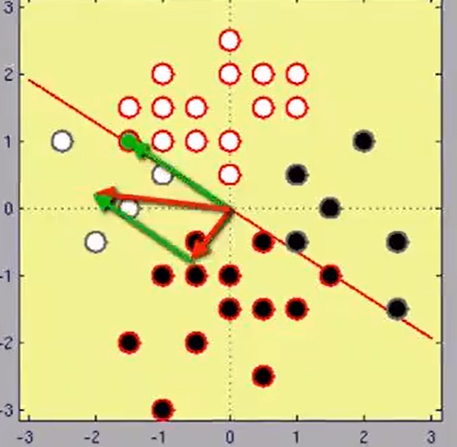 $\implies$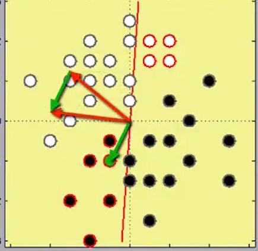

**The convergence theorem:**

the condition of the theorem says that data are *linearly seperable*

We minize : $E(\mathbf w)=-\sum\limits_{n=1}^{N}\mathrm{sign}(\mathbf w\cdot\mathbf x_n)t_n$ 

And... that is a problem because : 

We want to be less close from points ( image a diagonal line )

### Binary classification with linear regression 

Labels to predict are $0$ or $1$. 

**Step 1 : Predict value between 0 and 1 with regression **

The point where the predicted label changes from 0 to 1 forms a **decision boundary** . 

​													example with input in 1D 

* linear model is in green 
* decision boundary is the point in input dimension where $y = 0.5$ . 

​					

​					example with input in 2D						

in the second picture : 

* the orange plane is the linear model . 
* the blue plane represents $y=0.5$ . 
* the green line is the intersection between $y=0.5$ and the linear model. 

**Step2 : Converting continous output to linear**

* The output of the linear model is a continuous value * 

  *  What we would really like is a discrete output,     $y=\left\{\begin{matrix}1\quad\text{if}\ \mathbf{w}^T\mathbf{\tilde{x}}\geq0.5\\ 0\quad\text{otherwise}\end{matrix}\right.$

  

* This can be achieved by passing the output of the linear model through a step function.

  * the problem with the above function is that the gradient of the function is non continuous which makes optimization hard. 

  * a smooth approximation of the step function , such as the logistic sigmoid function . $\hat{y}=\sigma(\textbf{w}^T\tilde{x})=\dfrac{1}{1+\exp(-\textbf{w}^T\tilde{x})}$  

    ​							

    **sigmoid** is amazing because :

    1. infinitely differentiable
    2. derivate easy to compute : $\frac{\partial\sigma}{\partial a}=\sigma(1-\sigma)$ 
  
  
  
  ### Logistic regression
  
  1. Choose function to minimize.
  2. Find weights that minimize it using gradient descent.
  
  * likelihood of elements being well labeled $\begin{aligned}p(\textbf{y}\:|\:\textbf{w})=\prod\limits_{i=1}^N\hat{y}_i^{y_i}\cdot(1-\hat{y}_i)^{1-y_i}\end{aligned}$
  
    * if $\hat{y_i} = 1$ then the term in the product will be $1^{y_i}0^{1-y_i}$ so $1$ if we guess right and $0$ if we don't. Same reasoning if $y_0=0$ . 
  
  * Given that this is a product of terms between 0 and 1 , it is hard to maximize , so we will try to minize $- \ln(probability)$. 
  
    ​							$\begin{aligned}R(\textbf{w})=-\sum_{i=1}^N\big(y_i\ln(\hat{y}_i)+(1-y_i)\ln(1-\hat{y}_i)\big)\end{aligned}$  
  
    This is a *convex* function of $\textbf{w}$  $\implies$ easy to optimize. 

​			this is the cross entropy , it can also be rewritten as : 

​										$\begin{aligned}R(\mathbf{w})=-\sum_{i\in\text{positive samples}}\ln(\hat{y}_i)-\sum_{i\in\text{negative samples}}\ln(1-\hat{y}_i)\end{aligned}$   . The problem 

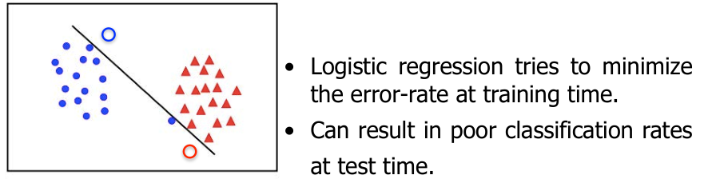

The right classification would be : 

### Multiclass logistic regression 

Our approach will be similar : 

* $K$ linear classifiers of the form $y^{k}(\mathbf{x})=\sigma(\mathbf{w}_{k}^{T}\mathbf{x})$ . The $i$-th classifier answers the question : Is this input in class $i$ ?
* Assign $x$ to class $k$ if $y^{k}(\mathbf{x})>y^{l}(\mathbf{x}) \quad \forall l\neq k$ 

### Maximizing the margin 

**The margin** : the distance from the closest point of the decision boundary.   

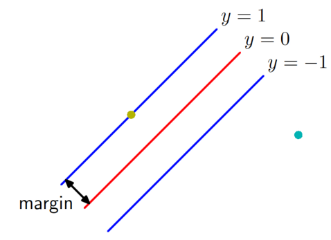

The larger the margin , the better. 

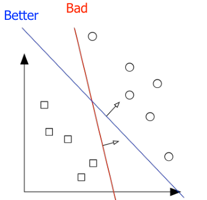

Signed distance :  $\frac{\tilde{\mathbf{w}}\cdot\tilde{\mathbf{x}}}{\mid\mid\mathbf{w}\mid\mid\mid}$

To make it unsinged :  $d_n=t_n\dfrac{(\tilde{\mathbf{w}}\cdot\tilde{\mathbf{x}}_n)}{\mid\mid\mathbf{w}\mid\mid}$  , $\tilde{\mathbf{w}}^{\prime}=\frac{\tilde{\mathbf{w}}}{\mid\mid\mathbf{w}\mid\mid}=[\frac{w_{0}}{\mid\mid\mathbf{w}\mid\mid}\mid\frac{\mathbf{w}}{\mid\mid\mathbf{w}\mid\mid\mid}]$ 

* Suppose all points can be classified $\forall n,\quad t_n(\tilde{\mathbf{w}}_n\cdot\tilde{\mathbf{x}}_n)>=0$ 

* We want to maximize the closest distance : $\tilde{\mathbf{w}}^*=\operatorname{argmax}_{\tilde{\mathbf{w}}}\min\limits_n\left(\dfrac{t_n\cdot(\tilde{\mathbf{w}}\cdot\mathbf{x}_n)}{\|\mathbf{w}\|}\right)$ 

* We observe that $t_n\dfrac{(\tilde{\mathbf{w}}\cdot\tilde{\mathbf{x}}_n)}{\mid\mid\mathbf{w}\mid\mid}$ is invariant to scaling $\tilde{\textbf{w}}$ so we can scale it such that for the closest point $x_m$ we have $t_m\cdot(\tilde{\mathbf{w}}\cdot\mathbf{x}_m)=1$ 
  * For all others : $t_n\cdot(\tilde{\mathbf{w}}\cdot\mathbf{x}_n)\geq1\,$ 

* the smallest distance becomes : $m i n_{n}d_{n}=m i n_{n}\frac{t_{n}(\tilde{\mathbf{w}}\cdot\mathbf{x}_{n})}{\mid\mid\mathbf{w}\mid\mid}=\frac{1}{\mid\mid\mathbf{w}\mid\mid}$ 

  * The new problem is : maximize $\frac{1}{\mid\mid\mathbf{w}\mid\mid}$ subject $t_n\cdot(\tilde{\mathbf{w}}\cdot\mathbf{x}_n)\geq1\,$ 

  * very hard 

* Easier equivalent problem : 

  > $\mathbf{w}*=argmin_{\mathbf{w}}\dfrac{1}{2}|\big|\mathbf{w}|\big|^2 \quad \text{subject to },t_n\cdot(\tilde{\mathbf{w}}\cdot\mathbf{x}_n)\geq1 \quad \forall n$ 

  * This is a quadratic program, which is a **convex** problem. 

BUT , we are heavily reliant on the fact that $\forall n,\quad t_n(\tilde{\mathbf{w}}_n\cdot\tilde{\mathbf{x}}_n) \geq 0$  and 

In the real world , that is never the case 

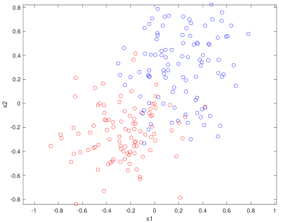

#### SVM and Slack variables 

$t_n\cdot(\tilde{\mathbf{w}}\cdot\mathbf{x}_n)\geq1\,$ is a strict constraint let's relax it $t_{n}\cdot(\tilde{\mathbf{w}}\cdot\mathbf{x}_{n})\geq1-\xi_{n}.$ 

The higher the $\xi_n$ is the more we allow the model to misclassify  $\mathbf{x}_n $  

**Naive formulation:** 

> $\begin{aligned}\mathbf{w}^*=argmin_{\mathbf{w}}\frac{1}{2}\left|\left|\mathbf{w}\right|\right|^2\\ \text{subject to }\forall n,t_n\cdot(\mathbf{\bar{w}}\cdot\mathbf{x}_n)\geq1-\xi_n\text{ and }\xi_n\geq0\end{aligned}$  

The model will just choose hight values of $\xi_n$ and will not learn  

**Right formulation :**

> $\quad \quad \begin{array}{c}\mathbf{w}^*=argmin_{(\mathbf{w},(\xi_n))}\dfrac{1}{2}|\left|\mathbf{w}\right||^2+C\sum_{n=1}^N\xi_n,\\\text{subject to}\forall n,\quad t_n\cdot(\mathbf{\tilde{w}}\cdot\mathbf{x}_n)\geq1-\xi_n\text{ and }\xi_n\geq0.\end{array}$  

### AdaBoost

What if our data is not linearly classifiable ? 

We will try to solve this problem we will combine many linear classifiers ( these are "weak" classifiers )

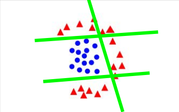

$\begin{aligned}y(\textbf{x})=\alpha_1y_1(\textbf{x})+\alpha_2y_2(\textbf{x})+\alpha_3y_3(\textbf{x})+\ldots\end{aligned}$ 

* $y_i$ are our classifiers
* $\alpha_i$ are our classifier weights 

Our algorithm will be iterative and will assign weights $w_i$ to points. If a point is misclassified often its weight will be high to prioritize correcting it. 

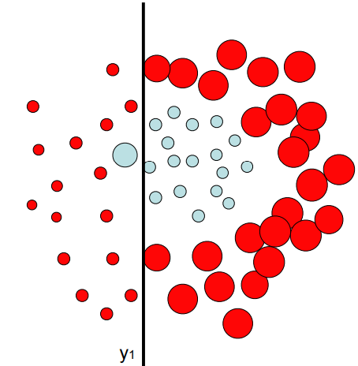

Example : Right points are missclassified $\implies$ they will get bigger weights

---

Algorithm 

1. Initialize $w_n^{(1)} = 1/N$ 

2. for $t$ in $1,...,N$ 

3. Find classifiers $y_t$ : that minimizes $\sum_{t_n\neq y_t(\textbf{x}_n)}w_n^t\text{.}$ 

4. Evaluate: $\epsilon_t=\dfrac{\sum_{t_n\neq y_t(\mathbf{x}_n)}w_n^t}{\sum_{n=1}^{N}w_n^t}$ 

   ​					$\alpha_t=\log(\dfrac{1-\epsilon_t}{\epsilon_t})$ 

5. Update weights $w_n^{t+1}=w_n^t\exp(\alpha_t \mathbb{I}(t_n\neq y_t(\mathbf{x}_n)))$ 

6. **Result** : $Y(\mathbf{x})=\text{sign}(\sum_{t=1}^{T}\alpha_t y_t(\mathbf{x}))$ 

---

**Important : ** Classifiers $y_t$ should behave better than random. 

###  Feature expansion :

We are always investing classification of non linearly seperable data : 

​         

1. **1-Dimension** :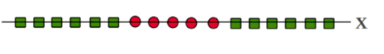

   We can use the following mapping : $x\rightarrow\phi(x)=\begin{bmatrix}x\\ x^2\end{bmatrix}\text{}$ to map to 2-dimensions

   

   We see that the result of this mapping is *linearly seperable* 

2. **2-Dimension** : 
   same thing from 2d to 3d 
   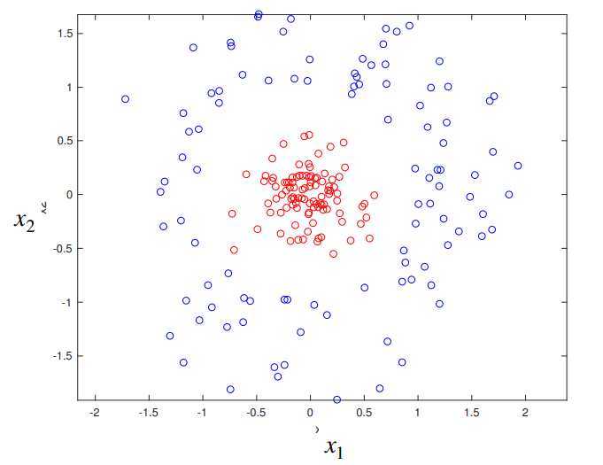 becomes       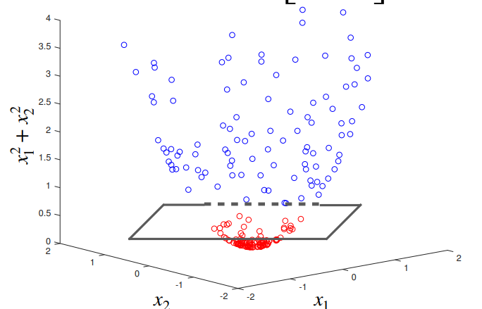

after applying $\textbf{x}=\begin{bmatrix}x_1\\ x_2\end{bmatrix}\to\phi(\textbf{x})=\begin{bmatrix}x_1\\ x_2\\ x_1^2+x_2^2\end{bmatrix}$ 

3. **Polynomial approximation**
   Another case where we can have better result by expanding our data to a higher dimension is polynomial approximation : 

   We cannot nicely approximate the following curve with a line but if we choose a degree 3 polynomial, it becomes possible. 

   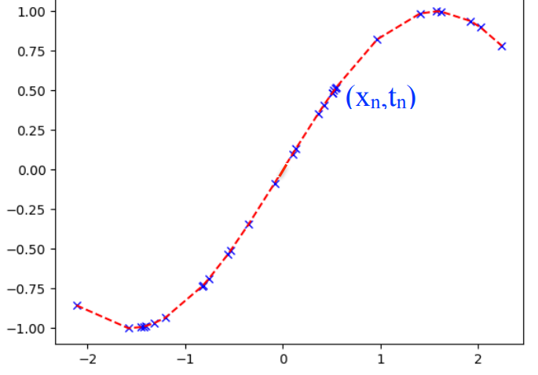

   

   Fitting our data $(x_n,t_n)$ with polynomial of weights $w_i$ 

   1. expand our data $x\to\phi(x)=\begin{bmatrix}1\\ x\\ x^2\\ \vdots\\ x^M\end{bmatrix}$   
   2. Approximate using least squares $\begin{aligned}\mathbf{w}*=\text{argmin}_{\mathbf{w}}\sum_n\left(t_n-\mathbf{w}^T\phi(x_n)\right)^2\end{aligned}$ 
   3. Solution : $(\Phi^{T}\Phi)_{_{M\times M}}\textbf{w}^{*}=\Phi^{T}\textbf{t}_{_{M\times1}}$ 

   **Regularization** 

   We want to prevent to following quick variations 

   

   To do so , we penalize high weights : $\mathbf{w}^*=\underset{\mathbf{w}}{\arg\min}\|\Phi\mathbf{w}-\mathbf{t}\|^2+\dfrac{\lambda}{2}\|\mathbf{w}\|^2\quad$ 

   * This is known as weight decay because in iterative algorithms it encourages the weight values to decay to zero, unless supported by the data
   * $\lambda$ will be chosen with cross validation 

Let's use this to create **non linear** boundaries : 

Recall normal SVM : 

$\quad \quad \begin{array}{c}\mathbf{w}^*=argmin_{(\mathbf{w},(\xi_n))}\dfrac{1}{2}|\left|\mathbf{w}\right||^2+C\sum_{n=1}^N\xi_n,\\\text{subject to}\forall n,\quad t_n\cdot(\mathbf{\tilde{w}}\cdot\mathbf{x}_n)\geq1-\xi_n\text{ and }\xi_n\geq0.\end{array}$  

Non linear SVM :

 $\quad \quad \begin{array}{c}\mathbf{w}^*=argmin_{(\mathbf{w},(\xi_n))}\dfrac{1}{2}|\left|\mathbf{w}\right||^2+C\sum_{n=1}^N\xi_n,\\\text{subject to}\forall n,\quad t_n\cdot(\mathbf{\tilde{w}}\cdot\mathbf{  \color{\red} \phi(x)_n })\geq1-\xi_n\text{ and }\xi_n\geq0.\end{array}$

[missing content here]

### Decision trees 

The goal to classify data : 

 

The number of data-points of each class must be the same. 

We will build a tree s.t :  for any data-point $v$ 

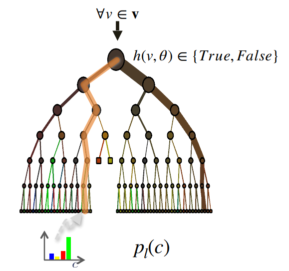

* any node will output true or false 
* if true we go to the right child , if false we go to the other child 
* we stop when we arrive at leaf 

Compute $p_l(c)$ the proportion of samples in each class that lands in leaf $l$ . 

If , at test time , our test point $v$ falls into leaf $l$ , we will consider to  $p_l(c)$  to be the probability that $v$ has label $c$ . 

[CONTENT MISSING HERE]

## V-Neural Networks  

Let's recap what we have been doing : 

* <u>AdaBoost</u>: Use several hyperplanes. 
*  <u>Forests</u>: Use several hyperplanes. 
*  <u>SVMs</u>: Map to a higher dimension. 
*  NEW **Neural Nets:** Map to a higher dimension and use lots of hyperplanes. 

Neural networks is about repeating logistic regression multiple times 

Logistic regression : $y(\textbf{x})=\sigma(\textbf{w}\cdot\textbf{x}+b)$ and minimize *binary cross entropy*

​                                                       

Repeating the process multiple times :   $\textbf{h}=\sigma(\textbf{Wx}+\textbf{b})$ each node has its vector $\textbf{w}_i$ of weights and and each layer has its matrix $\textbf{W}=\left[\begin{array}{c}\textbf{w}_1\\ \textbf{w}_2\\ \vdots\\ \textbf{w}_H\end{array}\right]$ 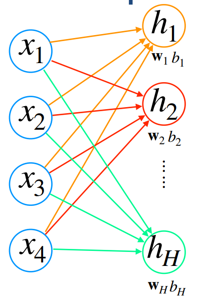                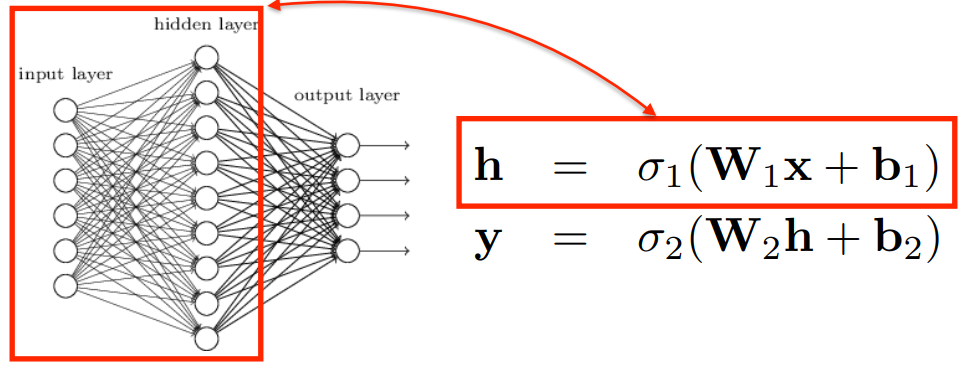

The 

Like logistic regression : we minimize the cross entropy : 

$E(\mathbf{W}_1,\mathbf{w}_2,\mathbf{b}_1,\mathbf{b}_2)=\dfrac{1}{N}\sum_{n=1}^N E_n(\mathbf{W}_1,\mathbf{w}_2,\mathbf{b}_1,\mathbf{b}_2)$ 

*2 classes :*   for sample $n$ 

​						$E_{n}(\mathbf{W}_{1},\mathbf{w}_{2},\mathbf{b}_{1},\mathbf{b}_{2})=-{(t_{n}\ln(y_{n})+(1-t_{n})\ln(1-y_{n}))}$ 

*K classes :*

* $p_n^k=\dfrac{\exp(\mathbf{y}_n[k])}{\sum_j\exp(\mathbf{y}_n[j])}$  : probability of sample $n$ to be in class $k$ 

* $E_n(\mathbf{W}_1,\mathbf{W}_2,\mathbf{b}_1,\mathbf{b}_2)=-\sum t_n^k\ln(p_n^k)$

### Gradient Descent  

We go in the reverse direction of the gradient : The direction of greatest decrease 

Iterative process : $\mathbf{x}^{\tau+1}=\mathbf{x}^{\tau}-\eta\nabla f(\mathbf{x}^{\tau})$ 

$f$ is the function we want to minimize : here it will be $E_n$ 

$\mathbf{w}^{\tau+1}=\mathbf{w}^{\tau}-\eta\sum\limits_{n=1}^N\nabla E_n(\mathbf{w}^{\tau})$ 

**Stochastic gradient descent :**

At each iteration , we don't need to compute the gradient over *all* the dataset. We just choose a batch random on which we compute the gradient. 

$\text{Stochastic~descent:}~\mathbf{w}^{\tau+1}=\mathbf{w}^{\tau}-\eta\sum_{n\in B^{\tau}}\nabla E_{n}(\mathbf{w}^{\tau})$ 

$B^{\tau}$ is the randomly chosen batch at iteration $\tau$ 

* Helps computation go fast
* Prevents local minimum and overfitting (why?)

**How to compute gradients ? Backpropagation**

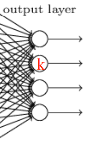

Let's consider the last layer : we have : The loss function is a function of the activations of the last layers : 

$E_n = L_n(a_1,\dots,a_K)$ 

If we want to derivate the loss function wrt to the weights $w_{ij}$ we will have to use the chaine rule ( $w_{ij}$  $i$-th weight of of node $j$ )

$\frac{\delta E_n}{\delta w_{ji}}=\frac{\delta E_n}{\delta a_j}\frac{\delta a_j}{\delta w_{ji}}$ by chain rule 

given that $a_j=\sum_i w_{ji}z_i$ we have that $\dfrac{\delta a_j}{\delta w_{ji}} = z_i$ 

So $\frac{\delta E_n}{\delta w_{ji}}=\delta_j z_i$ : where $\delta_j \equiv \dfrac{\delta E_n}{\delta a_j}$ 

All layers will depend of some $\delta_h$ and some $z_k$ , backpropagation is the act of starting from the last layer and computing all $\delta_h$ 

We do that in two steps : 

1. Forward pass : compute all activations $a$ : each layer depends on previous layer 

2. Backward pass : compute all $\delta$  : each layer depends on following layer that's we it's done backward.

   

### Convolutional neural networks 

**Fully connected neural nets :** 

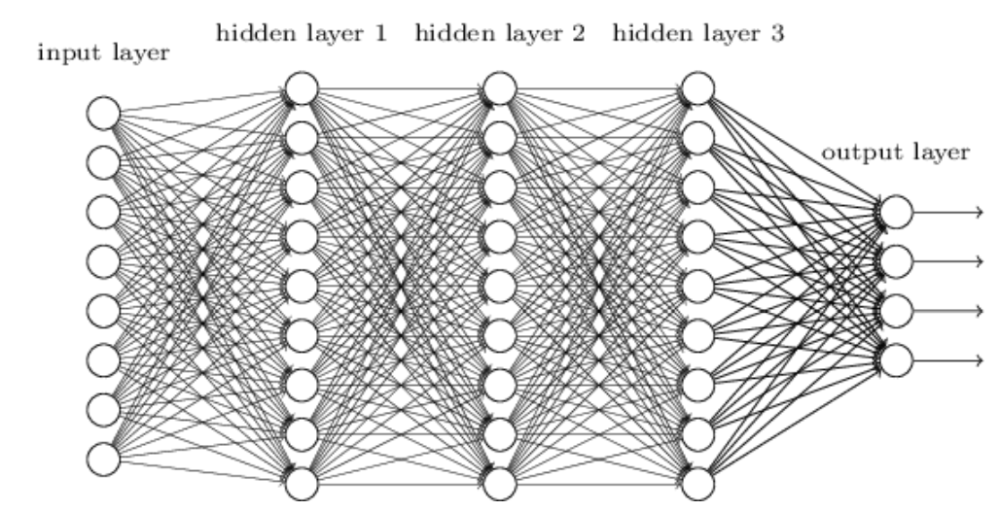

The problem of neural networks is their huge number of weights. 

This is especially the case when we deal with images. 

If we consider a WxH image , we can encode it as a WH dimensional vector. 

Drawbacks : 

* huge vector , we will need an NN with a *lot* of weights. 
* We loose the *neighborhood relationship* of the points of the image.  

We want to have : 

* neighborhood relationships
* translation invariance : the output of the nn shouldn't change after a translation. 

Solution :

We will add some special layers before our fully connected network :   

1. **Convolutional layer :** 
   

   We take our input image , we create multiple modified versions of it. 
   Each version will capture some type of information. Each version is created by taking the *convolution* of the image with some *filter*. 

   filters : 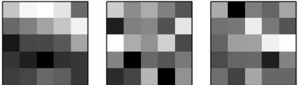   

   the convolution will naturally decrease the size of the image a little (we cannot convolute pixels on the edge). We can fix this by *padding* i.e adding zeroes . 

2. **Pooling layer :**
                          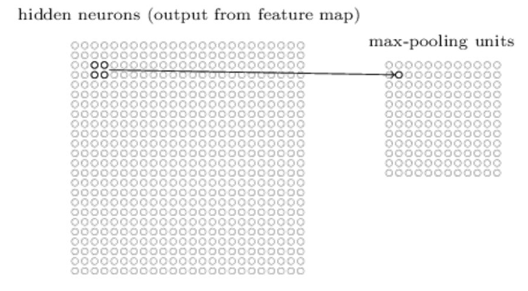 

   Reduces the number of inputs by replacing all activations in a neighborhood by a single one which is a function of the others. 

   A common choice is **max pooling** where we replace a neighborhood by the  node with the maximum value of that grid. 

The final architecture of the neural network : 

#### ResNet

####  UNet

Let's use the road detection problem to illustrate UNets, 

given : 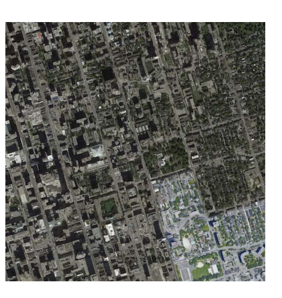       predict : 

This a UNet : 

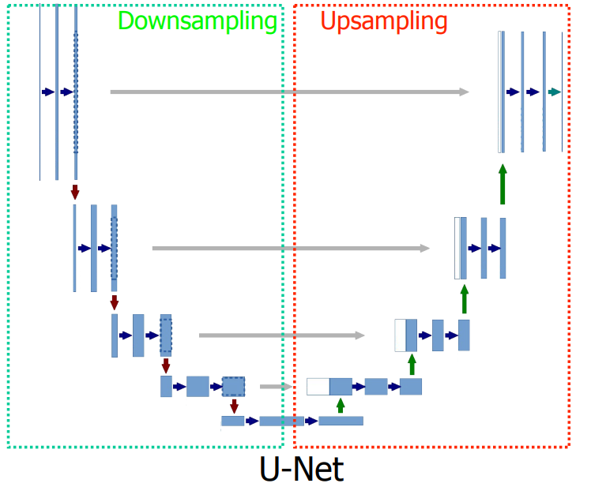

It is constituted from : 

* **Down sampling** layer : 

  The encoder network acts as the feature extractor and learns an abstract representation of the input image through a sequence of the encoder blocks.

* **Upsampling** layer : 

  To have the same dimensions as the input function. 

