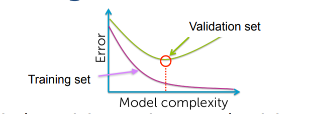
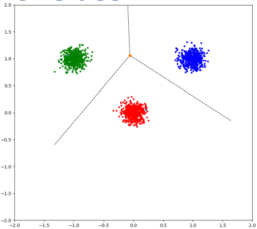
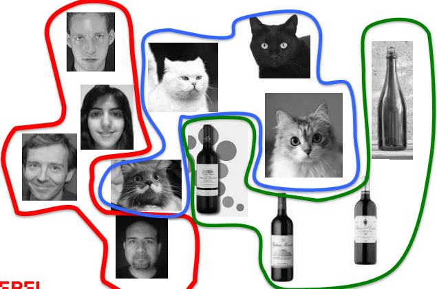
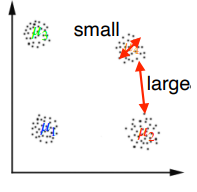

# Introduction to Machine Learning : 

[TOC]

## General ML concepts : 

* *supervised learning* : we are given data and its true labels. 
* *unsupervised learning* : The training set is not annotated and the system must also learn the classes.
* *loss function* : $l(\hat y_i,y_i)$computes an error value between the prediction and the true value. *examples* : 
  * single dimension : $\ell(\hat y_i,y_i) = (\hat y_i,y_i)^2$
  * multiple dimensions : $\begin{aligned}\ell(\hat{\textbf{y}}_i,\textbf{y}_i)=\|\hat{\textbf{y}}_i-\textbf{y}_i\|^2\end{aligned}$ 
  * L1 loss function : $\begin{aligned}\ell(\hat y_i,y_i)=|\hat y_i-y_i|\end{aligned}$ 
  
* *Empirical risk :* combination loss function of multiple data-points $R(\{\mathbf{x}_i\},\{y_i\},\mathbf{w})=\dfrac{1}{N}\sum_{i=1}^N\ell(\hat{y}_i,y_i)$    

* *Overfitting*  : general phenomenon where we get a very low training error , and a large test error. usually happens when  the mode is too *complex*.                           

  ​                                                                                                                                                                                                                                                                                                                                                                                                                                                                                                        

* *Underfitting :* low training and testing error.  

  

## I- K-Nearest Neighbors : 

We want to classify our data in classes. For example our data is in $\mathbb{R}^2$ and we have  2 classes (say dogs and cats). 

In red we have the **decision boundary** 

### 1-Nearest Neighbors 

Simplest algorithm: 

* Given a new x to be classified, find the *nearest* neighbor in the training set. 
*  Classify the point according to the label of this nearest neighbor. 

The result will depend on our choice of *distance measure* : 

Problem : the results may be very sensitive to outliers. 

Solution : use multiple neighbors. 

​									 

### K-nearest neighbor Classifier:  

---

Improved algorithm: 

• Given a new x to be classified, find its k nearest neighbors in the training set. 

• Classify the point according to the **majority** of labels of its **k** nearest neighbors.

---

 

​		$\implies$ predict yellow

**Key assumption in K-NN :**

* The training set and the test set are drawn from the same statistical distribution. Otherwise, there is no reason for a decision boundary learned on the training set to be useful on the test set.

**Overfitting :** Sometimes the model overfits : works very well for the training test but not on the test set. 

A solution maybe to vary **k** ( increase up to a certain point ).This may increase training error but may at the same time decrease test error.  

​																					red : training , green : validation

Model complexity increases when we decrease **k**. 

**Cross validation : **

* split training test to a real training set and a validation set. 
* choose **k** that minimizes error the validation set. 

Remember that we cannot use test data in training. 

**Trouble at the border : **

K-NN is prone to misclassifying points in the border.   

​								         

**Unbalanced traning set : **( More reds than blues )

The better represented class is unduly favored.

**Data reduction : ** 

* In K-NN we have to compare the data point to the whole dataset then take **k** best. 
*  Sometimes we do not need the whole dataset.

### Condensed Nearest Neighbors : 

---

Let **X** be the set of training samples and **P** the set of prototypes:

* Initialize 
* Repeat : 
  1. Look for **x** in **X** such that its nearest prototype in **P** has a different label than itself. 
  2. Remove **x** from **X** and add it to **P**.

---

               

​																										condensed 1NN works well 

We only have to search for Nearest neighbor in **P**. Huge time improvement 

### Curse of dimensionality :

High dimensional are very dense and so we need a lot of samples to cover them uniformly. 

Hopefully most of the time the data we are interesting in leaves on a (small) subspace of the containing space. 

Example with MNIST : We do not care about all 28x28 images , but only those who represent numbers. 

​		               

​																		this is an image that does not intereset us 

  So we can use dimensionality reduction techniques seen later. 

## II- K-means Clustering : 

This is an *unsupervised* learning algorithm. Group dataset in clusters without having their labels. 

* Cluster $k$ is formed by the points $\{\textbf{x}_{i_1^k},...,\textbf{x}_{i_n^k}\}$ 

* $\mu_k$ is the *center of gravity* of cluster $k$ , $\mu_k=\frac{1}{N}\sum_{j=1}^N\textbf{x}_{ { i_j } ^k},\mu\in\mathbb{R}^D$ : vectorial mean of elements of the cluster. 

* We want points in the same cluster to be the closest possible to each other , 

  so we want to minimize : 

  ​				$$\sum_{k=1}^{K}\sum_{j=1}^{n^{k}}(\mathbf{x}_{i_{j}^{k}}-\mu_{k})^{2}$$             

  * that's a hard problem 

We propose the following algorithm that is guaranteed to converge but not to find the optimal solution  :

---

1. Initialize $\{\mu_1,\text{...},\mu_K\}$ randomly if need be. 
2. Until convergence 
   1. Assign each point $x_i$ to the nearest center $\mu_k$ 
   2. Update each center  $\mu_k$ given the points assigned to it

---

The solution does **heavily** rely on the initialization. 

**Heuristic for choosing K : ** choose **k** where the drop of within cluster distances become less significant. 

### Inhomogeneous data and normalization : 

The Euclidean distance is most appropriate for data with homogeneous dimensions:

* In the 2D toy data, both dimensions are of commensurate magnitude. 
* In the color image, each dimension represents a color channel and varies in the range [0,255]. 

In practice, this is not always the case: 

* Different data dimensions may have different magnitudes. 
* They can encode different types of information.

Suppose this is our 13-D data : 

we can see that the last dimension have large values , and thus contributes largely to the euclidean distance. 

**Solution : **

* Scale each dimension by subtracting the smallest value and scaling the result to be between 0 and 1. 

* Use a different metric such as the Manhattan distance we saw earlier.

### Compactness and graphs 

Given K-means clustering utilizes the notion of compactness, it has struggles in the following example : 

What to do ? What to do ? 

We will try to favor **connectivity** rather than compactness : 

We will transform our dataset in a graph : 

Similar data-points will have strong edges and different data points will have strong edges. this is how we will define **similarity** : $W_{ij}=\exp\left(\dfrac{-\|\mathbf{x}_i-\mathbf{x}_j\|^2}{\sigma^2}\right)$ 

$ W$ ( on the right in the image below ) will be the similarity matrix of our graph . 

let's define a cut in the graph : $cut(A,B)=\sum\limits_{i\in A,j\in B}W_{ij}$ , be try to find a min cut. 

a problem we can encounter is very unbalanced cuts. to balance it we will minimize :  where $\begin{aligned}vol(A)=\sum_{i\in A}d_i\end{aligned}$ 

Lots of mathematics later this leads to the following problem : 

 The solution is then obtained by the eigenvector with the second smallest eigenvalue ! 

## III- Linear regression : 

Given pairs of elements $(x_i,y_i)$ and another input $x$ we want to predict $\hat{y}$ that is as close as possible from $y$. 

So we will fit a line parametrized with weights $w_0,w_1$ : $y=w^{(0)}+w^{(1)}$  between our points $(x_i,y_i)$. 

**How to choose the weights ? **

The weights must be st that minimize the distance between $\hat{y_i}$ and $y_i$ (prediction and real data ) where $\hat{y}_i=w^{(0)}+w^{(1)} x_i$. 

So the metric to minimize is $\begin{aligned}\frac{1}{N}\sum_{i=1}^N (\hat y_i-y_i)^2\end{aligned}$  : *loss function* 

**In higher dimensions : **

* Our line become a plane. 

  

  ​															example for  $x\in \mathbb{R}^2 $  

* Our input $x \in \text{$\mathbb{R}$} $ becomes a vector $x \in {\text{$\mathbb{R}$}}^D$. 

* Our prediction becomes $\hat y =  w^{(0)}+w^{(1)}x^{(1)}+w^{(2)}x^{(2)}+\ldots+w^{(D)}x^{(D)}=\mathbf{w}^{T}\left[\begin{matrix}{1}\\ {x^{(1)}}\\ {x^{(2)}}\\ {\vdots}\\ {x^{(D)}}\\ \end{matrix}\right] = w^Tx $

  where $x \in {\text{$\mathbb{R}$}}^{D+1}$ where the extra dimension is the 1 that goes with $w^{(0)}$.

* Weights are  $w = argmin( \frac{1}{N}\sum_{i=1}^N(\textbf{x}_i^T\textbf{w}-y_i)^2 )$ where $w \in \mathbb{R}^{D+1}$ . 

* This is a least squares problem. 

  

  ## Derivates and gradients : 

  

  * The gradient $\nabla_{\textbf{w}}R(\textbf{w})=\begin{bmatrix}\frac{\partial R}{\partial w^{(1)}}\\ \frac{\partial R}{\partial w^{(2)}}\\ \vdots\\ \frac{\partial R}{\partial w^{(D)}}\end{bmatrix}\in\mathbb{R}^D$ 

  The derivative vanishes ($ \:\nabla_{\textbf{w}}R(\textbf{w})=\textbf{0}\:$) at the stationary points: 

  * Minima 

  * Maxima 

  * Saddle points (orange). 

  

   

**Computation of gradient** : 

1. Given that $ R(\textbf{w}) $ is an average we can focus on : $ \:\nabla_{\textbf{w}}(\textbf{x}_i^T\textbf{w}-y_i)^2\:$ 

2. Chain rule : 

   1. the function $(\textbf{x}_i^T\textbf{w}-y_i)^2$  has the form $f(g(\textbf{x}))$ with $f(g) = g^2 $ . 
   2. the gradient is $ \frac{df(g)}{dg}\nabla_{\textbf{w}}g(\textbf{w})$ 

   

3.  $\nabla_{\textbf{w}}R&=\frac{1}{N}\sum_{i=1}^N\frac{\partial(g^2)}{\partial g} ( \textbf{x}_i^T\textbf{w}-y_i)\cdot\frac{\partial(\textbf{x}_i^T\textbf{w}-y_i)}{\partial\textbf{w}}\\$ 

   

   ​				$=\frac{2}{N}\sum_{i=1}^N(\textbf{x}_i^T\textbf{w}-y_i)\cdot\textbf{x}_i$ 

​	

**Solution ** 

We will find $w^*$ by solving the following problem  : $\begin{aligned}\nabla_{\textbf{w}}R(\textbf{w}*)=\frac{2}{N}\sum_{i=1}^N\textbf{x}_i(\textbf{x}_i^T\textbf{w}^*-y_i)=\textbf{0}\end{aligned}$ 

$\implies \text{(}\sum_{i=1}^N\mathbf{x}_i\mathbf{x}_i^T)\mathbf{w}^*=\sum_{i=1}^N(\mathbf{x}_i y_i\text{)}$ 

on the left hand side we have $XX^T$ and on the right hand side we have a vector matrix multiplication $X^T  \textbf{y}$ .

where $X$ and $\textbf{y}$ are : 

$ \mathbf{X}=\begin{bmatrix}\mathbf{x}_1^T\\ \mathbf{x}_2^T\\ \vdots\\ \mathbf{x}_N^T\end{bmatrix}=\begin{bmatrix}1&x_1^{(1)}&x_1^{(2)}&\cdots&x_1^{(D)}\\ 1&x_2^{(1)}&x_2^{(2)}&\cdots&x_2^{(D)}\\ \vdots&\vdots&\vdots&\vdots&\vdots\\ 1&x_N^{(1)}&x_N^{(2)}&\cdots&x_N^{(D)}\end{bmatrix}\in\mathbb{R}^{D\times(D+1)}$ and $\textbf{y}=\begin{bmatrix}y_1\\ y_2\\ \vdots\\ y_N\end{bmatrix}\in\mathbb{R}^N$ 

so we solve : 

$ \:\textbf{X}^T\textbf{X}\textbf{w}^*=\textbf{X}^T\textbf{y}\: \implies \:\textbf{w}^*=\left(\textbf{X}^T\textbf{X}\right)^{-1}\textbf{X}^T\textbf{y}=\textbf{X}^\dagger\textbf{y}\: $ 

This is a closed form form formula were $ X^{\dagger} $ is  *Moore-Penrose pseudo-inverse*. 

### Model evaluation : 

* Once an ML model is trained, one would typically understand how well it performs on unseen test data. 
  *  At this stage, the parameters of the model are fixed 
  * Recall that the training and testing data must be separated!
*  During this evaluation, one compares the predictions of the model with the true annotations of the test data
* The evaluation criteria is sometimes the loss function but It can we different:
  * **Mean Squared Error : **$ \begin{aligned}MSE=\frac{1}{N_t}\sum_{i=1}^{N_t}(\hat{y}_i-y_i)^2\end{aligned}$  (same as loss function)
  * **Root Mean Squared Error (RMSE) : ** $\sqrt{MSE}$
  * **Mean Absolute Error (MAE) : ** $\begin{aligned}MAE=\frac{1}{N_t}\sum_{i=1}^{N_t}\left|\hat{y}_i-y_i\right|\end{aligned}$ 
  * **Mean Absolute Percentage Error (MAPE) :** $MAPE=\frac{1}{N_t}\sum_{i=1}^{N_t}\left|\frac{\hat{y}_i-y_i}{y_i}\right|$ 

**Interpreting a linear model : **

* One can then look at the coefficient values (i.e., the ) to see the influence of each attribute

* Warning: The magnitude of a coefficient will depend on the magnitude of the corresponding feature/attribute 
  * A coefficient might be very small simply to compensate for the fact that the range of the feature is very large $\implies $ we will use normalization. 

### Multi-output linear regression:

Until now we have only seen regressions with output $ y_i \in \mathbb{R}$ , what if we want a multidimensional output $ y_i \in \mathbb{R}^{C} , C > 1 $ . 

* To output multiple values, the linear model cannot just rely on a vector $\textbf{w}$ ,  because the product $\textbf{w}^TX$ yields a single value. 
* therefore we will use a matrix $ \textbf{W}\in\mathbb{R}^{(D+1)\times C}$ and $\hat{\mathbf{y}}_i=\mathbf{W}^T\mathbf{x}_i=\begin{bmatrix}\mathbf{w}_{(1)}^T\\ \mathbf{w}_{(2)}^T\\ \vdots\\ \mathbf{w}_{(C)}^T\end{bmatrix}\mathbf{x}_i$ 
* We can repeat the same reasoning as earlier , $y$ becomes a matrix $\textbf{y }=\begin{bmatrix}\textbf{y}_1^T\\ \textbf{y}^T\\ \vdots\\ \textbf{y}_N^T\end{bmatrix} \in \mathbb{R}^{(N\times C)}$

## Classification 

### Binary classification with regressions  

The point where the predicted label changes from 0 to 1 forms a **decision boundary** . 

​													example with input in 1D 

* linear model is in green 
* decision boundary is the point in input dimension where $y = 0.5$ . 

​					

​					example with input in 2D						

in the second picture : 

* the orange plane is the linear model . 
* the blue plane represents $y=0.5$ . 
* the green line is the intersection between $y=0.5$ and the linear model. 

**Adding non linearity **

* The output of the linear model is a continuous value * 

  *  What we would really like is a discrete output,     $y=\left\{\begin{matrix}1\quad\text{if}\ \mathbf{w}^T\mathbf{x}\geq0.5\\ 0\quad\text{otherwise}\end{matrix}\right.$

  

* This can be achieved by passing the output of the linear model through a step function.

  * the problem with the above function is that the gradient of the function is non continuous which makes optimization hard. 

  * a smooth approximation of the step function , such as the logistic sigmoid function . $\hat{y}=\sigma(\textbf{w}^T\textbf{x})=\dfrac{1}{1+\exp(-\textbf{w}^T\textbf{x})}$  

    ​							 

  * probability of elements being well labeled $\begin{aligned}p(\textbf{y}\:|\:\textbf{w})=\prod\limits_{i=1}^N\hat{y}_i^{y_i}\cdot(1-\hat{y}_i)^{1-y_i}\end{aligned}$ 

  * Given that this is a product of terms between 0 and 1 , it is hard to maximize , so we will try to minize $- \ln(probability)$. 

    ​							$\begin{aligned}R(\textbf{w})=-\sum_{i=1}^N\big(y_i\ln(\hat{y}_i)+(1-y_i)\ln(1-\hat{y}_i)\big)\end{aligned}$  

​			this is the cross entropy , it can also be rewritten as : 

​										$\begin{aligned}R(\mathbf{w})=-\sum_{i\in\text{positive samples}}\ln(\hat{y}_i)-\sum_{i\in\text{negative samples}}\ln(1-\hat{y}_i)\end{aligned}$   . 

