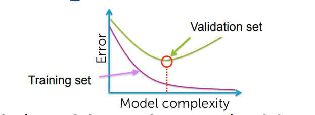
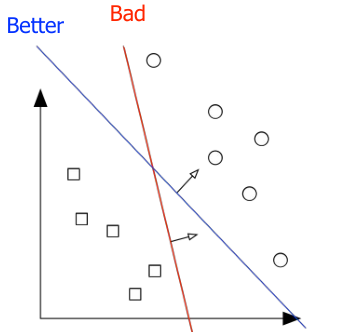
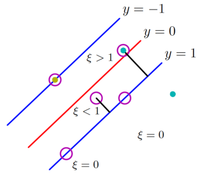
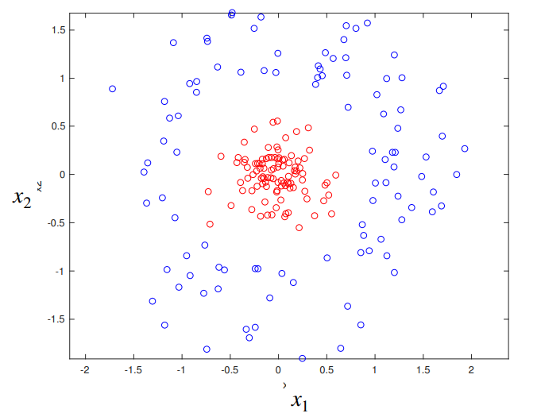
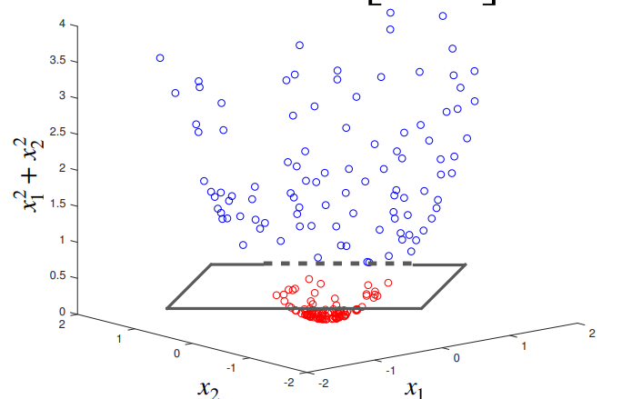
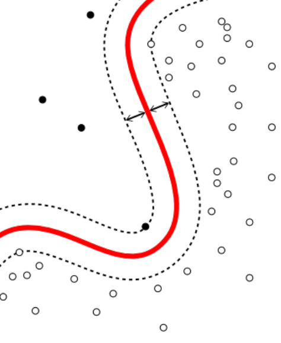
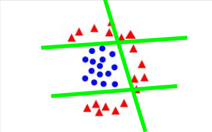
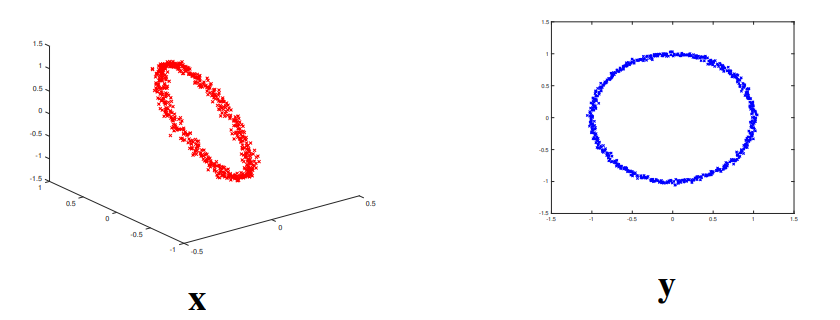
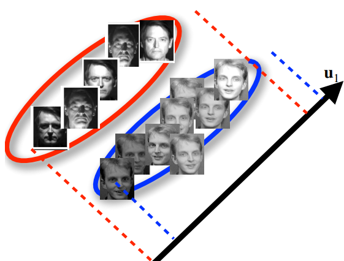
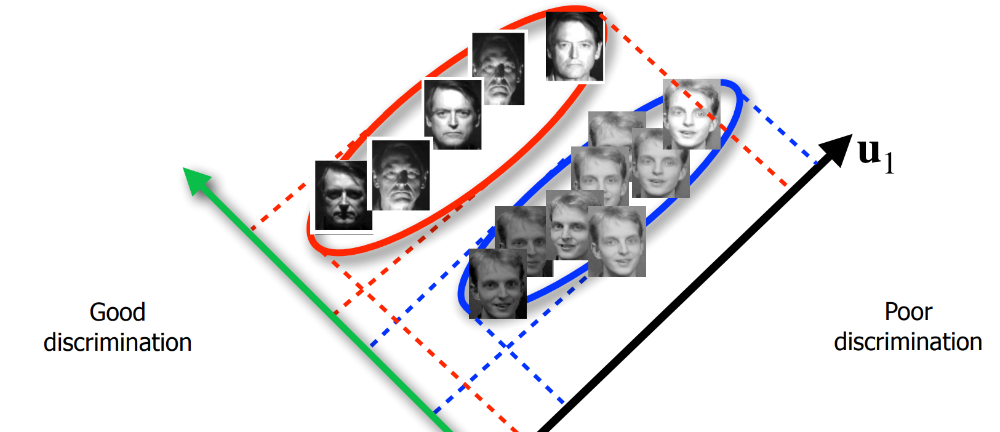

# Regression 

## Linear regression 

Predict future value predict future value of $\hat{y}$ by passing a plane throught data $(x_i,y_i)$ . 

Rigourously we try to minimize the MSE :  $\begin{aligned}\frac{1}{N}\sum_{i=1}^N (\hat y_i-y_i)^2\end{aligned}$ 

The solution is $\:\textbf{w}^*=\left(\textbf{X}^T\textbf{X}\right)^{-1}\textbf{X}^T\textbf{y}=\textbf{X}^\dagger\textbf{y}\: $  ($\textbf{X}$ here has a bias in it)

closed form form formula were $ X^{\dagger} $ is  *Moore-Penrose pseudo-inverse*. 

This is a *supervised* learning method because we are given labels. 

We can also predict multiple values ( a vector $\hat{y}$ instead of a single scalar)

# Classification 

## Logistic regression 

Classification technique (despite of the name) where we minimize the cross entropy with gradient descent. 

Cross entropy : a loss function , in the case of two classes it is : 

​						 $\begin{aligned}R(\textbf{w})=-\sum_{i=1}^N\big(t_iln(\hat{y}_i)+(1-t_i)\ln(1-\hat{y}_i)\big)\end{aligned}$ 

Where $t_i$ is the ground truth. 

Our prediction $\hat{y}=\sigma(\textbf{w}^T\tilde{x})=\dfrac{1}{1+\exp( {\color{red} -} \textbf{w}^T\tilde{x})}$  ( bias in $x$ ) and $\textbf{W}$ is learned with gradient descent. 

From exercises:

* More robust to outliers than linear regression. 

## K-nearest neighbors 

Predict label of data point from $k$ closed data points. 

We are given the labels therefore it is a *supervised* learning method. 

Notes : 

* Test data and train data *must* be from the same **statistical distribution** Otherwise, there is no reason for a what is learned on the training set to be useful on the test set
* Low $\textbf{k}$ = complex model = overfitting 
  High $\textbf{k}$   = "underfitting"
  Best $\textbf{k}$  is usually in the middle found with cross validation
* K-NN is prone to misclassifying points in the border.   
* Problems when the classes are unbalanced (more data for a class)

## Support vector machine  

Maximize the margin 💰💰 from the decision boundary. 

Margin : Distance between decision boudary and its closest point. 

The analytical problem is : 

> $\quad \quad \begin{array}{c}\mathbf{w}^*=argmin_{(\mathbf{w},(\xi_n))}\dfrac{1}{2}|\left|\mathbf{w}\right||^2+C\sum_{n=1}^N\xi_n,\\\text{subject to}\forall n,\quad t_n\cdot(\mathbf{\tilde{w}}\cdot\mathbf{x}_n)\geq1-\xi_n\text{ and }\xi_n\geq0.\end{array}$ 

* First line comes from maximizing boundary 

* Higher $\xi_n$ means more higher misclassification. 	
  * If we choose large $C$  (hyperparameter) we a  penalize misclassification (we can do that if the data in "fairly separable" )
  * If we choose low $C$ we allow it  to misclassify. 
  
* Second line is for correct classification (otherwise just set $w=0$ )

  The following picture is very important : 

  Points with $\xi=0$ Lie on the margin (between )

   

* $\mathbf{w}$ and  $\xi_n$  are the params to be optimized (with gradient descent) and $C$ is a hyper param

We are given the labels so this  is a *supervised* learning method. 

### Feature expansion 

Lifting data to higher dimensions helps find decisions boundaries becomes       
 becomes       

Non linear SVM :

 $\quad \quad \begin{array}{c}\mathbf{w}^*=argmin_{(\mathbf{w},(\xi_n))}\dfrac{1}{2}|\left|\mathbf{w}\right||^2+C\sum_{n=1}^N\xi_n,\\\text{subject to}\forall n,\quad t_n\cdot(\mathbf{\tilde{w}}\cdot\mathbf{  \color{\red} \phi(x)_n })\geq1-\xi_n\text{ and }\xi_n\geq0.\end{array}$

We actually do not need to know $\phi(x)$ we just need to chose a $k(x) = \phi(x) \phi(x)^T$  this is the kernel trick . 

Support Vectors : 

* Support vectors are the data points that lie closest to the decision surface (or hyperplane) 
*  They are the data points most difficult to classify 
*  They have direct impact on the optimal location of the decision surface

## AdaBoost 

When our data is not linearly classifiable , we can use multiple "weak" linear classifiers and combine them : 

$\begin{aligned}y(\textbf{x})=\alpha_1y_1(\textbf{x})+\alpha_2y_2(\textbf{x})+\alpha_3y_3(\textbf{x})+\ldots\end{aligned}$  where 

* $y_i$ are our classifiers
* $\alpha_i$ are our classifier weights 

The algorithm is iterative and assigns highers weights to points that are missclassified so we prioritize correcting them in the next iteration. 

# Dimentionality Reduction 

## Principle components analysis 

Given data we want to reduce their dimension while maintaining the maximum *amout of information.* 

We use a linear transformation as mapping :  $ \textbf{y}_i=\textbf{W}^T\textbf{x}_i$  , we vizualize it by a projection on some system of axis. 

To keep the maximum amount of information we seek to maximize the variance *after reduction (projection)*: 	$\operatorname{var}(\{y_i\})=\frac{1}{N}\sum_{i=1}^N(y_i-\bar{y})^2$ 

The principle components are the eigen vectors of the *covariance matrix* : 

$\textbf{C}=\frac{1}{N}\sum_{i=1}^N(\textbf{x}_i-\bar{\textbf{x}})(\textbf{x}_i-\bar{\textbf{x}})^T$

The labels are not given to PCA so thefore it *unsupervised*

## LDA (linear discriminent analysis)

PCA does not always preserve seperability. 

Our classes are red and blue , but the maximal component is $\textbf{u}_1$ because it is the direction where we have the maximal variance after projection. 

To maintain this seperability we : 

We want to simultaneously : 

* minimize $E_W(\textbf{w}_1)$  : variance within classes 
* maximize $E_B(\textbf{w}_1)$  : variance beetween classes 

The solution is still the largest eigen vectors of some matrix.

Green arrow is the axis given by LDA. 

Contrary to PCA, labels are given to LDA (so it can keep them after reduction) so it is *supervised*. 

