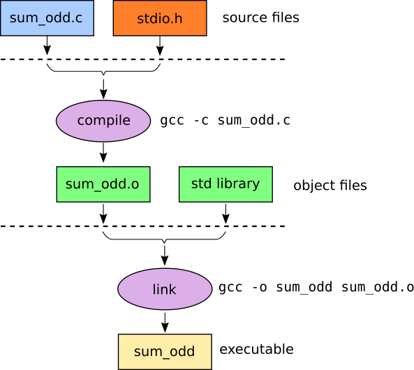

# Programmation orientée système

[TOC]


## W1-Introduction  

Les principaux types élémentaires définis en C sont : `int`,`double`et `char`. 

**Remarque** : en C, il n'y a pas de type « chaîne de caractères » (`string`). En C89 il n'y a pas de booléen. (depuis C99 : type `bool` dans `stdbool.h`)

**⚠️Attention** en C il faut toujours initialiser ses variables. Elle ne sont **pas** initialisée automatiquement comme en Java mais elle peuvent ( ne doivent pas ) être utilisée sans initialisation. 

### Données modifiables / non modifiable

Par défaut, les variables en C sont modifiables. 

En déclarant une variable `const`, on dit que *donnée ne pourra pas être modifiée via ce <u>nom de variable</u>*. 

**⚠️Attention: **cela n'assure pas l'invariabilité de la zone mémoire elle même car on peut modifier la mémoire directement. 

```c
int const a = 2 ; 
/*
code qui modifie la zone mémoire de a à 3 
*/
printf("%d",a) // affiche 3 
```

### Les opérateurs 

**L'opérateur =** 


en Java, oui . En C,non. 

En C, l'opérateur **=** modifie le contenu de son premier opérande (à gauche) : **sémantique de valeur**

⚠️ L'opérateur de division entière vs régulière : `5/2 = 2` et `5.0/2 = 2.5`


**Quelques particularités de C** : 

1. Toutes les expressions font quelque chose *et* retournent quelque chose. 
2. N'importe quel expression a une valeur logique ( toute value qui n'est pas `0` est considérée `true`)

*Conséquences:* 

*  La différence entre `x++ `et `++x` : 


En C, la seule différence a donc lieu si l'on utilise la valeur de ces expressions... ...ce qui est fortement déconseillé !

* `x = 3` : affecte la valeur 3 à la variable x (et donc modifie cette dernière) 

  `x == 3` : teste la valeur de la variable x, renvoie `vrai`  si elle vaut 3 et `faux`  sinon (et donc ne modifie pas la valeur de x) 

  Cependant  `if (x = 3)` est tout à fait accepté par le compilateur. ⚠️

**L'évaluation paresseuse: **

Les opérateurs logiques `&&` et `||` effectuent une évaluation "paresseuse" : 

L'évaluation des arguments se fait de la gauche vers la droite et seuls les arguments strictement nécessaires à la détermination de la valeur logique sont évalués.

exemple : `(x != 0.0) && (3.0/x > 12.0)` , le second terme n'est pas évalué si x non nul. 


## W2-Boucles et structures de contrôle 

* Eviter les variables globales. 

* En C (contrairement à Java) Un sous-bloc peut redéfinir une variable de même nom. Elle a pour portée ce bloc et masque la variable du bloc contenant. 

  exemple ( à éviter )

  ```C
  #include <stdio.h>
  int const MAX = 5;
  int main(void) {
      int i = 120;
      
      { int i = 1;
          for (; i < MAX; ++i) {
          	printf("%d ", i);
          }
      }
      printf("%d\n", i);
  return 0;
  }
  // 1,2,3,4
  ```

  

* Conseil : utilisez toujours la syntaxe avec des blocs, même si vous n'avez qu'une seule instruction. 

  ```C
  if (fabs(x) > EPSILON) { // if (x != 0.0) à la précision EPSILON
      printf("%f\n", 1.0/x); 
  } 
  else { 
      puts("erreur : x est nul."); 
  }
  ```

* ```C
  while (condition)
  	Instructions //soit un bloc , soit une expression qui se finit avec ;  
  
      
  do
  	Instructions // soit un bloc , soit une expression qui se finit avec ; 
  while (condition); //PRIVILIGIER LES BLOCS
  ```

  

* L'utilisation de `break` et `continue`est découragée. 

  * 

  ```C
  while (1) {							  do {
  Instruction 1;							instruction 1; 
  	/* ... */							/* ... */ 
  	if (condition d arrêt)         ==> }
  	break;								while (!condition d arret); 
  }									  autres instructions;
  autres instructions;
  
  ```

  ```C
  int i;
  ...
  i = 0;
  while (i < 100) {
  	++i;
      if ((i % 2) == 0) continue;
      /* la suite n'est exécutée que pour les entiers ... */
      Instructions;
      ...
  }
  suite; // i = 100
  
  
  // devient 
  int i = 1 ; 
  for( i = 1; i < 100 ; i+=2 ){
     	Instructions; 
  }
  suites;  // probleme ici i = 101
  
  // probleme, si suite utilise i 
  // solution i-- ou  i = 100 ( i-- mieux)
  ```

  Conseil : Ne jamais faire de copier/coller en programmant. 

  * rend la mise à jour de ce programme plus difficile : reporter chaque modification de P dans chacune des copies de P 
  * réduit fortement la compréhension du programme résultant 
  * augmente inutilement la taille du programme( `i = 100`au dessus est du copier collé ) 

* **Prototypage** :

  Le prototypage est la déclaration de la fonction sans en définir le corps.

  ```c
  double moyenne(double x, double y);
  double moyenne (double,double); // possible mais déconseillé 
  ```

  Une fonction ne peut être appelée que si elle prototypée où déclarée( la déclaration compte comme prototype ).

  Le prototypage sera utile quand on a un projet à plusieurs fichiers. 

* **Fonction sans arguments ** : Il faut mettre `void `au lieu des arguments. 

  ```C
  int saisie_entier(void) {
      int i;
      printf("entrez un entier: ");
      scanf("%d", &i);
  	return i;
  }
  ```

  `Type f();` n'est pas accepté en C : "deprecated feature"

* **Passage par valeurs vs Passage par référence **

  Les passage d'arguments est fait toujours par valeurs.

  Le passage par référence  est simulé en passant *la valeur du pointeur* :  

  ```C
  void f(int* x) { // passage par « référence »
  	*x = *x + 1;
  	printf("x=%d", *x);
  }
  int main(void) {
      int val = 1;
      f(&val);
      printf(" val=%d\n", val);
  	return 0;
  }
  
  ```

* **Pas de surcharge en C** : 

  On ne peut définir deux fonctions avec le même nom mais avec des listes d'arguments différents . Si on veut une fonction qui affiche des int ou des double , en doit les nommer différemment : `display_int`et `display_double`


# Astuces PPOS 

La compilation se fait en deux étapes. 

- l'étape de *compilation* proprement dite :
  - la syntaxe est vérifiée ;
  - les variables et appels aux fonctions sont vérifiés pour s'assurer que toutes les déclarations existent ;
  - résultat : "objets"  (l'extension `.o`)
- l'étape "*d'édition de liens*" (*linking*) :
  - il est vérifié que les appels aux fonctions correspondent à leur définition ;
  - il est vérifié qu'une et une seule définition existe pour chacune des fonctions appelées ;
  - résultat : **exécutable**



**création de l'objet **

```C
gcc -c sum_odd.c -o sum_odd.o
```

**Linking**

````C
gcc -o sum_odd sum_odd.o
````

### Protection contre les inclusions multiples

Que se passe-t-il si par erreur on met deux fois un  `#include <stdio.h>`  dans un de vos programmes ?

Si les fichiers `.h` ne sont pas protégés contre cela (inclusions multiples), le compilateur risque de refuser de compiler. 

Il est pour cela nécessaire de protéger les fichiers `.h` contre les inclusions : 

```C
#pragma once
```

Cela doit être la toute première ligne de vos fichiers `.h`. 

**Solution : MAKEFILE **