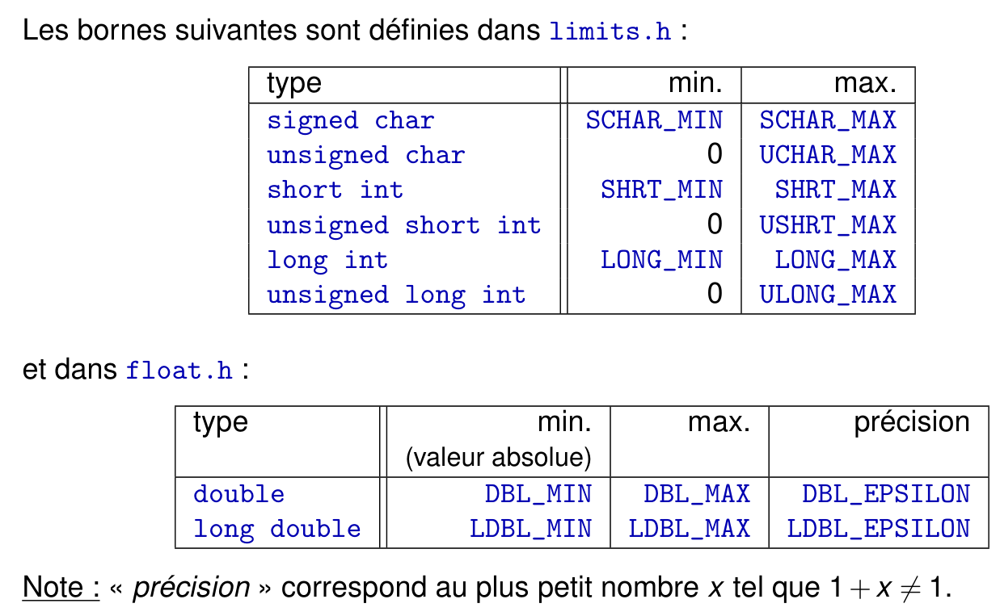
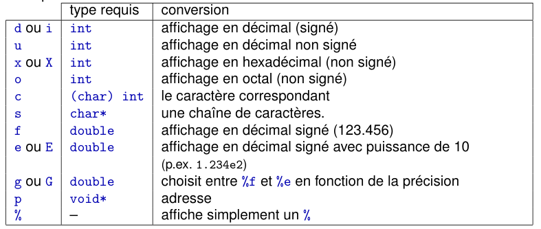
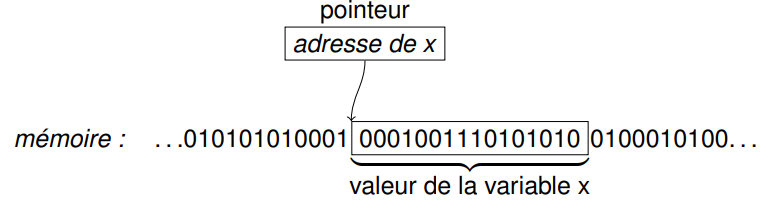
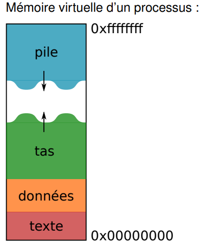

# Programmation orientée système

[TOC]


## W1-Introduction 

**Les principaux types élémentaires définis en C sont : `int`,`double`et `char`. 

Remarque : en C, il n'y a pas de type « chaîne de caractères » (`string`). En C89 il n'y a pas de booléen. (depuis C99 : type `bool` dans `stdbool.h`)

⚠️Attention en C il faut toujours initialiser ses variables. Elle ne sont pas initialisée automatiquement comme en Java mais elle peuvent ( ne doivent pas ) être utilisée sans initialisation. 

### Données modifiables / non modifiable 

Par défaut, les variables en C sont modifiables. 

En déclarant une variable `const`, on dit que *donnée ne pourra pas être modifiée via ce <u>nom de variable</u>*. 

⚠️**Attention**: cela n'assure pas l'invariabilité de la zone mémoire elle même car on peut modifier la mémoire directement. 

```c
int const a = 2 ; 
/*
code qui modifie la zone mémoire de a à 3 
*/
printf("%d",a) // affiche 3 
```


### Les opérateurs 

**L'opérateur =** 

****

en Java, oui . En C,non. 

En C, l'opérateur = modifie le contenu de son premier opérande (à gauche) : sémantique de valeur

⚠️ L'opérateur de division entière vs régulière : `5/2 = 2` et `5.0/2 = 2.5`


**Quelques particularités de C :** 

1. **Toutes les expressions font quelque chose *et* retournent quelque chose. 
2. N'importe quel expression a une valeur logique ( toute value qui n'est pas `0` est considérée `true`)

***Conséquences:*** 

*  **La différence entre `x++ `et `++x` : 


En C, la seule différence a donc lieu si l'on utilise la valeur de ces expressions... ...ce qui est fortement déconseillé !

* `x = 3` : affecte la valeur 3 à la variable x (et donc modifie cette dernière)** 

  **`x == 3` : teste la valeur de la variable x, renvoie `vrai`  si elle vaut 3 et `faux`  sinon (et donc ne modifie pas la valeur de x) 

  Cependant  `if (x = 3)` est tout à fait accepté par le compilateur. ⚠️

L'évaluation paresseuse: 

Les opérateurs logiques `&&` et `||` effectuent une évaluation "paresseuse" : 

L'évaluation des arguments se fait de la gauche vers la droite et seuls les arguments strictement nécessaires à la détermination de la valeur logique sont évalués.

exemple : `(x != 0.0) && (3.0/x > 12.0)` , le second terme n'est pas évalué si x non nul. 


## W2-Boucles et structures de contrôle

* Eviter les variables globales. 

* En C (contrairement à Java) Un sous-bloc peut redéfinir une variable de même nom. Elle a pour portée ce bloc et masque la variable du bloc contenant. 

  exemple ( à éviter )

  ```C
  #include <stdio.h>
  int const MAX = 5;
  int main(void) {
      int i = 120;
      
      { int i = 1;
          for (; i < MAX; ++i) {
          	printf("%d ", i);
          }
      }
      printf("%d\n", i);
  return 0;
  }
  // 1,2,3,4
  ```

  ****

* Conseil : utilisez **toujours** la syntaxe avec des blocs, même si vous n'avez qu'une seule instruction. 

  ```C
  if (fabs(x) > EPSILON) { // if (x != 0.0) à la précision EPSILON
      printf("%f\n", 1.0/x); 
  } 
  else { 
      puts("erreur : x est nul."); 
  }
  ```

* ```C
  while (condition)
  	Instructions //soit un bloc , soit une expression qui se finit avec ;  
  
      
  do
  	Instructions // soit un bloc , soit une expression qui se finit avec ; 
  while (condition); //PRIVILIGIER LES BLOCS
  ```

  

* L'utilisation de `break` et `continue`est **découragée**. 

  * 

  ```C
  while (1) {							  do {
  Instruction 1;							instruction 1; 
  	/* ... */							/* ... */ 
  	if (condition d arrêt)         ==> }
  	break;								while (!condition d arret); 
  }									  autres instructions;
  autres instructions;
  
  ```

  ```C
  int i;
  ...
  i = 0;
  while (i < 100) {
  	++i;
      if ((i % 2) == 0) continue;
      /* la suite n'est exécutée que pour les entiers ... */
      Instructions;
      ...
  }
  suite; // i = 100
  
  
  // devient 
  int i = 1 ; 
  for( i = 1; i < 100 ; i+=2 ){
     	Instructions; 
  }
  suites;  // probleme ici i = 101
  
  // probleme, si suite utilise i 
  // solution i-- ou  i = 100 ( i-- mieux)
  ```

  **Conseil** : Ne jamais faire de copier/coller en programmant. 

  * rend la mise à jour de ce programme plus difficile : reporter chaque modification de P dans chacune des copies de P 
  * réduit fortement la compréhension du programme résultant 
  * augmente inutilement la taille du programme( `i = 100`au dessus est du copier collé ) 

* **Prototypage :**

  Le prototypage est la déclaration de la fonction sans en définir le corps.

  ```c
  double moyenne(double x, double y);
  double moyenne (double,double); // possible mais déconseillé 
  ```

  Une fonction ne peut être appelée que si elle prototypée où déclarée( la déclaration compte comme prototype ).

  Le prototypage sera utile quand on a un projet à plusieurs fichiers.*

* **Fonction sans arguments ** : Il faut mettre `void `au lieu des arguments. 

  ```C
  int saisie_entier(void) {
      int i;
      printf("entrez un entier: ");
      scanf("%d", &i);
  	return i;
  }
  ```

  `Type f();` n'est pas accepté en C : "deprecated feature"

* **Passage par valeurs vs Passage par référence** 

  Les passage d'arguments est fait **toujours** par **valeurs**.

  Le passage par référence  est simulé en passant *la valeur du pointeur* :  

  ```C
  void f(int* x) { // passage par « référence »
  	*x = *x + 1;
  	printf("x=%d", *x);
  }
  int main(void) {
      int val = 1;
      f(&val);
      printf(" val=%d\n", val);
  	return 0;
  }
  
  ```

* **Pas de surcharge en C :** 

  On ne peut **pas** définir deux fonctions avec le même nom mais avec des listes d'arguments différents . Si on veut une fonction qui affiche des int ou des double , en doit les nommer différemment : `display_int`et `display_double`

## W3- Types avancés , tableaux et structs :

### Modificateur de type 

* pour `int` et `double` on peut ajouter `long` pour avoir un plus grand nombre de bits : `long int n; `a plus de bits que `int`. 
* On peut avoir moins de bits pour les `int`avec `short int n;`
* pour `int` et `char` on peut utiliser `unsigned int n;` pour travailler avec des positifs ; 

En C, la taille des types n'est pas spécifiée ( on ne sait pas combien de bit a le type `int`par exemple) dans la norme.
Seules indications :

* le plus petit type est char

* les inégalités suivantes sont toujours vérifiées sur les tailles mémoires :
  `char ≤ short int ≤ int ≤ long int`
  `double ≤ long double`  

**Pour spécifier la taille :** 

* **`int8_t`, `uint8_t`, ..., `int64_t`, `uint64_t` (définis dans `stdint.h`)**

  **Bornes :** 

  **** 

**Piège arithmétique :** 

Ce code contient une faille , où est-elle ?

```C
int index = demander_nombre();
if (index < 0){ index = -index; }
if (index >= MAX) { index = MAX-1;}
utilisation(tableau[index]);
```

Il ne marque pas pour `INT_MIN` car `-INT_MIN = INT_MIN`et donc on va essayer accéder à un indice négatif. ( cela a un rapport avec la représentation en Complément à deux). 

Pour la même raison `abs(x)<0` est possible.  

Quels sont les int x tel que x == -x?`0 ET INT_MIN` ou l'équivalent pour d'autres types(`LONG_MIN`). 

### Enum

**`enum Type { valeur1, valeur2, ... };` par exemple : 

```C
enum CantonRomand { Vaud, Valais, Geneve, Neuchatel, Fribourg, Jura };
```

On peut les utiliser avec `switch` :

```C
enum CantonRomand moncanton = Vaud;
...
moncanton = Valais;
...
switch (moncanton) {
    case Valais: ... ; break;
    case Vaud:
	... ; break;
}
```

On peut même les utiliser comme entiers, sachant que la convention utilisée est que la première valeur énumérée (`Vaud` dans l'exemple précédent) correspond à `0`.On pourrait alors par exemple faire : 

```C
int const NB_CANTONS_ROMANDS = Jura+1;
ou encore
for (i = Vaud; i <= Jura; ++i) ...
ou alors 
population[moncanton] = 616;
```

### Tableaux 

**Différent des tableaux de Java. En `C` les tableaux à taille variable n'existent pas. 

Déclaration : `type identificateur[taille];` ex : `int age[5];` (il ne faut pas utiliser les magic numbers comme ici `5`)


 **Les VLA : variable length array**  

Le code suivant n'est pas un tableau statique mais une VLA , la taille du tableau ne change pas, mais elle n'est pas connue à la compilation. 

```C
size_t const NB_CANTONS = 26;   // pas conne à la compilateur
							   // on aussi faire scanf("%d",NB_CANTONS); 
double superficie[NB_CANTONS];
```

**⚠️ le nom VLA est trompeur car la taille reste fixe.** 

```C
#define NB_CANTONS 26         //  C'est une macro : connue à la compilation 
double superficie[NB_CANTONS];    
```

**Syntaxe :**

```C
int age[5] = { 20, 35, 26, 38, 22 };
int age[] = { 20, 35, 26, 38, 22 }; // DEUX INTIALISATIONS EQUIVALENTES

int age[BIG_N] = { 0 }; // TOUT LE TABLEAU INITIALISE à 0 
```

**Syntaxe avancée :** 

Depuis C99, on peut initialiser partiellement un tableau avec la syntaxe :`{ [n] = val1, ... , valq }`
**Note : ** le reste du tableau reste initialisé à 0.**
Par exemple :

```C
double tablo[N] = { [2] = 0.5 }; // 0.0, 0.0, 0.5, 0.0, ...

int tab[MAX] = {
1, 2, 3, 4, 5,
// commence par faire : tab[0]=1, tab[1]=2, ...
[MAX-5] = 9, 8, 7, 6
// puis : tab[MAX-5] = 9, tab[MAX-4] = 8, ...
// le reste est initialisé à 0
};
// Pour MAX= 6, tab contient 1, 9, 8, 7, 6, 0
```

**Remarques :** 

* ⚠️ ⚠️ Il n'y a pas de vérification de débordement sur les indices du tableau. 

* Un tableau n'a pas connaissance de la taille , il faut toujours l'enregistrer , la passer aux fonctions ... 

```C
int f(double tableau[], size_t const taille);
```

Toutes les déclarations suivantes sont équivalent et ne passent pas la taille du tableau : 

```C
int f(double tableau[TAILLE]);
int f(double tableau[]);
int f(double* tableau);
```

⚠️**Attention** ! Le passage d'un tableau à une fonction se fait toujours par référence , bien que ce ne soit pas explicitement marqué par le signe `&`.

Si on ne veut pas une telle modification, on ajoute `const ` à la déclaration. 

```C
int f(const double tableau[], size_t const taille){
    // ci on essaye de modifier tableau ici , une erreure se produit. 
}
```

### Alias de types : typedefs

définir un nouveau nom de type : `typedef type alias;`. ça permet de clarifier les types: 

```C
typedef double Vecteur[N]; // comme une déclaration de variable double tableau[N]
						  // et remplacer le nom de variable par le nouveau nom 
						  // tableau => vector  on a alors : double Vecteur[N]
double produit_scalaire(Vecteur a, Vecteur b);
```

Les utilisations `typedef` est encouragée pour éclaircir les concepts dans le code. 

### Structs 

une `struct` est une sorte d'objet avec des  attribut publiques et sans fonctions. 

```C
struct Nom_du_type {
    type1 identificateur1 ;
    type2 identificateur2 ;
    ...
};
// example 

```

```C
struct Personne {
    char nom[TAILLE_MAX_NOM];
    double taille;
    int age;
	char sexe;
};

struct Personne untel; // la déclaration : struct type nom_de_la_variable

// MIEUX : utiliser typedef : pour éviter de déclarer avec struct
typedef struct
{
    char nom[TAILLE_MAX_NOM];
    double taille;
    int age;
    char sexe;
} Personne;
// puis 
Personne untel;
// pour 
initialiser  
Personne untel = { "Dupontel", 1.75, 20, 'M' };
// acces au champ de la struct 
untel.taille = 1.75;
// si la struct est passée par réference ( pointeur ) on utilise -> au lieu de . 
void anniversaire(Personne* p) {
	++(p->age); // un an de plus ! on peux aussi paire (*p).age
}

```

**Affectation de struct**

```C
Personne p1 = { "Durand", 1.75, 20, 'M' };
Personne p2;
p2 = p1;
// équivalent à 
p2.nom=p1.nom; p2.taille=p1.taille; p2.age=p1.age; p2.sexe=p1.sexe;
```

⚠️ le seul opérateur global est `=` (affectation) , `==` n'existe pas , il faut faire soit même une fonction qui compare tout. 

**union**

````C
typedef union {
	int i;
	double d;
} Int_or_Double;

Int_or_Double x; // x a un attribut i , OU .d mais les deux
x.i = 3; // x.d a été modifié ici 
...
x.d = 9.87;// x.i at
````

## W4- Entrées sorties 

### Printf 

`int printf("FORMAT", expr1, expr2, ...)`

**Important :** `printf` retourne le nombre de caractères écrits ou une valeur négative en cas d'échec.

Tous les caractères ordinaires (sauf ’%’) sont recopiés tels quels

* ’%’ introduit une conversion de valeur spécifiée par 1 caractère
   entre le ’%’ et le caractère de spécification de conversion peuvent  apparaître
*  ’-’ : ajustement à gauche dans le champ
*  ’+’ : toujours afficher le signe (nombres)
*  ’ ’ : met un espace si le premier caractère n’est pas un signe (en clair : pour les
  nombre positifs, et sans l’option +)
*  ’#’ : indicateur explicite de format : ajoute un 0 devant les nombres en octal, un 0x ou
  0X devant les nombres en hexadécimal, un point systématique pour les double.
*  ’0’ : compléter le champ par des 0 non significatifs
*  des nombres : taille minimale du champ
   ’*’ : taille du champ donné par une variable supplémentaire
* ’.’ suivit d’un nombre ou de ’*’ : la « précision »
* un indicateur de taille de l'objet : h pour short, l pour long et L pour long double.



````C
double x = 10.4276;
double y = 123.456789;
double z = 4.0;
char nom[] = "ABCDEFGH";
// 5 ici c'est le nombre minimal de caractères. .2 : deux nombres après la virgules.  
printf(">%5.2f%%<\n",x); // >10.43%<    

printf(">%7.2f%%<\n",x); // >  10.43%<  , remarquer les dex espaces, c'est à case du 7 
printf(">%3.2f%%<\n\n", x); // >10.43%< (le « .2 » est prioritaire sur le « 3 »)

printf("XX%5.4sXX\n",nom); // XX ABCDXX (4 caractères au maximum affichés sur 5 « places »)


printf("XX%+12.4fXX\n",y); // XX+123.4568XX , pour forcer l'affichage du signe , mettre + 
printf("XX%+012.4fXX\n",y); // XX+000123.4568XX , +quelque chose , ajoute quelquechose au lieu des espace pour padder 
printf("XX%012.4fXX\n",y); // XX0000123.4568XX
printf("XX%-+12.4fXX\n",y); // XX+123.4568XX , ajuste à gauche 
    
printf("%.2f\n",z); // 4.00
printf("%.2g\n",z); // 4  , %g se rend compte que c'est un int , il s'adape 
printf("%#.2g\n", z); // 4.0 , pas besoin de print 4.00 , %g s'adapte
````


⚠️`printf` n'affiche pas toujours quelque chose! En fait printf envoie ses messages dans un **tampon** (buffer). 

Pour forcer l'affichage `fflush(stdout)`

### scanf 

`int scanf("FORMAT", pointeur1, pointeur2, ...)`

Retourne `1` si la lecture s'est faite sans erreur. 

Remarque : Lorsque plusieurs valeurs sont lues à la suite, le caractère séparateur de ces valeurs est **le blanc** ( le blanc est ce que `isspace`accepte)

* `scanf("%[A-Z]", chaine);` Lire que des majuscules
* `scanf("%[ˆ\n]", chaine)` Lire tout sauf ce qui suis ^ , donc ici tout sauf les retours à la ligne. 
* `scanf(" %[ˆ\n]", chaine)`Lire tout sauf blancs initiaux et retours à la ligne. 
* **différence avec printf** lire un double avec ` %lf` 
* `scanf("%d%*d%lf", &i, &x)` saute un champ, ex : `3 4 5` alors 5 dans x et 3 dans i.

```C
do {
    printf("Entrez un nombre entre 1 et 10 : ");
    fflush(stdout);
	scanf("%d", &i);
} while ((i < 1) || (i > 10)); // si on rentre a => boucle infinie 

// solution : 
do {
    printf("Entrez un nombre entre 1 et 10 : "); fflush(stdout);
    j = scanf("%d", &i);
    if (j != 1) {
        printf("Je vous ai demandé un nombre, pas du charabia !\n");
        
        // cette ligne vide le tampon , lire tant qu'on a pas atteint la fin de stdin ou qu'il ny'a pas d'erreur sur stdin 
        while (!feof(stdin) && !ferror(stdin) && getc(stdin) != '\n');
    }
} while (!feof(stdin) && !ferror(stdin) && ((j!=1) || (i<1) || (i>10)));
```

`stderr` est un flot fait pour afficher les erreurs. Il faut l'utiliser pour les messages d'erreurs. 

Mais comment ?

### Fichiers 

Pour ouvrir un flot : 

```C
FILE* entree = NULL;
char nom_entree[FILENAME_MAX+1];
...
entree = fopen(nom_entree, "r"); // en mode lecture : READ
```

Dans le cas des fichiers textes (fichiers lisibles par les humains), les « modes » d'ouverture possibles sont :

* r en lecture

* w en écriture (écrasement)

* a en écriture (à la fin)
* b pour manipuler des fichers binaires 
* On peut combiner : `fichier3 = fopen(nom3, "a+b")`  

En cas d'erreur d'ouverture, la fonction `fopen` retourne la valeur `NULL`.

```C
entree = fopen(...);
if (entree == NULL) {
/* gestion de l'erreur */
} else {
/* suite (avec un fichier entree valide) */
}
```

On peut utiliser le flot ouvert avec `fprintf` , `fscanf`. 

```C
FILE* entree = NULL;
FILE* sortie = NULL;
// ouvrir ici ... 
/* lit un entier dans le fichier "entree" */
fscanf(entree, "%d", &i);
/* et l'écrit dans le fichier "sortie" */
fprintf(sortie, "%d\n", i);
```

Toujours vérifier la fin de ficher et l'erreur: `while ( !feof(entree) && !ferror(entree) )`

⚠️ **NE PAS oublier** de fermer tout fichier ouvert! on fait : `fclose(FILE*)`

#### Fichiers binaires :

Il faut pour cela : 

* ouvrir le fichier pour une écriture en binaire
  sortie = `fopen(nom_fichier, "wb");`
*  utiliser la commande `fwrite` au lieu de `fprintf` :
  `size_t fwrite(const void* ptr, size_t taille_el,size_t nb_el, FILE* fichier);`
  `fwrite` écrit dans le fichier fichier, `nb_el éléments`, chacun de taille `taille_el`, stockés en mémoire à la position pointée par `ptr`.
  `fwrite` retourne le nombre d'éléments effectivement écrits.

Regarder les slides(4) pour des exemples typiques le lecture / écriture. 

**Repositionner la tête de lecture**: `fseek` , `ftell` , `rewind`, `ferror` et `clearerr`

## W5-Pointeurs

Pourquoi les pointeurs ? 

* à permettre un partage d'objet *sans copies* entre divers bouts de code.

   ☞ **Reference**

  Pour ne pas faire de copies de `struct` par exemple

* à pouvoir choisir des éléments non connus a priori ☞**généricité** : 

   exemple : Choisir une fonction : 

  ```C
  typedef double (*Fonction)(double);
  
  double integre(Fonction f, double a, double b) { ... }
  
  integre(f1, a, b)  		// 
  integre(&f1, a, b)		// ces deux lignes équivalentes 
  ```

* à pouvoir manipuler des objets dont la durée de vie (≃ portée dynamique) dépasse les blocs dans lesquels ils sont déclarés (portée, au sens syntaxique) ☞ **allocation dynamique**

**Qu'est-ce qu'un pointeur ? **

Le pointeur sur une variable est l'adresse de l'emplacement mémoire qui contient sa valeur.



**Comprendre les pointeurs**

Un pointeur c'est comme la page d'un carnet d'adresse

* *déclarer un pointeur*  :  ajouter une page dans le carnet (mais cela ne veut pas dire qu'il y a une adresse écrite dessus ! )

  ```C
  int* ptr = &i;
  int* ptr = NULL; /* ne pointe NULLe part */
  ```

* *allouer un pointeur p :* aller construire une maison quelque part et noter son adresse sur la page p (mais p n'est pas la maison, c'est juste la page qui contient l’adresse de cette maison !)

**Le contenu de cette semaine n'est pas fini.** 

## W6-Allocation dynamique 

Il y'a 2 façons de déclarer des variables :

1. déclarer des variables. 
2. allouer dynamiquement de la mémoire pendant l'exécution d'un programme. 



Les variables sont stockés dans la pile (**stack**) : que quelques Mo. 

Tout ce qui est alloué dynamiquement est dans le **tas**. 

### malloc et calloc 

* `pointeur = malloc(taille);`

  réserve une zone mémoire de taille `taille` et met l'adresse correspondante dans `pointeur`. 

  Pour aider à spécifier la taille , on peut utiliser : `sizeof`

* `pointeur =  calloc(size_t nb_elements, size_t taille_element) ` 

  allouer de la mémoire consécutive pour plusieurs variables de même type (typiquement un tableau, dynamique), on préfèrera `calloc` à 

  `void* calloc(size_t nb_elements, size_t taille_element)`;

  Par exemple pour allouer de la place pour 3 double consécutifs :

   `pointeur = calloc(3, sizeof(double));`

* **Différences** entre `calloc` et `malloc` : Préférer **toujours** `calloc` à `p = malloc(n * sizeof(Type))` 

  * ⚠️ `p = malloc(n * sizeof(Type))`  peut engendrer un **overflow** sur la multiplication

  * calloc` initialise à 0 (le contenu de) la zone allouée contrairement à `malloc`

    ​	**toujours** initialiser quand on utilise `malloc` 

    ​	On peut utiliser ` memset(ptr, 255, sizeof(*ptr));`

* `free(pointeur)` : libère la zone mémoire pour qu'elle puisse être utilisée pour autre chose . 

  * Mais le pointeur pointe toujours vers cette zone mémoire ,⚠️ **il ne faut pas utiliser ce pointeur** :  pour cela : 

    > Un `free(pointeur)` doit toujours être précédé par `pointeur = NULL` 

* > **Règle absolue :** Toute zone mémoire allouée par un `[cm]alloc` doit impérativement être libérée par un `free` correspondant !


**Vérification d'une Allocation correcte**

Les fonctions `malloc` et `calloc` retournent `NULL` si l'allocation n'a pas pu avoir lieu.

```C
pointeur = calloc(nombre, sizeof(type));
if (pointeur == NULL) {
/* ... gestion de l’erreur ... */
/* ... et sortie (return code d’erreur) */
}
/* suite normale */

```

### Tableau dynamique 

```C
vector* vector_construct(vector* v) {
if (v != NULL) {
    vector result = { 0, 0, NULL };
    result.content = calloc(VECTOR_PADDING, sizeof(type_el));
    if (result.content != NULL) {
    result.allocated = VECTOR_PADDING;
    } else {
    // retourne NULL si on n'a pas pu allouer la mémoire nécessaire
    return NULL;
    }
    // écriture atomique
	*v = result;
}
return v }
```

⚠️  OFFRIR UNE FONCTION POUR `free`

```C
void vector_delete(vector* v) {
    if ((v != NULL) && (v->content != NULL)) {
    free(v->content);
    v->content = NULL;
    v->size = 0;
    v->allocated = 0;
    }
}

```

 Utilisation de `realloc`   pour agrandir le tableau ⚠️ ne jamais `faireptr = realloc(ptr,...)`

```C
vector* vector_enlarge(vector* v) {
if (v != NULL) {
    vector result = *v;
    result.allocated += VECTOR_PADDING;
    if ((result.allocated > SIZE_MAX / sizeof(type_el)) ||
    ((result.content = realloc(result.content,
    result.allocated * sizeof(type_el)))
    == NULL)) {
    return NULL; /* retourne NULL en cas d'échec ;
    * v n'a pas été modifié. */
    }
    // affectation finale, tout d'un coup
    *v = result;
    // SI IL Y'A UNE ERROR v RESTE INTACT 
    }
    return v;
}
```

*  ⚠️` (result.allocated > SIZE_MAX / sizeof(type_el))` et pas
   `(result.allocated * sizeof(type_el)> SIZE_MAX)` cette dernier peut OVERFLOW

  
