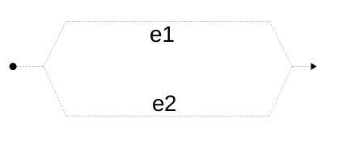
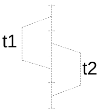

# Parallelism and Concurrency 

[TOC]


**Parallelism** : In parallel computing, multiple parts of a program execute at the same time , on separate processors for example, with the goal of speeding up computations. 

**Concurrency : ** concurrent computing consists of process *lifetimes* overlapping, but execution need not happen at the same instant.( process 1 then process 2 then process 1 again ... )

# Parallelism 

## Week 1 : Basics of parallel computing and parallel program analysis

We will try to unsure the following *important* property :

> **No Race Conditions :** If one parallel thread writes to a variable (or array entry), no other thread may read or write this variable at the same time. 

 

### Our first parallel program 

Suppose we cant to compute the norm of a vector $\left(\sum\limits_{i=1}^n|a_i|^p\right)^{1/p}\quad\text{}$ 

The following program can do it from us when we call `sumSegment(a,0,n-1)`

```scala
def sumSegment(a: Array[Int], p: Double, s: Int, t: Int): Int = {
    var i= s; var sum: Int = 0
        while (i < t) {
            sum= sum + power(a(i), p)
            i= i + 1
        }
    sum
}
```

We can also split the to sum to two sums $(\sqrt{\sum_{i=0}^{m-1}{|a_i|^2} +\sum_{i=m}^{N-1}|a_i|^2}$ 

```scala
def pNormTwoPart(a: Array[Int], p: Double): Int = {
    val m = a.length / 2
    val (sum1, sum2) = (sumSegment(a,p, 0, m), sumSegment(a,p, m, a.length))
power(sum1 + sum2, 1/p)
```

Non can we run the two parts in *parallel* : 

suppose we have access to `parallel(e1,e2)` that computes `e1` and `e2` in parallel and return the pair of results. 

```scala
val (sum1, sum2) = 
    parallel(sumSegment(a, p , 0, m), sumSegment(a, m, a.length))
```



Splitting the task in 4 is easy, now what if we have an unlimited number of threads : we use recursion.  

```scala
def segmentRec(a: Array[Int], p: Double, s: Int, t: Int) = {
if (t - s < threshold)
	sumSegment(a, p, s, t)
// small segment: do it sequentially
else {
    val m = s + (t - s)/2
    val (sum1, sum2) = parallel(segmentRec(a, p, s, m),
								segmentRec(a, p, m, t))
sum1 + sum2 } }
```

The signature of parallel would be as follows : 

```scala
def parallel[A, B](taskA: => A, taskB: => B): (A, B) = { ... }
```

Notice that it takes arguments *by name* `task1: => A` , because we do not want to evaluate them yet . If it was not the case , execution would be *sequential*.

**Parallelism is not always the solution : **

```scala
def sum1(a: Array[Int], p: Double, s: Int, t: Int): Int = {
    var i= s; var sum: Int = 0
    while (i < t) {
    	sum= sum + a(i) // no exponentiation!
    	i= i + 1
    }
sum }

val ((sum1, sum2),(sum3,sum4)) = parallel(
                    parallel(sum1(a, p, 0, m1), sum1(a, p, m1, m2)),
                    parallel(sum1(a, p, m2, m3), sum1(a, p, m3, a.length)))
```

`sum1`doesn't get faster when parallelized , contrarily to `sumSegment`. 

WHY ? Because when we do not use exponentiation (which is very time consuming ) the code is so fast that the bottleneck becomes the RAM. 

### Tasks : 

Instead of : 

```scala
val (v1, v2) = parallel(e1, e2)
```

we can write : 

```scala
val t1 = task(e1)
val t2 = task(e2)
val v1 = t1.join
val v2 = t2.join
```



▶ `t.join` blocks and waits until the result is computed
▶ subsequent `t.join` calls quickly return the same result

We can now implement `parallel` ourselves :

```scala
def parallel[A, B](cA: => A, cB: => B): (A, B) = {
    val tB: Task[B] = task { cB }
    val tA: A = cA
    (tA, tB.join)
}
```


be careful , this is not parallel 

```scala
def parallelWrong[A, B](cA: => A, cB: => B): (A, B) = {
    val tB: B = (task { cB }).join
    val tA: A = cA
	(tA, tB.join)
}
```

### Asymptotic analysis of parallel algorithms : 

```scala
e1
e2 
```

Total running time = running time(e1) + running time(e2)

```scala
parallel(e1,e2)
```

Total running time is the maximum of the two running times. 

```scala
def segmentRec(a: Array[Int], p: Double, s: Int, t: Int) = {
    if (t - s < threshold)
    	sumSegment(a, p, s, t)
    else {
        val m= s + (t - s)/2
        val (sum1, sum2)= (segmentRec(a, p, s, m),
        				segmentRec(a, p, m, t))
sum1 + sum2 } }
```

we have the following recurrence: 


the solution is $O(t-s)$ 

if we parallel it : 

```scala
val (sum1, sum2)= parallel(segmentRec(a, p, s, m), segmentRec(a, p, m, t))
```


​	the solution is $O(log(t-s))$ 


**Work and depth :** 

Work W(e): number of steps e would take if there was no parallelism

* this is simply the sequential execution time
*  treat all parallel`(e1,e2)` as `(e1,e2)`

Depth D(e): number of steps if we had unbounded parallelism

Key rules are:

* $W(parallel(e_1, e_2)) = W(e_1) + W(e_2) + c_2$
* $D(parallel(e_1, e_2)) = max(D(e_1), D(e_2)) + c_1$

we also have 

* $W(f(e_1, ..., e_n)) = W(e_1) + ... + W(e_n) + W(f)(v_1, ..., v_n)$

* $D(f(e_1, ..., e_n)) = D(e_1) + ... + D(e_n) + D(f)(v_1, ..., v_n)$

Here $v_i$ denotes values of $e_i$. If f is primitive operation on integers, then
$W(f)$ and $D(f)$ are constant functions, regardless of $v_i$.

**Time Estimate of parallel algorithm :**

* $D(e)$ assumes an unlimited number of thread or CPUs so $D(e)$ is our lower bound. 

* Regardless of $D(e)$, cannot finish sooner than $W(e)/P$ : every piece of work needs to be done

  So it is reasonable to use this estimate for running time:
$D(e) + \frac{W(e)}{P}$


so for `segmentRec` the time is $b1 \times log(t − s) + b2 + \frac{b3(t − s) + b4}{P}$


The speedup is $\quad\text{$1/\left(f+\dfrac{1-f}{P}\right)$}$ by Amdahl's law  


### Benchmarking parallel programs : 

Measuring performance is difficult – there multiples ways to enhance it's precision 

* multiple repetitions
*  statistical treatment – computing mean and variance
*  eliminating outliers
*  ensuring steady state (warm-up)
*  preventing anomalies (GC, JIT compilation, aggressive optimizations)

**ScalaMeter** is a library that helps with that , to use it : 

* add as dependency :

  ```scala
  libraryDependencies += ”com.storm-enroute” %% ”scalameter-core” % ”0.6” 
  ```

* use : 

  ```scala
  val time = measure {
      (0 until 1000000).toArray
      }
  println(s”Array initialization time: $time ms”)
  
  ```

  This is a naïve testing method. We will get very different result when running it multiple times. 

  WHY ? When a JVM program starts, it undergoes a period of *warmup*, after
  which it achieves its maximum performance ( at the *steady state*)

  So we should test *after* warmup : 

  ```scala
  import org.scalameter._
  val time = withWarmer(new Warmer.Default) measure {
  	(0 until 1000000).toArray
  }
  ```

  

  
