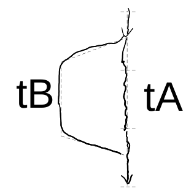
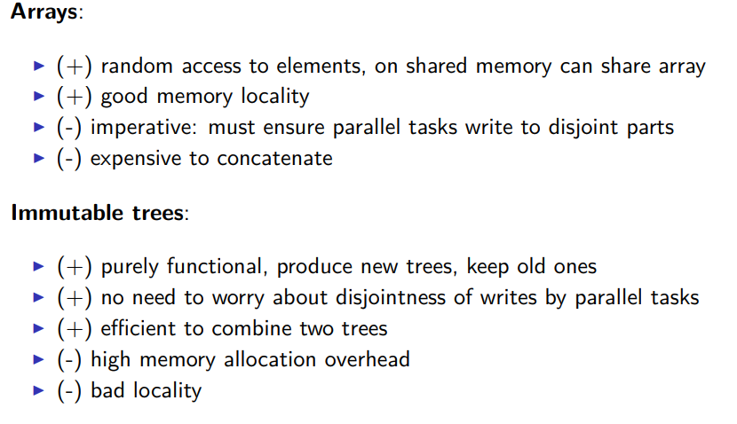
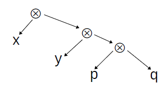

# Parallelism and Concurrency 

[TOC]


**Parallelism** : In parallel computing, multiple parts of a program execute at the same time , on separate processors for example, with the goal of speeding up computations. 

**Concurrency : ** concurrent computing consists of process *lifetimes* overlapping, but execution need not happen at the same instant.( process 1 then process 2 then process 1 again ... )

# Parallelism 

## Week 1 : Basics of parallel computing and parallel program analysis

We will try to unsure the following *important* property :

> **No Race Conditions :** If one parallel thread writes to a variable (or array entry), no other thread may read or write this variable at the same time. 

 

### Our first parallel program 

Suppose we cant to compute the norm of a vector $\left(\sum\limits_{i=1}^n|a_i|^p\right)^{1/p}\quad\text{}$ 

The following program can do it from us when we call `sumSegment(a,0,n-1)`

```scala
def sumSegment(a: Array[Int], p: Double, s: Int, t: Int): Int = {
    var i= s; var sum: Int = 0
        while (i < t) {
            sum= sum + power(a(i), p)
            i= i + 1
        }
    sum
}
```

We can also split the to sum to two sums $(\sqrt{\sum_{i=0}^{m-1}{|a_i|^2} +\sum_{i=m}^{N-1}|a_i|^2}$ 

```scala
def pNormTwoPart(a: Array[Int], p: Double): Int = {
    val m = a.length / 2
    val (sum1, sum2) = (sumSegment(a,p, 0, m), sumSegment(a,p, m, a.length))
power(sum1 + sum2, 1/p)
```

Non can we run the two parts in *parallel* : 

suppose we have access to `parallel(e1,e2)` that computes `e1` and `e2` in parallel and return the pair of results. 

```scala
val (sum1, sum2) = 
    parallel(sumSegment(a, p , 0, m), sumSegment(a, m, a.length))
```


Splitting the task in 4 is easy, now what if we have an unlimited number of threads : we use recursion.  

```scala
def segmentRec(a: Array[Int], p: Double, s: Int, t: Int) = {
if (t - s < threshold)
	sumSegment(a, p, s, t)
// small segment: do it sequentially
else {
    val m = s + (t - s)/2
    val (sum1, sum2) = parallel(segmentRec(a, p, s, m),
								segmentRec(a, p, m, t))
sum1 + sum2 } }
```

The signature of parallel would be as follows : 

```scala
def parallel[A, B](taskA: => A, taskB: => B): (A, B) = { ... }
```

Notice that it takes arguments *by name* `task1: => A` , because we do not want to evaluate them yet . If it was not the case , execution would be *sequential*.

**Parallelism is not always the solution : **

```scala
def sum1(a: Array[Int], p: Double, s: Int, t: Int): Int = {
    var i= s; var sum: Int = 0
    while (i < t) {
    	sum= sum + a(i) // no exponentiation!
    	i= i + 1
    }
sum }

val ((sum1, sum2),(sum3,sum4)) = parallel(
                    parallel(sum1(a, p, 0, m1), sum1(a, p, m1, m2)),
                    parallel(sum1(a, p, m2, m3), sum1(a, p, m3, a.length)))
```

`sum1`doesn't get faster when parallelized , contrarily to `sumSegment`. 

WHY ? Because when we do not use exponentiation (which is very time consuming ) the code is so fast that the bottleneck becomes the RAM. 

### Tasks : 

Instead of : 

```scala
val (v1, v2) = parallel(e1, e2)
```

we can write : 

```scala
val t1 = task(e1)
val t2 = task(e2)
val v1 = t1.join
val v2 = t2.join
```


▶ `t.join` blocks and waits until the result is computed
▶ subsequent `t.join` calls quickly return the same result

We can now implement `parallel` ourselves :

```scala
def parallel[A, B](cA: => A, cB: => B): (A, B) = {
    val tB: Task[B] = task { cB }
    val tA: A = cA
    (tA, tB.join)
}
```



be careful , this is not parallel 

```scala
def parallelWrong[A, B](cA: => A, cB: => B): (A, B) = {
    val tB: B = (task { cB }).join
    val tA: A = cA
	(tA, tB.join)
}
```

### Asymptotic analysis of parallel algorithms : 

```scala
e1
e2 
```

Total running time = running time(e1) + running time(e2)

```scala
parallel(e1,e2)
```

Total running time is the maximum of the two running times. 

```scala
def segmentRec(a: Array[Int], p: Double, s: Int, t: Int) = {
    if (t - s < threshold)
    	sumSegment(a, p, s, t)
    else {
        val m= s + (t - s)/2
        val (sum1, sum2)= (segmentRec(a, p, s, m),
        				segmentRec(a, p, m, t))
sum1 + sum2 } }
```

we have the following recurrence: 


the solution is $O(t-s)$ 

if we parallel it : 

```scala
val (sum1, sum2)= parallel(segmentRec(a, p, s, m), segmentRec(a, p, m, t))
```


​	the solution is $O(log(t-s))$ 


**Work and depth :** 

Work W(e): number of steps e would take if there was no parallelism

* this is simply the sequential execution time
*  treat all parallel`(e1,e2)` as `(e1,e2)`

Depth D(e): number of steps if we had unbounded parallelism

Key rules are:

* $W(parallel(e_1, e_2)) = W(e_1) + W(e_2) + c_2$
* $D(parallel(e_1, e_2)) = max(D(e_1), D(e_2)) + c_1$

we also have 

* $W(f(e_1, ..., e_n)) = W(e_1) + ... + W(e_n) + W(f)(v_1, ..., v_n)$

* $D(f(e_1, ..., e_n)) = D(e_1) + ... + D(e_n) + D(f)(v_1, ..., v_n)$

Here $v_i$ denotes values of $e_i$. If f is primitive operation on integers, then
$W(f)$ and $D(f)$ are constant functions, regardless of $v_i$.

**Time Estimate of parallel algorithm :**

* $D(e)$ assumes an unlimited number of thread or CPUs so $D(e)$ is our lower bound. 

* Regardless of $D(e)$, cannot finish sooner than $W(e)/P$ : every piece of work needs to be done

  So it is reasonable to use this estimate for running time:
$D(e) + \frac{W(e)}{P}$


so for `segmentRec` the time is $b1 \times log(t − s) + b2 + \frac{b3(t − s) + b4}{P}$


The speedup is $\quad\text{$1/\left(f+\dfrac{1-f}{P}\right)$}$ by Amdahl's law  


### Benchmarking parallel programs : 

Measuring performance is difficult – there multiples ways to enhance it's precision 

* multiple repetitions
*  statistical treatment – computing mean and variance
*  eliminating outliers
*  ensuring steady state (warm-up)
*  preventing anomalies (GC, JIT compilation, aggressive optimizations)

**ScalaMeter** is a library that helps with that , to use it : 

* add as dependency :

  ```scala
  libraryDependencies += ”com.storm-enroute” %% ”scalameter-core” % ”0.6” 
  ```

* use : 

  ```scala
  val time = measure {
      (0 until 1000000).toArray
      }
  println(s”Array initialization time: $time ms”)
  
  ```

  This is a naïve testing method. We will get very different result when running it multiple times. 

  WHY ? When a JVM program starts, it undergoes a period of *warmup*, after
  which it achieves its maximum performance ( at the *steady state*)

  So we should test *after* warmup : 

  ```scala
  import org.scalameter._
  val time = withWarmer(new Warmer.Default) measure {
  	(0 until 1000000).toArray
  }
  ```


### Week2 : Parallel algorithms and operations : 

### Parallel merge sort : 

We will implement parallel merge : 

1. recursively split in two halves treated in parallel. 
2. Sequentially merge the two halves by copying into a temporary array. 
3. copy the temporary array back into the original array.

```scala
def parMergeSort (xs: Array[Int], maxDepth: Int): Unit = {
    val ys = new Array[Int] (xs.length)
    
    def sort(from: Int, until: Int, depth: Int): Unit = {
    if (depth == maxDepth) {
    	quickSort(xs, from, until - from)
    } 
    else {
        val mid = (from + until) / 2
        parallel (sort (mid, until, depth + 1), sort (from, mid, depth + 1))
        val flip = (maxDepth depth) % 2 == 0
        val src= if (flip) ys else xs
        val dst = if (flip) xs else ys 
        merge(src, dst, from, mid, until)
        }
    }
    
    sort(0, xs.length, 0)
}
```

```scala
def copy(src: Array[Int], target: Array[Int],
  from: Int, until: Int, depth: Int): Unit = {
    if (depth == maxDepth) {
    Array.copy(src, from, target, from, until - from)
    } else {
    val mid = (from + until) / 2
      val right = parallel(
        copy(src, target, mid, until, depth + 1),
      copy(src, target, from, mid, depth + 1)

if (maxDepth % 2 == 0) copy(ys, xs, 0, xs.length, 0)
```

### Operations on collections 

we will study the following operation : 

* `map` :  `List(1,3,8).map(x => x*x) == List(1, 9, 64)`
* `fold`: `List(1,3,8).fold(100)((s,x) => s + x) == 112`
* `scan` :`List(1,3,8).scan(100)((s,x) => s + x) == List(100, 101, 104, 112)`

Note that `List` are not good for parallel use because we cannot efficiently : 

* split them in half 
* combine them 

We will mostly use : **Arrays** and **Trees**

#### Map on Lists 

 Main properties :

* `list.map(x => x) == list` 
* `list.map(f.compose(g)) == list.map(g).map(f)`

Sequential maps : 

```scala
// ON LIST 
def mapSeq[A,B](lst: List[A], f : A => B): List[B] = lst match {
    case Nil => Nil
	case h :: t => f(h) :: mapSeq(t,f)
} // NOT PARALLIZABLE


// ON ARRAY 
def mapASegSeq[A,B](inp: Array[A], left: Int, right: Int, f : A => B,
out: Array[B]) = {
    
    var i= left
    while (i < right) {
        out(i)= f(inp(i))
        i= i+1
    } 
}
```

Parralel map : 

````scala
def mapASegPar[A,B](inp: Array[A], left: Int, right: Int, f : A => B,
out: Array[B]): Unit = {
    // Writes to out(i) for left <= i <= right-1
    if (right - left < threshold)
    	mapASegSeq(inp, left, right, f, out)
    else {
        val mid = left + (right - left)/2
        parallel(mapASegPar(inp, left, mid, f, out),
        mapASegPar(inp, mid, right, f, out))
	}
}
````

* we need to write to **disjoint memory addresses** (nondeterministic behavior otherwise )
* threshold needs to be large ( loose of efficiency otherwise )

**Performence measure **: 

We have 4 functions , we want to compute $\text{Array}(a_1,a_2,\ldots,a_n)\longrightarrow\text{Array}(|a_1|^p,|a_2|^p,\ldots,|a_n|^p)$ : 

* `mapASegSeq` : uses map but sequentially
* `mapASegPar` : uses map but parallel 
* `normOfSeq` : normal sequential function with loop 
* `normOfPar` : computes in parallel without map  

```scala
def normsOfPar(inp: Array[Int], p: Double, left: Int, right: Int,
    out: Array[Double]): Unit = {
    if (right - left < threshold) {
 		// compute sequentially 
        normsOfSeq()
    } else {
    val mid = left + (right - left)/2
    parallel(normsOfPar(inp, p, left, mid, out),
    normsOfPar(inp, p, mid, right, out))
    }
}
```

```scala
mapASegSeq(inp, 0, inp.length, f, out) // sequential
mapASegPar(inp, 0, inp.length, f, out) // parallel
```

We get : 


* Parallel `map` this way is efficient. 

 

#### Maps on Trees 

Let's consider the following implementation of trees : 

```scala
sealed abstract class Tree[A] { val size: Int }
	case class Leaf[A](a: Array[A]) extends Tree[A] {
	override val size = a.size
}
case class Node[A](l: Tree[A], r: Tree[A]) extends Tree[A] {
	override val size = l.size + r.size
}
```

we can implement map ( parralel ) this way : 

```scala
def mapTreePar[A:Manifest,B:Manifest](t: Tree[A], f: A => B) : Tree[B] =
t match {
    case Leaf(a) => {
        val len = a.length; val b = new Array[B](len)
        var i= 0
        while (i < len) { b(i)= f(a(i)); i= i + 1 }
        Leaf(b) }
    case Node(l,r) => {
    	val (lb,rb) = parallel(mapTreePar(l,f), mapTreePar(r,f))
    	Node(lb, rb) }
}
```

Note that the time complexity is $O(h)$  , $h$ being the height of the tree. 

**List vs immutable tree :**



#### Fold operations : 

````scala
List(1,3,8).fold(100)((s,x) => s + x) == 112`
List(1,3,8).foldLeft(100)((s,x) => s - x) == ((100 - 1) - 3) - 8 == 88
List(1,3,8).foldRight(100)((s,x) => s - x) == 1 - (3 - (8-100)) == -94
List(1,3,8).reduceLeft((s,x) => s - x) == (1 - 3) - 8 == -10
List(1,3,8).reduceRight((s,x) => s - x) == 1 - (3 - 8) == 6
````

When we are working in parallel we want to be able to choose the order of our operations . example : calculated (3-8) then 1-(3-8) = 1--5 . 

So we want to be looking at **associative ** operations $f$ st$f(x,f(y,z)) = f(f(x,y),z)$ 

Let's consider `reduce` and operation $\bigotimes$ :  


By associativity we have that any all trees of same elements can be put in the following form: 



because we can do this transformation : 


Therefore we will reduce a tree :


#### Reduce on Array 

reduce on arrays follows naturally : 

```scala
def reduceSeg[A](inp: Array[A], left: Int, right: Int, f: (A,A) => A): A = {
if (right - left < threshold) {
    var res= inp(left); var i= left+1
    while (i < right) { res= f(res, inp(i)); i= i+1 }
    res
} else {
        val mid = left + (right - left)/2
        val (a1,a2) = parallel(reduceSeg(inp, left, mid, f),
        reduceSeg(inp, mid, right, f))
        f(a1,a2)
    }
}

def reduce[A](inp: Array[A], f: (A,A) => A): A =reduceSeg(inp, 0, inp.length, f)
```


example of use : Compute with map / reduce  $\begin{aligned}\sum_{i=s}^{t-1}\lfloor\left|a_i\right|^p\rfloor\end{aligned}$ 

`reduce( map(a , pow(abs(_),p))  , _ + _ )`
