# Parallelism and Concurrency 

[TOC]


**Parallelism** : In parallel computing, multiple parts of a program execute at the same time , on separate processors for example, with the goal of speeding up computations. 

**Concurrency : ** concurrent computing consists of process *lifetimes* overlapping, but execution need not happen at the same instant.( process 1 then process 2 then process 1 again ... )

# Parallelism 

## Week 1 : Basics of parallel computing and parallel program analysis

We will try to unsure the following *important* property :

> **No Race Conditions :** If one parallel thread writes to a variable (or array entry), no other thread may read or write this variable at the same time. 

 

### Our first parallel program 

Suppose we cant to compute the norm of a vector $\left(\sum\limits_{i=1}^n|a_i|^p\right)^{1/p}\quad\text{}$ 

The following program can do it from us when we call `sumSegment(a,0,n-1)`

```scala
def sumSegment(a: Array[Int], p: Double, s: Int, t: Int): Int = {
    var i= s; var sum: Int = 0
        while (i < t) {
            sum= sum + power(a(i), p)
            i= i + 1
        }
    sum
}
```

We can also split the to sum to two sums $(\sqrt{\sum_{i=0}^{m-1}{|a_i|^2} +\sum_{i=m}^{N-1}|a_i|^2}$ 

```scala
def pNormTwoPart(a: Array[Int], p: Double): Int = {
    val m = a.length / 2
    val (sum1, sum2) = (sumSegment(a,p, 0, m), sumSegment(a,p, m, a.length))
power(sum1 + sum2, 1/p)
```

Non can we run the two parts in *parallel* : 

suppose we have access to `parallel(e1,e2)` that computes `e1` and `e2` in parallel and return the pair of results. 

```scala
val (sum1, sum2) = 
    parallel(sumSegment(a, p , 0, m), sumSegment(a, m, a.length))
```


Splitting the task in 4 is easy, now what if we have an unlimited number of threads : we use recursion.  

```scala
def segmentRec(a: Array[Int], p: Double, s: Int, t: Int) = {
if (t - s < threshold)
	sumSegment(a, p, s, t)
// small segment: do it sequentially
else {
    val m = s + (t - s)/2
    val (sum1, sum2) = parallel(segmentRec(a, p, s, m),
								segmentRec(a, p, m, t))
sum1 + sum2 } }
```

The signature of parallel would be as follows : 

```scala
def parallel[A, B](taskA: => A, taskB: => B): (A, B) = { ... }
```

Notice that it takes arguments *by name* `task1: => A` , because we do not want to evaluate them yet . If it was not the case , execution would be *sequential*.

**Parallelism is not always the solution : **

```scala
def sum1(a: Array[Int], p: Double, s: Int, t: Int): Int = {
    var i= s; var sum: Int = 0
    while (i < t) {
    	sum= sum + a(i) // no exponentiation!
    	i= i + 1
    }
sum }

val ((sum1, sum2),(sum3,sum4)) = parallel(
                    parallel(sum1(a, p, 0, m1), sum1(a, p, m1, m2)),
                    parallel(sum1(a, p, m2, m3), sum1(a, p, m3, a.length)))
```

`sum1`doesn't get faster when parallelized , contrarily to `sumSegment`. 

WHY ? Because when we do not use exponentiation (which is very time consuming ) the code is so fast that the bottleneck becomes the RAM. 

### Tasks : 

Instead of : 

```scala
val (v1, v2) = parallel(e1, e2)
```

we can write : 

```scala
val t1 = task(e1)
val t2 = task(e2)
val v1 = t1.join
val v2 = t2.join
```


▶ `t.join` blocks and waits until the result is computed
▶ subsequent `t.join` calls quickly return the same result

We can now implement `parallel` ourselves :

```scala
def parallel[A, B](cA: => A, cB: => B): (A, B) = {
    val tB: Task[B] = task { cB }
    val tA: A = cA
    (tA, tB.join)
}
```


be careful , this is not parallel 

```scala
def parallelWrong[A, B](cA: => A, cB: => B): (A, B) = {
    val tB: B = (task { cB }).join
    val tA: A = cA
	(tA, tB.join)
}
```

### Asymptotic analysis of parallel algorithms : 

```scala
e1
e2 
```

Total running time = running time(e1) + running time(e2)

```scala
parallel(e1,e2)
```

Total running time is the maximum of the two running times. 

```scala
def segmentRec(a: Array[Int], p: Double, s: Int, t: Int) = {
    if (t - s < threshold)
    	sumSegment(a, p, s, t)
    else {
        val m= s + (t - s)/2
        val (sum1, sum2)= (segmentRec(a, p, s, m),
        				segmentRec(a, p, m, t))
sum1 + sum2 } }
```

we have the following recurrence: 


the solution is $O(t-s)$ 

if we parallel it : 

```scala
val (sum1, sum2)= parallel(segmentRec(a, p, s, m), segmentRec(a, p, m, t))
```


​	the solution is $O(log(t-s))$ 


**Work and depth :** 

Work W(e): number of steps e would take if there was no parallelism

* this is simply the sequential execution time
*  treat all parallel`(e1,e2)` as `(e1,e2)`

Depth D(e): number of steps if we had unbounded parallelism

Key rules are:

* $W(parallel(e_1, e_2)) = W(e_1) + W(e_2) + c_2$
* $D(parallel(e_1, e_2)) = max(D(e_1), D(e_2)) + c_1$

we also have 

* $W(f(e_1, ..., e_n)) = W(e_1) + ... + W(e_n) + W(f)(v_1, ..., v_n)$

* $D(f(e_1, ..., e_n)) = D(e_1) + ... + D(e_n) + D(f)(v_1, ..., v_n)$

Here $v_i$ denotes values of $e_i$. If f is primitive operation on integers, then
$W(f)$ and $D(f)$ are constant functions, regardless of $v_i$.

**Time Estimate of parallel algorithm :**

* $D(e)$ assumes an unlimited number of thread or CPUs so $D(e)$ is our lower bound. 

* Regardless of $D(e)$, cannot finish sooner than $W(e)/P$ : every piece of work needs to be done

  So it is reasonable to use this estimate for running time:
$D(e) + \frac{W(e)}{P}$


so for `segmentRec` the time is $b1 \times log(t − s) + b2 + \frac{b3(t − s) + b4}{P}$


The speedup is $\quad\text{$1/\left(f+\dfrac{1-f}{P}\right)$}$ by Amdahl's law  


### Benchmarking parallel programs : 

Measuring performance is difficult – there multiples ways to enhance it's precision 

* multiple repetitions
*  statistical treatment – computing mean and variance
*  eliminating outliers
*  ensuring steady state (warm-up)
*  preventing anomalies (GC, JIT compilation, aggressive optimizations)

**ScalaMeter** is a library that helps with that , to use it : 

* add as dependency :

  ```scala
  libraryDependencies += ”com.storm-enroute” %% ”scalameter-core” % ”0.6” 
  ```

* use : 

  ```scala
  val time = measure {
      (0 until 1000000).toArray
      }
  println(s”Array initialization time: $time ms”)
  
  ```

  This is a naïve testing method. We will get very different result when running it multiple times. 

  WHY ? When a JVM program starts, it undergoes a period of *warmup*, after
  which it achieves its maximum performance ( at the *steady state*)

  So we should test *after* warmup : 

  ```scala
  import org.scalameter._
  val time = withWarmer(new Warmer.Default) measure {
  	(0 until 1000000).toArray
  }
  ```

## Week2 : Parallel algorithms and operations : 

### Parallel merge sort : 

We will implement parallel merge : 

1. recursively split in two halves treated in parallel. 
2. Sequentially merge the two halves by copying into a temporary array. 
3. copy the temporary array back into the original array.

```scala
def parMergeSort (xs: Array[Int], maxDepth: Int): Unit = {
    val ys = new Array[Int] (xs.length)
    
    def sort(from: Int, until: Int, depth: Int): Unit = {
    if (depth == maxDepth) {
    	quickSort(xs, from, until - from)
    } 
    else {
        val mid = (from + until) / 2
        parallel (sort (mid, until, depth + 1), sort (from, mid, depth + 1))
        val flip = (maxDepth depth) % 2 == 0
        val src= if (flip) ys else xs
        val dst = if (flip) xs else ys 
        merge(src, dst, from, mid, until)
        }
    }
    
    sort(0, xs.length, 0)
}
```

```scala
def copy(src: Array[Int], target: Array[Int],
  from: Int, until: Int, depth: Int): Unit = {
    if (depth == maxDepth) {
    Array.copy(src, from, target, from, until - from)
    } else {
    val mid = (from + until) / 2
      val right = parallel(
        copy(src, target, mid, until, depth + 1),
      copy(src, target, from, mid, depth + 1)

if (maxDepth % 2 == 0) copy(ys, xs, 0, xs.length, 0)
```

### Operations on collections 

we will study the following operation : 

* `map` :  `List(1,3,8).map(x => x*x) == List(1, 9, 64)`
* `fold`: `List(1,3,8).fold(100)((s,x) => s + x) == 112`
* `scan` :`List(1,3,8).scan(100)((s,x) => s + x) == List(100, 101, 104, 112)`

Note that `List` are not good for parallel use because we cannot efficiently : 

* split them in half 
* combine them 

We will mostly use : **Arrays** and **Trees**

#### Map on Lists 

 Main properties :

* `list.map(x => x) == list` 
* `list.map(f.compose(g)) == list.map(g).map(f)`

Sequential maps : 

```scala
// ON LIST 
def mapSeq[A,B](lst: List[A], f : A => B): List[B] = lst match {
    case Nil => Nil
	case h :: t => f(h) :: mapSeq(t,f)
} // NOT PARALLIZABLE


// ON ARRAY 
def mapASegSeq[A,B](inp: Array[A], left: Int, right: Int, f : A => B,
out: Array[B]) = {
    
    var i= left
    while (i < right) {
        out(i)= f(inp(i))
        i= i+1
    } 
}
```

Parallel map : 

````scala
def mapASegPar[A,B](inp: Array[A], left: Int, right: Int, f : A => B,
out: Array[B]): Unit = {
    // Writes to out(i) for left <= i <= right-1
    if (right - left < threshold)
    	mapASegSeq(inp, left, right, f, out)
    else {
        val mid = left + (right - left)/2
        parallel(mapASegPar(inp, left, mid, f, out),
        mapASegPar(inp, mid, right, f, out))
	}
}
````

* we need to write to **disjoint memory addresses** (nondeterministic behavior otherwise )
* threshold needs to be large ( loose of efficiency otherwise )

**Performance measure **: 

We have 4 functions , we want to compute $\text{Array}(a_1,a_2,\ldots,a_n)\longrightarrow\text{Array}(|a_1|^p,|a_2|^p,\ldots,|a_n|^p)$ : 

* `mapASegSeq` : uses map but sequentially
* `mapASegPar` : uses map but parallel 
* `normOfSeq` : normal sequential function with loop 
* `normOfPar` : computes in parallel without map  

```scala
def normsOfPar(inp: Array[Int], p: Double, left: Int, right: Int,
    out: Array[Double]): Unit = {
    if (right - left < threshold) {
 		// compute sequentially 
        normsOfSeq()
    } else {
    val mid = left + (right - left)/2
    parallel(normsOfPar(inp, p, left, mid, out),
    normsOfPar(inp, p, mid, right, out))
    }
}
```

```scala
mapASegSeq(inp, 0, inp.length, f, out) // sequential
mapASegPar(inp, 0, inp.length, f, out) // parallel
```

We get : 


* Parallel `map` this way is efficient. 

 

#### Maps on Trees 

Let's consider the following implementation of trees : 

```scala
sealed abstract class Tree[A] { val size: Int }
	case class Leaf[A](a: Array[A]) extends Tree[A] {
	override val size = a.size
}
case class Node[A](l: Tree[A], r: Tree[A]) extends Tree[A] {
	override val size = l.size + r.size
}
```

we can implement map ( parralel ) this way : 

```scala
def mapTreePar[A:Manifest,B:Manifest](t: Tree[A], f: A => B) : Tree[B] =
t match {
    case Leaf(a) => {
        val len = a.length; val b = new Array[B](len)
        var i= 0
        while (i < len) { b(i)= f(a(i)); i= i + 1 }
        Leaf(b) }
    case Node(l,r) => {
    	val (lb,rb) = parallel(mapTreePar(l,f), mapTreePar(r,f))
    	Node(lb, rb) }
}
```

Note that the time complexity is $O(h)$  , $h$ being the height of the tree. 

**List vs immutable tree :**


#### Fold operations : 

````scala
List(1,3,8).fold(100)((s,x) => s + x) == 112 
// the difference between fold and foldLeft/foldRight is that the order of the operations is non deterministic for fold , therefore f must be associative
List(1,3,8).foldLeft(100)((s,x) => s - x) == ((100 - 1) - 3) - 8 == 88
List(1,3,8).foldRight(100)((s,x) => s - x) == 1 - (3 - (8-100)) == -94
List(1,3,8).reduceLeft((s,x) => s - x) == (1 - 3) - 8 == -10
List(1,3,8).reduceRight((s,x) => s - x) == 1 - (3 - 8) == 6
````

When we are working in parallel we want to be able to *choose* the order of our operations . 

The reason for that is that instead of doing the usual `foldRight\Left` operations that look like this : 


We want to apply divide and conquer to be able to parallelize. Thus our execution of the operators will be like this one : 

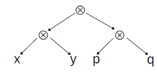

These two orders yield the same result only for **associative ** operations $\otimes $ st $(x\otimes( y \otimes z)) =( (x \otimes y)\otimes z)$ 

**Reduce on Trees: **

```scala
def reduce[A](t: Tree[A], f : (A,A) => A): A = t match {
    case Leaf(v) => v
    case Node(l, r) => {
        val (lV, rV) = parallel(reduce[A](l, f), reduce[A](r, f))
        f(lV, rV)
    }
}
```

**Reduce on Array** :

reduce on arrays follows naturally by divide and conquer : 

```scala
def reduceSeg[A](inp: Array[A], left: Int, right: Int, f: (A,A) => A): A = {
if (right - left < threshold) {
    var res= inp(left); var i= left+1
    while (i < right) { res= f(res, inp(i)); i= i+1 }
    res
} else {
        val mid = left + (right - left)/2
        val (a1,a2) = parallel(reduceSeg(inp, left, mid, f),
        reduceSeg(inp, mid, right, f))
        f(a1,a2)
    }
}

def reduce[A](inp: Array[A], f: (A,A) => A): A =reduceSeg(inp, 0, inp.length, f)
```

example of use : Compute with map / reduce  $\begin{aligned}\sum_{i=s}^{t-1}\lfloor\left|a_i\right|^p\rfloor\end{aligned}$

Answer : `reduce( map(a , pow(abs(_),p))  , _ + _ )`

⚠️: parallel reduce works only for **associative** operators. 

#### Associativity and Commutativity 

<u>Associative</u> : $f(x,f(y,z))=f(f(x,y),z)\quad\text{}$ e.g : addition , multiplication of **integers**

⚠️ floating points + not associative : `(1 + 1e20) + (-1e20) = 0 `, `1 + (1e20 + (-1e20))= 1 ` 

<u>Commutative</u> : $f(x,y)=f(y,x)\quad\text{}$ addition , concatenation 

concatenation commutative but not associative. many are the same. 

**Making an operation commutative : Easy **

`def f(x: A, y: A) = if (less(y,x)) g(y,x) else g(x,y)` , even if g is not commutative f will be. 

No such trick for associativity. 

**Associative operations on tuple **: associativity extends to tuples. 

If $f_1$ associative and $f_2$ associative then $f(x_1,x_2,y_1,y_2) = (f_1(x_1,y_1),f_2(x_2,y_2))$  associative. 

`times((x1,y1), (x2, y2)) = (x1*x2, y1*y2)` associative because multiplication is . 

**Another way to prove associativity **

If `f` *commutative* and `f(f(x,y), z) = f(f(y,z), x)` then f is also *associative*. 

#### How to do prefix sum in parallel : the example of scanLeft 

`List(1,3,8,4).scanLeft(100)(_ + _) == List(100, 101, 104, 112,116)`

We will only work on associative operations. 

The problem is that we try to do the usual divide and conquer , we will need values that are to be calculated by other treads. e.g we divide problem into 

`[1,3]`and `[8,4]` . The sequence `[8,4]` will need the value returned by `[1,3]` to compute 112 = <u>104</u> + 8 . 

What to do ? What to do ? 

We will solve the problem in two steps : 

1.  `upsweep`:  

We will solve the problem for each interval indenpendently and store it in a tree. 

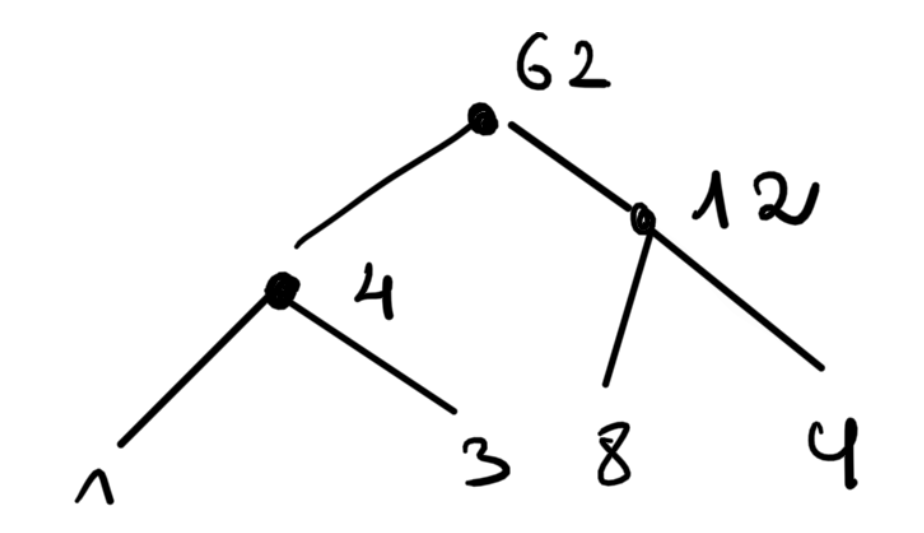

Here we will neglect the initial accumulator (100 in the example), we can add it later. 

This idea resides in this observation : 

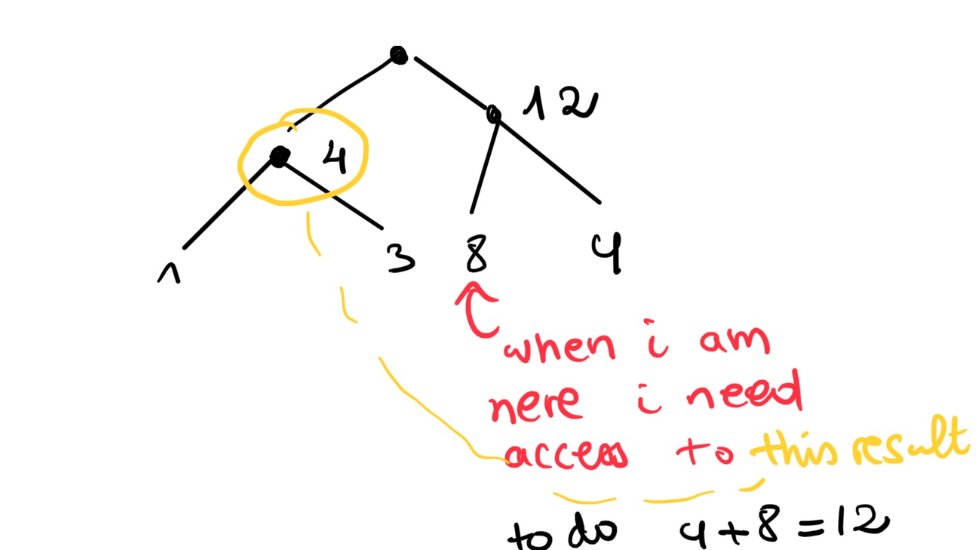

And that's exactly what we will do in 2.`backsweep`

2. `backsweep`

Now we well traverse the tree that we saved :


that is expressed in code in this way : 

`parallel(downsweep[A](l, a0, f), downsweep[A](r, f(a0, l.res), f))`

when we are in the root ( blue ) and we go to right (red) we pass to it `l.res`(which is 4 above = yellow ). 

Now the full code : 

```scala
def upsweep[A](t: Tree[A], f: (A,A) => A): TreeRes[A] = t match {
    case Leaf(v) => LeafRes(v)
    case Node(l, r) => {
        val (tL, tR) = parallel(upsweep(l, f), upsweep(r, f))
        NodeRes(tL, f(tL.res, tR.res), tR)
    }
}

// āa0ā is reduce of all elements left of the tree ātā
def downsweep[A](t: TreeRes[A], a0: A, f : (A,A) => A): Tree[A] = t match {
    case LeafRes(a) => Leaf(f(a0, a))
    case NodeRes(l, _, r) => {
        val (tL, tR) = parallel(downsweep[A](l, a0, f),
        downsweep[A](r, f(a0, l.res), f))
        Node(tL, tR) } 
}


```

## Week3 : Data-Parallelism 

*Task-parallelism* : we have multiple processors , we give each a task. 

*Data-parallelism:* we have multiple process , we give all same task on different data(we distribute the *data*). 

Example : for loop

```scala
def initializeArray(xs: Array[Int])(v: Int): Unit = {
    for (i <- (0 until xs.length).par) { // will create a parallel array
    	xs(i) = v
    }
}
```

Let's consider `def foldLeft[B](z: B)(f: (B, A) => B): B` , we know it is not parallelizable without extra assuming on the operator `f` (associativity). 

That is because if `f`is not associative there's only one possible order to execute it.

It is the same for `foldRight`,`reduceLeft`,`reduceRight` and `scanRight`

​													 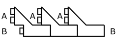

Let us see it's consider `def fold(z: A)(f: (A, A) => A): A`, we can parallelize it :                                

​															  

`fold` is useful :

```scala
def sum(xs: Array[Int]): Int = {
	xs.par.fold(0)(_ + _)
}
def max(xs: Array[Int]): Int = {
	xs.par.fold(Int.MinValue)(math.max)
}
```

for the fold operation to work , it must hold that: `f` is associative and `z` is neutral (`f(z,x)=x`)

What if we want to do this ? 

```scala
Array('E','P', 'F', 'L').par
.fold(0)((count, c) => if (isVowel(c)) count + 1 else count)
// DOES NOT COMPILE 
Array('E','P', 'F', 'L').par.aggregate(0)(
(count, c) => if (isVowel(c)) count + 1 else count,
_ + _
)n// WORKS 
 
```

`aggregate` is a combination of `fold` and 

```scala
def aggregate[B](z: B)(f: (B, A) => B, g: (B, B) => B): B
```

Do the `foldingLeft`  with `f`and then combine them with `g`

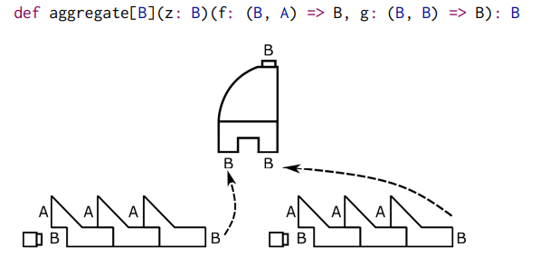

It is important to note that `aggregate` splits the input arbitrarily : 

`xs.aggregate(z)(f, g)`might result in `g(f(z, x1), f(f(z, x2), x3))` or

 `g(f(f(z, x1), x2), f(z, x3))`. 

When does `aggregate` always give the same results ? 

* **split invariance : **
  ` g( xs.foldLeft(z)(f) ,ys.foldLeft(z)(f) ) == (xs ++ ys).foldLeft(z)(f) for all xs,ys`

  it implies correctness of agregate.

* The following two properties imply split invariance : 

  1. `g(u,f(v,x)) == f(g(u,v),x) for all x,y,u               (g-f-associative)`
  2. `g(z,x ) = x 									        (g-right-unit)`

### Scala parallel collections 

There exists traits `ParIterable` ,`ParSet` , `ParSeq` and `ParMap[K,V]` the parallel counterparts of `Iterable` , `Sequence` , `Set` and `Map`. 

`Interable[T]` : collection of elements operations implemented using `interator`. 

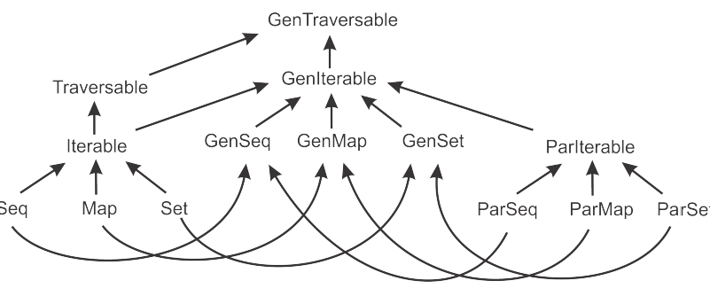

Collections prefixed with `Gen` are super classes of normal collections , it helps to write code that is unware of parallelization. 

```scala
def largestPalindrome(xs: GenSeq[Int]): Int = {
xs.aggregate(Int.MinValue)(
(largest, n) =>
if (n > largest && n.toString == n.toString.reverse) n else 	largest,
    math.max)
}
val array = (0 until 1000000).toArray
largestPalindrome(array) // works 
largestPalindrome(array.par) // works too and is parallized
```

add `.par`to make the collection parallel eg : `a.par` 


but `list.par` returns `ParVector[]` => converts to closes parallel collection 

**Side effecting operations **

```scala
def intersection(a: GenSet[Int], b: GenSet[Int]): Set[Int] = {
    val result = mutable.Set[Int]()
    for (x <- a) if (b contains x) result += x
    result
}
intersection((0 until 1000).toSet, (0 until 1000 by 4).toSet)

intersection((0 until 1000).par.toSet, (0 until 1000 by 4).par.toSet)
// DOES NOT WORK , DIFFERENT PROCESS MODIFIE RESULT 
```

> **RULE : **Avoid mutations to the same memory location without proper synchronization

Solutions :

```scala
// 1. OBSCURE CONCURRENCY LIBRARY 
import java.util.concurrent._
def intersection(a: GenSet[Int], b: GenSet[Int]) = {
	val result = new ConcurrentSkipListSet[Int]()
	for (x <- a) if (b contains x) result += x
	result
}

// 2. NO SIDE EFFECTS : FUNCTIONAL 
def intersection(a: GenSet[Int], b: GenSet[Int]): GenSet[Int] = {
	if (a.size < b.size) a.filter(b(_))
	else b.filter(a(_))
}
```

**Modification during traversal**

```scala
val graph = mutable.Map[Int, Int]() ++= (0 until 100000).map(i => (i, i + 1))
graph(graph.size - 1) = 0
for ((k, v) <- graph.par) graph(k) = graph(v)
val violation = graph.find({ case (i, v) => v != (i + 2) % graph.size })
// DOES NOT WORK 
// 1. WE CHANGE graph while traversing it 
// 2. WE READ SOME VALUES FROM graph THAT are currently being modified by other process

```

This is a solution 

````scala
val graph =
concurrent.TrieMap[Int, Int]() ++= (0 until 100000).map(i => (i, i + 1))
graph(graph.size - 1) = 0
val previous = graph.snapshot()
for ((k, v) <- graph.par) graph(k) = previous(v)
val violation = graph.find({ case (i, v) => v != (i + 2) % graph.size })
println(sŏviolation: $violationŏ)
````

a snapshot saves that specific version of the data structure. 

It is done is $O(1)$  time ! 

#### Splitters  

```scala
trait Splitter[A] extends Iterator[A] {
    def split: Seq[Splitter[A]]
	def remaining: Int
}
def splitter: Splitter[A] // on every parallel collection
```


`fold` on `Splitter`: 

```scala
def fold(z:A)(f:(A,A) => A): A = {
    if (remaining < threshhold ) foldLeft(z)(f)
    else{
        val children = for (child <- split) yield task {child.fold(z)(f) }
		children.map(_.join()).foldLeft(z)(f)
    }
}
```

#### Builder

 ```scala
 trait Builder[A, Repr] {
     def +=(elem: A): Builder[A, Repr]
     def result: Repr
 }
 def newBuilder: Builder[A, Repr] // on every collection
 ```


```scala
def filter(p: T => Boolean): Repr = {
    val b = newBuilder
    for (x <- this) if (p(x)) b += x
	b.result
}
```

### Combiner : 

Like builder but in arbitrary order and in parallel 

```scala
trait Combiner[A, Repr] extends Builder[A, Repr] {
	def combine(that: Combiner[A, Repr]): Combiner[A, Repr]
}
def newCombiner: Combiner[T, Repr] // on every parallel collection
```

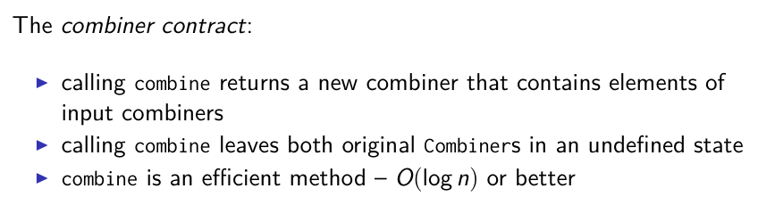

* `result` **must be parallelizable** 

## Week4 : Data-structures for efficient combining 

Let's remember the `combiner` trait that extends the `Builder` trait : 

```scala
trait Builder[T, Repr] {
    def +=(elem: T): this.type
	def result: Repr
}

trait Combiner[T, Repr] extends Builder[T, Repr] {
	def combine(that: Combiner[T, Repr]): Combiner[T, Repr]
}
```

The meaning of the combine depends on the type of `Repr` :                                                              

​                        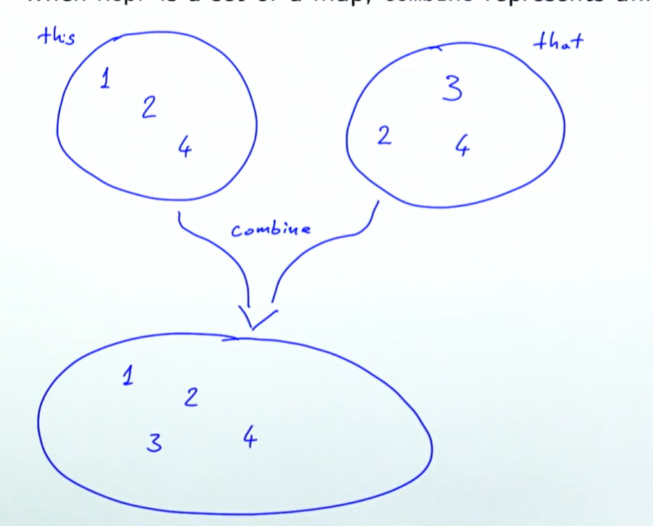     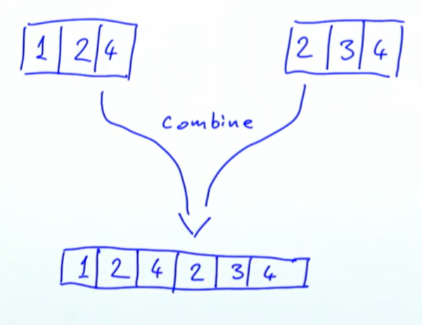

​						case of `Set` or `Map` : union            case of `Array` : concatenation

Why is it useful ? efficient data parallel computing : example

```scala
def filter(start : Int , end : Int , A : Array[Int] , threshold :Int ) : Array[Int]= 	
	def filter_com((start : Int , end : Int ) : Combiner[Int,Array] =
		if( end - start < threshold ) then // solve sequentially 
        else 
            val mid = (start+end)/2 
			val left = filter_com(start,mid)
            val right = filter_com(mid,end)
            left.combine(right)
	
	filter_com(start,end).result 
```

How to implement a combiner ? 

**Naïve way :** Very bad $O(n+m)$ where $n,m$ are the sizes of `n` and `m` respectively

Example on an array : 

```scala
def combine(xs: Array[Int], ys: Array[Int]): Array[Int] = {
	val r = new Array[Int](xs.length + ys.length)
	Array.copy(xs, 0, r, 0, xs.length)
	Array.copy(ys, 0, r, xs.length, ys.length)
	r
}
```

Why is that bad ? 

Imagine we implement parallel `filter` using a  $O(n+m)$ time `combine` we would get worse running times than the simple iteration linear `filter` : 

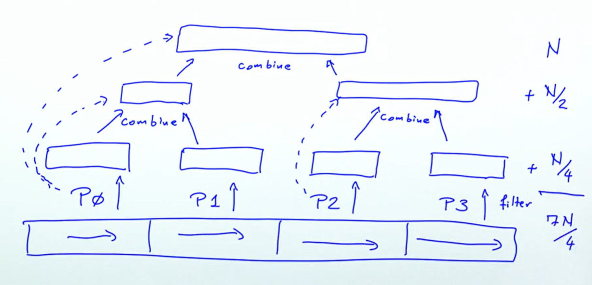

**We want better running times ** i.e $O(log(n)+log(m))$ running times for `combine`

### Two phase construction 

We will use an intermediate data structure that we will convert to our final (wanted) data structure at the end. 

The intermediate data structure must have : 

*  $O(log(n)+log(m))$ `combine` or better
* efficient `+= ` method 
* can be converted to our desired data structe in $O(n/p)$ where $p$ is the number of processors. 

Example on arrays 

```scala
class ArrayCombiner[T <: AnyRef: ClassTag](val parallelism: Int) {
    private var numElems = 0
    private val buffers = new ArrayBuffer[ArrayBuffer[T]]
    buffers += new ArrayBuffer[T]
```


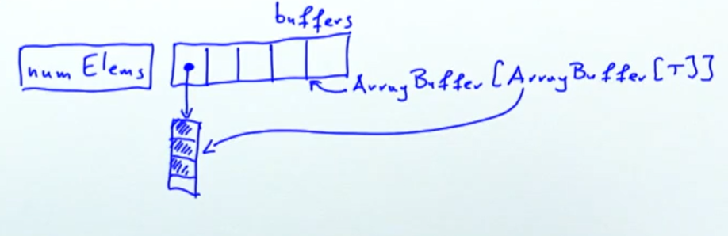

```scala
def +=(x: T) = {
    buffers.last += x
    numElems += 1
	this
}
```

We add a new element to the last `ArrayBuffer` in our array of `ArrayBuffers` , this is done in $O(1)$ time. 

```scala
def combine(that: ArrayCombiner[T]) = {
	buffers ++= that.buffers
	numElems += that.numElems
	this
}
```

Combining is just appending (the reference of ) buffers . ( concatenation will happen on the buffer level ) . Given that we will have one `Combiner` working per processor that size of `buffers` will never have more than $p$ `ArrayBuffer`s. 

So concatenation will take $O(p)$ time.

```scala
def result: Array[T] = {
    val array = new Array[T](numElems)
    // PARTITION INDICES IN 
    val step = math.max(1, numElems / parallelism)
    val starts = (0 until numElems by step) :+ numElems
    val chunks = starts.zip(starts.tail)
    	
    val tasks = for ((from, end) <- chunks) yield task {
    copyTo(array, from, end)  // COPIES FROM THE BUFFERS 
    }
    tasks.foreach(_.join())
    ar
```

Two steps : 

1. partition indices 
2. copy the combiners elements into the array in parallel 

For `maps`: 

1. Partition the hash codes into buckets 
2. Element from different buckets will be in different region of the final table, therefore we can fill the table in parallel. 

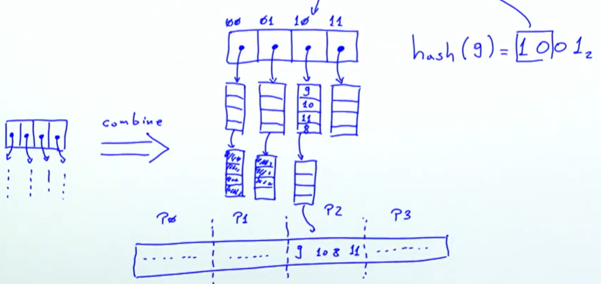

### ConcTree

ConcTree is a data structure that accepts efficient concatenation 

> Trees are only good for parallelism when they are balanced. Otherwise we cannot balance the workload equally between processors. 

So ConcTree will be balanced : 

```scala
sealed trait Conc[+T] {
    def level: Int
    def size: Int
    def left: Conc[T]
	def right: Conc[T]
}

case object Empty extends Conc[Nothing] {
	def level = 0
	def size = 0
}
class Single[T](val x: T) extends Conc[T] {
	def level = 0
	def size = 1
}
// <> is a confusing name for node 
case class <>[T](left: Conc[T], right: Conc[T]) extends Conc[T] {
    val level = 1 + math.max(left.level, right.level)
	val size = left.size + right.size
}

```

**Properties of ConcTree**

1. A node `<> ` cannot contain an empty subtree. 
2. The `level` difference between the left and right subtree of a node `<>` is at most 1. 

```scala
def <>(that: Conc[T]): Conc[T] = { // CONSTRUCTOR OF <> 
    if (this == Empty) that
    else if (that == Empty) this
    else concat(this, that)			// "merge" them and return root  
}
```

​	**The challenge : **Concatenation  

1. if the have ~ same level ( +- 1 ) : merge 

2. Let's assume (WLOG because we can swap them ) that the left is bigger : 

   1. Case left is itself left leaning

      ```scala
      if (xs.left.level >= xs.right.level) {
      	val nr = concat(xs.right, ys)
      	new <>(xs.left, nr)
      }
      ```

   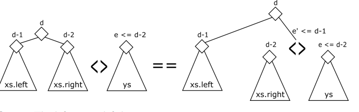

   b. Case the right is right leaning : then there 4 subtrees at play 
   
   link the two smallest first (  like the Huffman code )

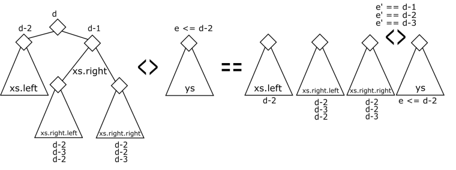

```scala
} else {
    val nrr = concat(xs.right.right, ys)
    if (nrr.level == xs.level - 3) {
        val nl = xs.left
        val nr = new <>(xs.right.left, nrr)
        new <>(nl, nr)
    } else {
        val nl = new <>(xs.left, xs.right.left)
        val nr = nrr
        new <>(nl, nr)
    }
}
```

It takes $O(h_1-h_2)$ time where $h_1,h_2$ are the heights 

### Append in amortized constant time 

very simple append : 

```scala
var xs: Conc[T] = Empty
	def +=(elem: T) {
	xs = xs <> Single(elem)
}
```

this works in $O(log(n))$ time. 

Can we do better ? Yes. 

The idea is to store our append requests in an intelligent way in our tree. 

```scala
case class Append[T](left: Conc[T], right: Conc[T]) extends Conc[T] {
	val level = 1 + math.max(left.level, right.level)
	val size = left.size + right.size
}
```

suppose we do this 

```scala
def appendLeaf[T](xs: Conc[T], y: T): Conc[T] = Append(xs, new Single(y))
```

It will make the tree unbalanced 

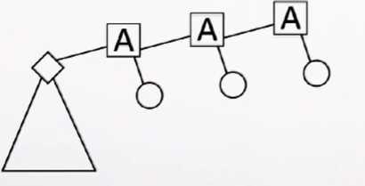

We will do not do that. Our technique will ensure that the number of `Append` nodes does not exceed $log(n)$. 

the `Append` nodes are not balanced as `Conc`nodes but they satisfy these invariants : 

* the right subtree of an `Append` node is never another `Append` node. (we only append to the left)
* if an Append node a has another Append node b as the left child, then a.right.level < b.right.level.

```scala
def appendLeaf[T](xs: Conc[T], ys: Single[T]): Conc[T] = xs match {
case Empty => ys
case xs: Single[T] => new <>(xs, ys)
case _ <> _ => new Append(xs, ys)
case xs: Append[T] => append(xs, ys)
}


@tailrec private def append[T](xs: Append[T], ys: Conc[T]): Conc[T] = {
    if (xs.right.level > ys.level) new Append(xs, ys) // verify append invariant
    else {
    val zs = new <>(xs.right, ys)
    //       xs 				ys 
    // 	  / 		\          big subtree
    //   xs.left   xs.right 
        
    // 		<>
    // 	 / 		\              xs.left = ws 
    // xs.right		ys
     // 	      big subtree
    xs.left match { // these violate append invariant
        case ws @ Append(_, _) => append(ws, zs) // assure invariant
        case ws if ws.level <= zs.level => ws <> zs // violate append invariant 
        // making right side bigger , trying to balance . 
        case ws => new Append(ws, zs)  // ws.level >= zs.level 
        // invariant verified 
   		}
    }
}
```


#### Chuck nodes 

Like `Single` nodes but hold multiple elements. `ConcBuffer` adds all added elements to a buffer and pushes them once they exceed a certain threshold. 

````scala
class ConcBuffer[T: ClassTag](val k: Int, private var conc: Conc[T]) {
private var chunk: Array[T] = new Array(k) // buffer to group elements and push them in one time 
private var chunkSize: Int = 0
````

When we add 

```scala
final def +=(elem: T): Unit = {
    if (chunkSize >= k) expand() // if full add it to tree 
    chunk(chunkSize) = elem
    chunkSize += 1
}
private def expand() {
	conc = appendLeaf(conc, new Chunk(chunk, chunkSize))
	chunk = new Array(k)	
	chunkSize = 0
}

final def combine(that: ConcBuffer[T]): ConcBuffer[T] = {
	val combinedConc = this.result <> that.result
	new ConcBuffer(k, combinedConc)
}

def result: Conc[T] = {
conc = appendLeaf(conc, new Chunk(chunk, chunkSize))
conc
}
```


