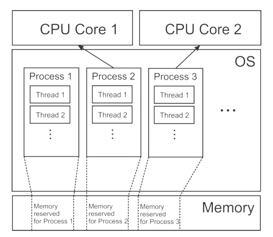
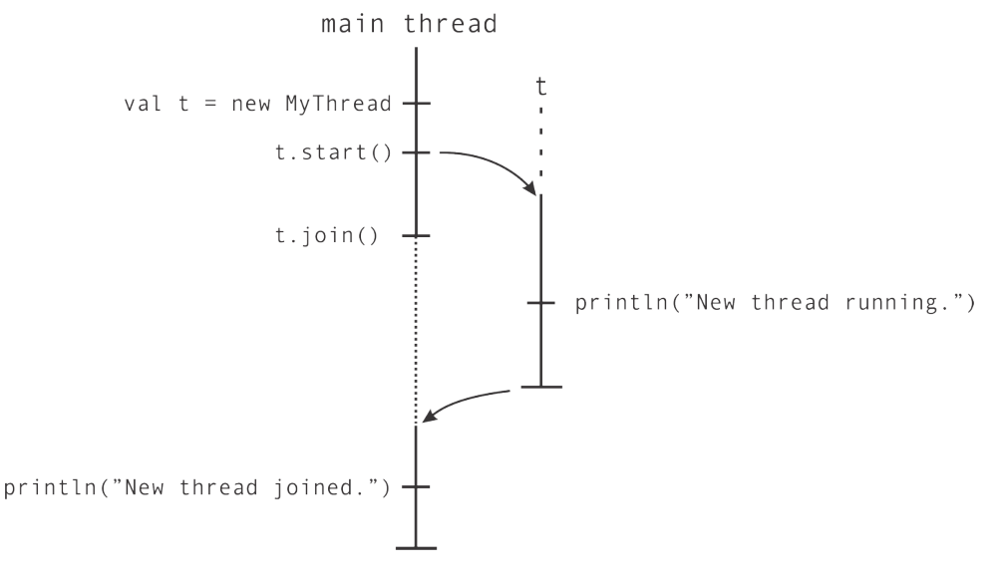
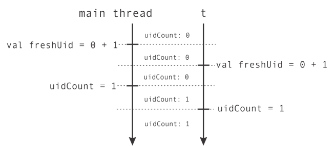
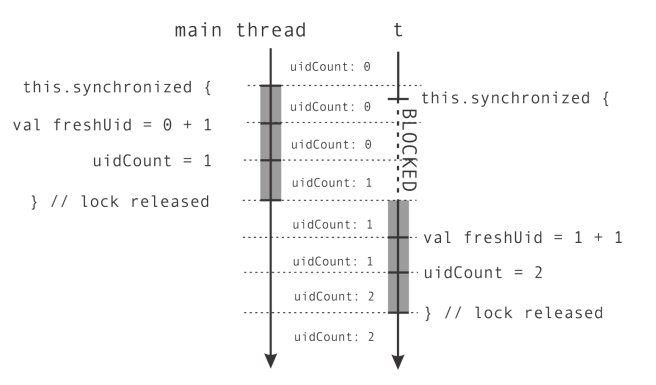
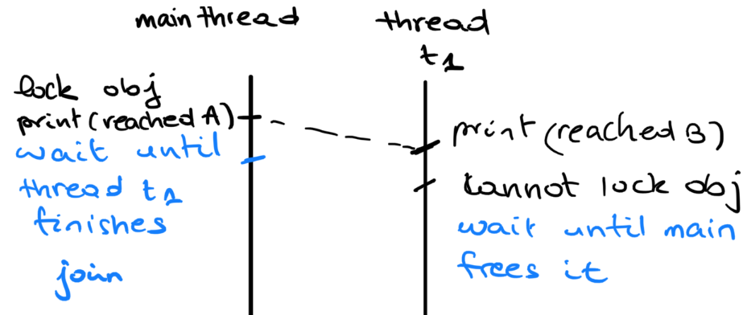

# Concurrency

[TOC]


**Concurrency : ** concurrent computing consists of process *lifetimes* overlapping, but execution need not happen at the same instant.( process 1 then process 2 then process 1 again ... )

## Week 5:



The OS schedules **threads** to run on **cores**.

 ```scala
def thread(b: => Unit) = {
    val t = new Thread {
    	override def run() = b
    }
    t.start()
    t
}
 ```

To start a thread on scala: 

1. inherit from `java.lang.Thread` and redefine the `run` method 
2. create an instance of the class 
3. run it using `.start`

The call `t.join()` lets the calling thread wait until thread `t` has terminated.

> Creating a thread is *expensive* in terms of resources. 

First example : 

```scala
val t = thread { println(s”New thread running”) }
t.join()
println(s”New thread joined”)
```



**Non-deterministic behavior : **

```scala
val t = thread {
println(”New thread running”)
}
println(”...”)
println(”...”)
t.join()  					
println(”New thread joined”)
```

Sometimes "New threadrunning , .... ,.... " is printed , other times "....,New threadrunning,...." is printed. 

Instructions are *interleaved* this makes a lot of valid sequential programs invalid with concurrency. 

Consider the following piece of code that returns a unique id. 

```scala
object ThreadsGetUID extends App {
    var uidCount = 0
    def getUniqueId() = {
        val freshUID = uidCount + 1
        uidCount = freshUID
        freshUID
	}
}					    
```

we test it *concurrently* with : 

```scala
// test it with : 
def printUniqueIds(n: Int): Unit = {
	val uids = for (i <- 0 until n) yield getUniqueId()
	println(s”Generated uids: $uids”)
}

val t = thread { printUniqueIds(5) } // one call on seperate thread 
printUniqueIds(5)					// one call on the main thread 
t.join()

//> ThreadsGetUID // first run of the code 
//[53:thread] Generated uids: Vector(2, 5, 7, 9, 10)
//[1:main] Generated uids: Vector(1, 3, 4, 6, 8)

//> ThreadsGetUID // second run of the code 
//[1:main] Generated uids: Vector(1, 2, 3, 4, 5)
//[55:thread] Generated uids: Vector(5, 6, 7, 8, 9) // 5 is repeated 
```

1. non-deterministic behavior 

2. Ids are not unique. 

   

### Synchronization and Atomic execution 

The problem above is that we use a shared variable `uidCount` that is *not synchronized* properly.

We want to the instructions of `getUniqueId` to be run sequentially without interleaving with another thread. That's what we call **atomic execution**. To do that : 

```scala
object GetUID:
	var uidCount = 0
    def getUniqueId() = synchronized {
        val freshUID = uidCount + 1
        uidCount = freshUID
        freshUID
	}
```

It means that only one thread can run the block inside `synchronized` at at time. 



Two possible syntax : 

* `synchronized{block}`

* `obj.synchronized{block}`  where `obj` is a an instance of `anyRef`
  * this one puts a lock on `obj` : any thread that wants to use it should wait until the thread that has the lock on it is done. 


#### Ledger example

```scala
object Ledger:
import scala.collection._

private val transfers = mutable.ArrayBuffer[String]()
    
def logTransfer(name: String, n: Int) = transfers.synchronized {
		transfers += s"transfer to account $name = $n"
}// notice that synchronized here is necessary 

def getlog = transfers

class Account(val name: String, var initialBalance: Int):
    private var myBalance = initialBalance
    private var uid = getUID
    def balance: Int = this.synchronized { myBalance } // synchronized here is optional 

    def add(n: Int): Unit = this.synchronized {
        myBalance += n
        // Log only if more than 10 CHF is transferred
        if n > 10 then logTransfer(name, n)
	}
```

#### Deadlock  

Let's make a function to transfer money 

```scala
def transfer(from: Account, to: Account, n: Int) =
    from.synchronized {
        to.synchronized {
            from.add(-n)
            to.add(n)
        }
	}
```

suppose we launch the following program : 

```scala
val jane = new Account("Jane", 1000)
val john = new Account("John", 2000)
log("started...")
val t1 = thread { for i <- 0 until 100 do transfer(jane, john, 1) }
val t2 = thread { for i <- 0 until 100 do transfer(john, jane, 1) }
```

1. `t1` locks `jane` and `t2` locks `john` 
2. `t1` tries to lock `john` but cannot because `t2` has it so it waits
3. `t2` tries to lock `jane` but cannot because `t1` has it so it waits 

**Solution : ** **One approach is to always acquire resources in the same order**

````scala
def transfer(from: Account, to: Account, n: Int) =
    def adjust() { to.add(n); from.add(-n) }
    if from.getUID < to.getUID then
    	from.synchronized { to.synchronized { adjust() } }
    else
    	to.synchronized { from.synchronized { adjust() } }
````

Another deadlock example : 

```scala
val obj = AnyRef
obj.synchronized {
    println("Reached A")
    thread {
        println("Reached B")
        obj.synchronized {
        	println("Reached C")
        }
    }.join
    println("Reached D")
}
```

This will not halt. 



```scala
// one solution 
val lock = AnyRef
lock.synchronized {
println("Reached A")
}
thread {
    println("Reached B")
    lock.synchronized {
    	println("Reached C")
    }
}.join
println("Reached D")
```

#### Consumer/Producer model 

When using a one place buffer. We distinguish two thread roles :

1. <u>consumers :</u> take element from buffer 

   if thread is empty consumers must wait 

2. <u>producers</u> : put elements in buffer 

   if thread is full producers have to wait 

3. at most one element can be in the buffer at any one time

```scala
def put(e: Elem) = synchronized {
    while bufferIsFull do {}
        putElementInTheBuffer(e)
        bufferIsFull = true
    }
def get(): Elem = synchronized {
    while !bufferIsFull do {}
        elem = getElementFromTheBuffer()
        bufferIsFull = false
        elem
    }
// DEAD LOCK SITUATION 
```

Solution: Hold the lock for a short duration and release it after checking the buffer is full (for producers) empty (for consumers). Repeat the operation without always holding the lock. 

```scala
// SOLUTION 
class TempObj[Elem]:
    var e:Elem = uninitialized
    class OnePlaceBuffer[Elem]:
    private var elem: Elem = uninitialized
    private var bufferIsFull: Boolean = false
    
	def put(e: Elem) =
        while !tryToPut(e) do {}
        def tryToPut(e: Elem): Boolean = this.synchronized {
        	if bufferIsFull then false
        	else { elem = e; bufferIsFull = true; true }
        }
    def get(): Elem =
        var temp = new TempObj[Elem]
        var bufferIsEmpty: Boolean = true
        while bufferIsEmpty do
            this.synchronized {
                if bufferIsFull then
                bufferIsFull = false; temp.e = elem; bufferIsEmpty = false
            }
        return temp.e

```

#### The classical example of the dining philosophers 

There are N philosphers sitting around a circular table eating spaghetti and discussing philosphy. The problem is that each philosopher needs 2 forks to eat, and there are only N forks, one between each 2 philosophers


```scala
def philosophersDining(n: Int) =
    val forks = new Array[Fork](n)
    val philosophers = new Array[Thread](n)
    val waiter = new Waiter
    for p <- 0 to n - 1 do
    	forks(p) = new Fork()
    for p <- 0 to n-1 do
    	philosophers(p) = thread{
    		while (!philosopherTurn(w, forks(p%n), forks((p+1)%n))) {}
    	}
    for p <- 0 to n - 1 do
	philosophers(p).join()

def philosopherTurn(w: Waiter, left: Fork, right: Fork): Boolean =
    Thread.sleep(100) // wait for some time
    w.synchronized {
        if !left.inUse && !right.inUse then
            left.inUse = true
            right.inUse = true
        }
        else
            false
    }
    Thread.sleep(1000) // eating
    w.synchronized {
        left.inUse = false
        right.inUse = false
    }
	
	true
```

