[Homepage](../html/homepage.html)

# Data intensive systems
Notes taken for EPFL's CS300 course by Youssef Boughizane. There are probably some mistakes and typos. If you find any, please make a PR to https://github.com/youssef62/youssef62.github.io or write me. 
[TOC]

# SQL 

### The Basics

The main components of an SQL query are : 

* `FROM` Compute cross-product of tables (e.g., Students and Enrolled).
* `WHERE` Check for a condition. 
* `SELECT` Delete unwanted files. 
* `DISTINCT` Iliminate duplicates. 

Example 1: All students of age 18. 

```SQL
SELECT *
FROM Students S
Where S.age = 18 
```

An SQL table like the following is also called a *relation* :

 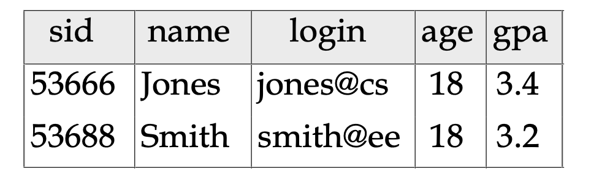

**Querying Multiple Relations:**

Name and course id of a student and a course where the student got a grade of "B" at this course. 

```sql
SELECT S.name, E.cid
FROM Students S, Enrolled E
WHERE S.sid=E.sid AND E.grade=‘B'
```

**Query evaluation**

1. First the cross product is computed : all combinations of a row from first table and a row from second table are computed. 
2. WHERE is applied ot filter. 


**Problem: **Average `age` of sailors whose `rating` is 10 

**Solution: Aggregate operators**

```sql
COUNT (*)
COUNT ( [DISTINCT] A)
SUM ( [DISTINCT] A) # add distinct to remove duplicates. 
AVG ( [DISTINCT] A)
MAX (A)
MIN (A)	
```

Example : 

```sql
SELECT AVG (S.age)
FROM Sailors S
WHERE S.rating=10
```

**Problem:**  Find the age of the youngest sailor for each rating level

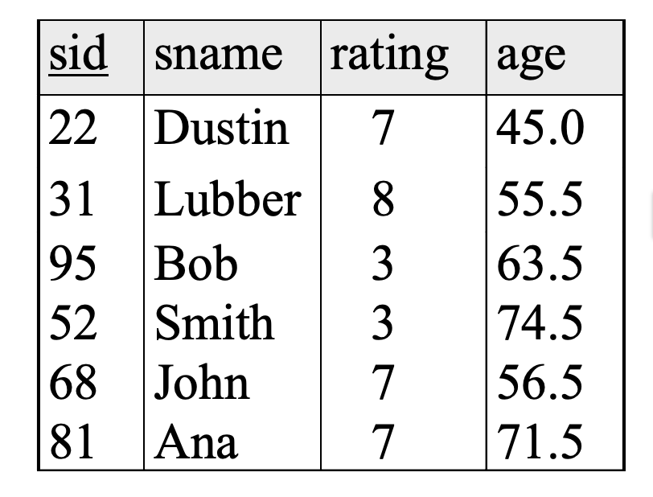

**Solution: Group BY** - HAVING

```sql
SELECT MIN (S.age), S.rating
FROM Sailors S
GROUP BY S.rating
HAVING COUNT(*) > 1
```

How is this query evaluated ? 

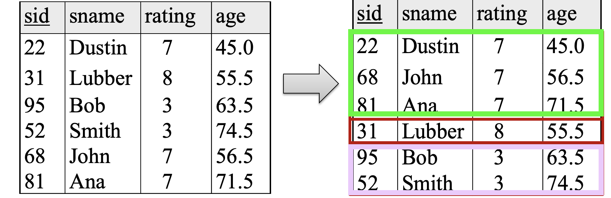

‚Äã                                                                                                  			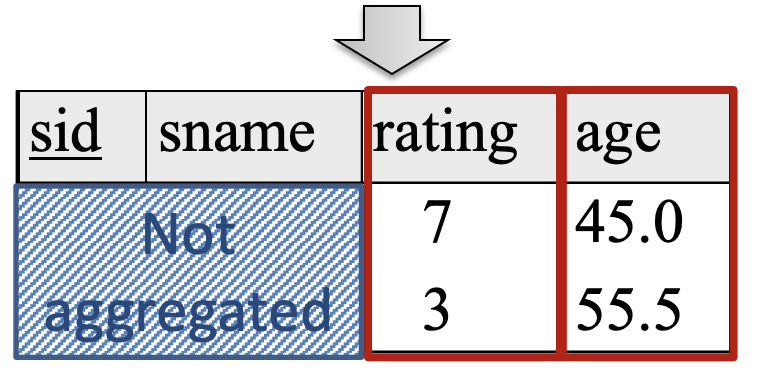

Remark: When we group by an attribute, that attribute must be present in the select clause. 


**Modifications**

Creating a table: 

```sql
CREATE TABLE Enrolled(sid CHAR(20),cid CHAR(20),grade CHAR(2)) 
```

Adding row:

```sql
INSERT INTO Students (sid, name, login, age, gpa)
VALUES (‘53688’, ‘Smith’, ‘smith@cs’, 18, 3.2)
```

Deleting rows: 

```sql
DELETE
FROM Students S
WHERE S.name = ‘Smith’
```

**Nested queries:** Names of sailors who have reserved boat #103. 

Using `IN` : 

```sql
SELECT S.sname
FROM Sailors S
WHERE S.sid IN (SELECT R.sid 
                FROM Reserves R
                WHERE R.bid=103)
```

We can do the same thing using `EXISTS` : 

```sql
SELECT S.sname
FROM Sailors S
WHERE EXISTS (SELECT *
 FROM Reserves R
 WHERE R.bid=103 AND S.sid=R.sid)
```

To find sailors who’ve not reserved #103 – `NOT IN` or `NOT EXISTS`. 

**Expressions**

We can do arithmetic in `SELECT` : 

```sql
SELECT S.age, S.age-5 AS age1, 2*S.age AS age2
FROM Sailors S
WHERE S.sname = ‘dustin’
```

Also possible in `WHERE` : 

```sql
SELECT S1.sname AS name1, S2.sname AS name2
FROM Sailors S1, Sailors S2
WHERE 2*S1.rating = S2.rating - 1
```

**Strings:** 

`%` stands for 0 or more arbitrary characters. `_` stands for any one character. So for example "one" satisfies `o_e`. 

```sql
SELECT S.age, age1=S.age-5, 2*S.age AS age2
FROM Sailors S
WHERE S.sname LIKE ‘B_%b’
```

**More operatiosn: **

* `UNION` : sailors who reserved red or green boat. 

* `INTERSECT`: sailors who reserved red **and** green boats. 
  More useful than `UNION`. 

  E.g: without `INTERSECT`:

  ```sql
  SELECT R1.sid
  FROM Boats B1, Reserves R1,
   Boats B2, Reserves R2
  WHERE R1.sid=R2.sid
   AND R1.bid=B1.bid
   AND R2.bid=B2.bid
   AND (B1.color=‘red’ AND B2.color=‘green’)
  ```

  With : 

  ```sql
  SELECT S.sid
  FROM Sailors S, Boats B,
  Reserves R
  WHERE S.sid=R.sid AND R.bid=B.bid AND B.color=‘red’
  
  INTERSECT
  
  SELECT S.sid FROM Sailors S, Boats B,
  Reserves R
  WHERE S.sid=R.sid AND R.bid=B.bid AND B.color=‘green’
  ```

* `EXCEPT`: Set difference. 

* `ANY` : Find sailors whose rating is greater than that of some sailor called Horatio. 

  ```sql
  SELECT *
  FROM Sailors S 
  WHERE S.rating > ANY (SELECT S2.rating 
                        FROM Sailors S2
                        WHERE S2.sname=‘Horatio’) 
  ```

  

### ER to SQL conversion

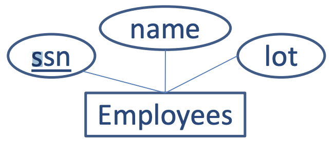

``` SQL
CREATE TABLE Employees (
 ssn CHAR(11), # CHAR( #nb of characters )
 name CHAR(30),
 lot INTEGER,
 PRIMARY KEY (ssn) # specify the primary key
);
```

**Many to many relations**


* These 3 cases are dealt with similarly. In fact, we don't enforce the atleast constraint. 
* Primary key is (pk(A),pk(B)). (because one a can be in relation with many b and vice versa)

Example: 

```sql
CREATE TABLE Works_In(
 ssn CHAR(11),
 did INTEGER,
 since DATE,
 PRIMARY KEY (ssn, did),
 FOREIGN KEY (ssn) REFERENCES Employees, 
 FOREIGN KEY (did) REFERENCES Department
);
```

**One to many relations**


Two possibilites : 

1. Create a table for R, with only B as primary key. 

2. Merge R and B: attribute of B + attribute of R + primary key of A. 

   ‚úÖ if total participation, we can enforce this by ensuring A NON NULL. 

Method (2) has the risk of having much more NULL cells, while (1) creates a new table => trade-off. 

example method 2 : 

```sql
CREATE TABLE Dept_Mgr(#Employees: ssn, name, lot | Department did, dname, budget
 did INTEGER,
 dname CHAR(20),
 budget REAL,
 since DATE,
 ssn CHAR(11) NOT NULL,
 PRIMARY KEY (did),
 FOREIGN KEY (ssn) REFERENCES Employees
);
```

**One to one constraints: **


Merge A and B in one table and set pk of b as pk and set pk of a as UNIQUE. (so an a can map to exactly one b)


Merge B and R in one table, set pk of a as forein key and NON NULL. 

**Hierarchies**

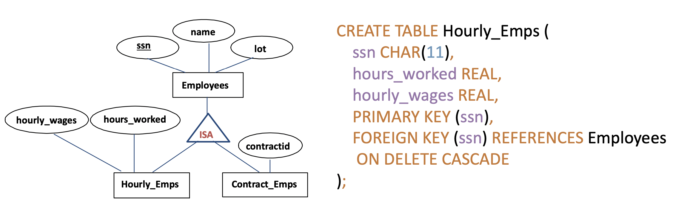

# Week1 : ER model  

Database design layers

1. **Conceptual design:** High level description (often done with ER model)

    

2. **Logical design:** Translate ER into DBMS data model (like the relational model)

   relational data model = **Relation** (Table with rows and columns) + **Schema**: columns of a relation

   **Schema: **

   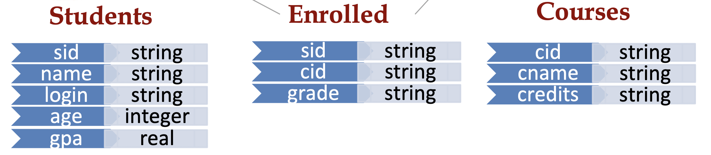

3. other layers to be seen later : Disk layout... 

**Entity-Relation(ER) model**

Entity: a subject like student, courses, employee... 

Relationship: Association among two or more entities. 


**Arrow or not arrow :** 

A --> B means that A has a relationship with at most a B. 


**Thick or not Thick :**

A **----** B (as opposed to A---B) means that A is in relation with at least a B. 

1. Total participation : each entity needs to participate in a relationship 


2. Each department has one employee. Each employee can manage at at most one department. 

   ‚Äã                                                                                 

3. Partial partitipation 


**Weak entities**

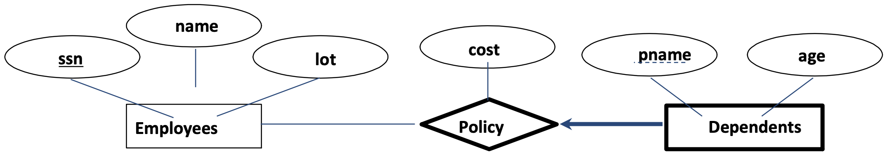


An entity whose existence depends on its relationship with another entity. 

An employee can or not have an insurance *policy* (relation) for a closed one (a *Dependent*). A dependent (in our model) only exists if there is an employee has has them if their policy. 

**ISA relation**


An isa relation can be **overlapping** or **non-overlapping**. 


**Weak entity** 

To identify weak entry : we need pk of owner + pk weak entity. 

Merge R with the weak entity – Primary key is the combination of the owner entity pk and the weak key. 

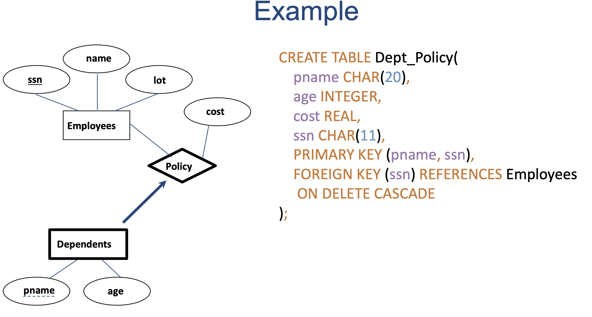

# Week 2: Relational data model 

After completing our conceptual design using the ER model, we need to model the data so we can then store it and query it. Many data models exist: relational, object oriented data model, network data model... 

We focus on the **relational data** model for its simplicity. 

* **Relation(table):** set of named attributes(colums)

* **Tuple(row):**  a value for each attribute. 

* Each attribute has a type(domain). 

It is important to seperate two concepts, the schema(design) and the instance(actual content)


We can have special value for “unknown” or “undefined” : `NULL`. 

**Question: **If we query for GPA > 3. 3 and have NULL for some user. If not do we get it in GPA>=3.3 ? (We should get it in one for union consistency)


**SuperKey: **attribute unique to each tuple(row). It also can be a set of attributes that are unique. (e.g colleges below)

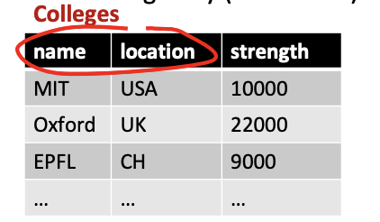

**Key: ** A superkey that is minimal. 

Suppose we chose name,location and strenght to be our superkey, it is indeed a superkey but not a key(not minimal). 

**Candidate key:** If there are multiple possible keys each of them is referred to as a candidate key. 

**Primary Key: **A key chosen by *us*. 

**Foreign keys: **Set of fields in one relation that is used to `refer’ to a tuple in another relation. 


**Integrity constraints(IC):**

**Def** condition that must be true for any instance of the database; e.g., domain constraints 

*  ICs are specified when schema is defined 
*  ICs are checked when relations are modified

**⚠️ Careful about integrity constraints**


The right side code makes a student only able to have one course. 

### Relational algebra 

Five basic operations: 

* **Selection** ($\sigma$‚Äã): Selects a subset of rows from relation (horizontal).

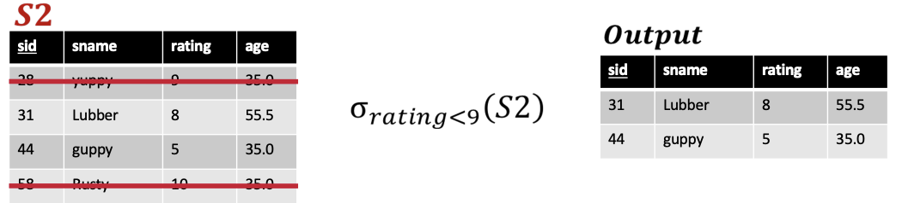

* **Project** ($\pi$‚Äã): Retains only wanted columns from relation (vertical). 

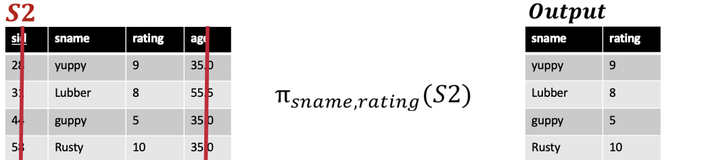

⚠️ Selection($\sigma$) choses rows.  SELECT in SQL is to select colums, it refers to  Project ($\pi$) in relational algebra. 

* **Set-difference** (–): Tuples in r1, but not in r2. 

* **Union**(‚à™): Tuples in r1 and/or in r2. 

* **Cross-product**(‚úï): Allows us to combine two relations. Each row of s1 with each row of s2. 

* **Rename**($\rho$‚Äã): Renames the list of attributes specified in the form of oldname ‚Üí newname or position ‚Üí newname. Renane is usefull to get a coherent cross product. 

  

**Remark:**

These operations output sets: 


**Composition**

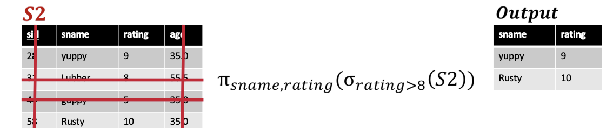

in SQL it would be `SELECT sname,rating FROM S2 WHERE rating > 8`. 

**More relations (compositions of basic relations): **

* (natural)**Join ‚ãà: **  compute RXS, select rows where attributes(usually key) have same values, project. $\pi (\sigma (R \times S))$ 

  

* **Condition join** $‚ãà_c$‚Äã‚Äã

  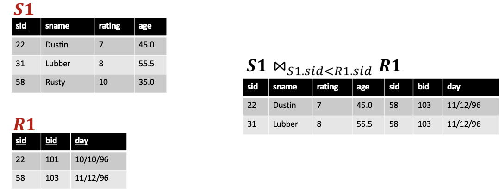

* **Division /: **Find all sailors who have reserved **all** boats. 
  In A/B, attributes of B are subset of attributes of A.  A/B are the "entities" (colums that are in A and not in B) that are in a relationship with all elements of B. (this is not an accurate description). 
  E.g : a table A with attributes student_id, course_id and a table B containing courses. A/B would give the students who took all the courses. 
  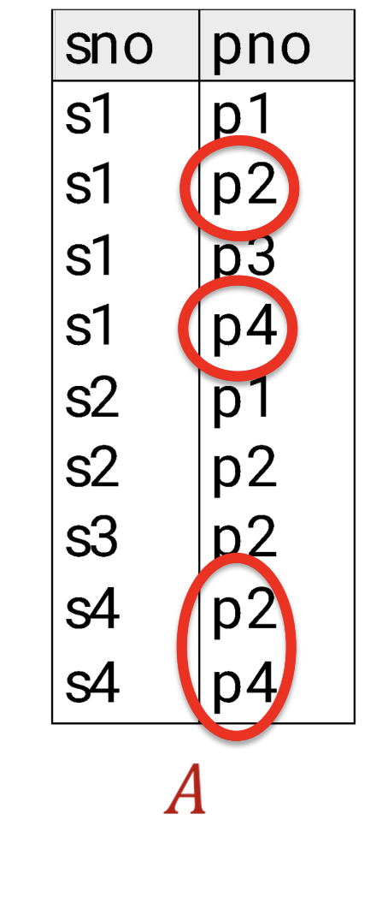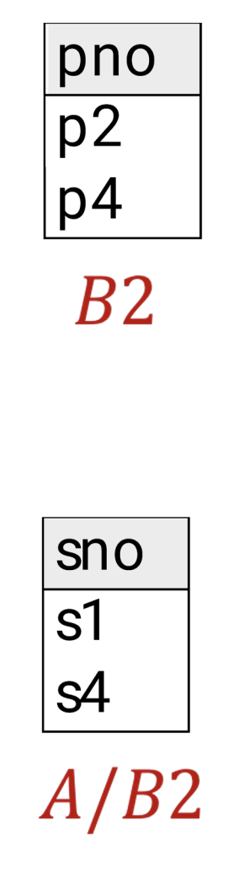

  

**Remark:** Equivalent formulas can express the same output and some are more efficient. (e.g second one below)

 


# Week3: Storage, Files, and Indexing

We will answer the following questions: 

* **File Organization: ** How to organize data in files ? 
* **Indexing:** How to make data access efficient ? 
* **Storage:** How is data physically stored on disk ? 

  

Each **file** consists of a set of **pages**. Each **page** consists of **fields** and **records**. 


### File organization 

#### Page format

How to store data in pages ? 

##### N-ary storage model(NSM): Row by row storage 

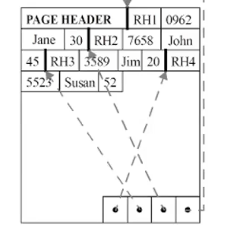

Each pointer points to one record, so we can access specific records fast. 

* Each **slot** stores a record. 
* PageHeader has information on how much free space in the header. It also has the pointers (unlike the above figure). 
* RecordHeader (RH) has information on records. For example for variable size attributes(where they start and where they end)


**Fixed Length**

*Record format :* 


*Page Format:* 

Two ways to format page: 

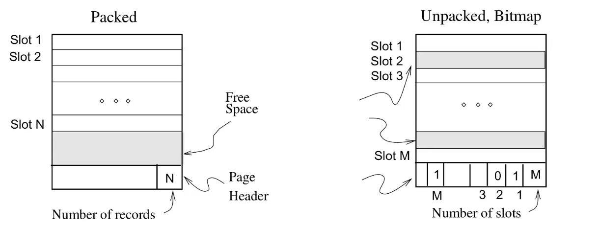

1. We only store the number of slots we need. We need to store this number (N) to be able to add records. 
   	Faster appending. Slower deletion (need to "compact everything"). 

2. We store a constant number of slots along with bitmap to see if they are free or not. 

   ‚Äã	Faster deletion(just mark free). Slower appending. 


**Variable length**

We may  need to change the size of an attribute. 

*Record format:* 

Two solutions : 

1. Bad: Delimit fields by special symbols(we can't use it in filds later). 
2. Good: Store offsets(pointers). 


*Page format:* Much more chaotic: 


* After deleting and modifying records may not even be in order. 
* Good to keep free space compact. 

##### Decomposition Storage Model (DSM): Colum by column storage 

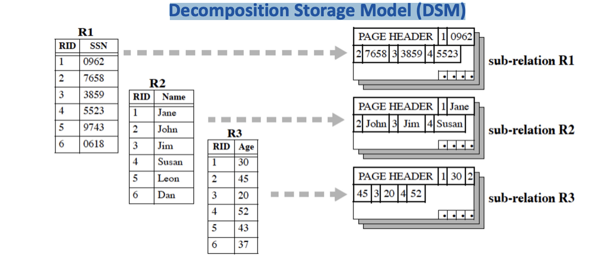

Faster for queries on attributes(analytics) e.g average age. 

##### Alternate format: Partition Attributes Across (PAX)


V-minipage: variable length 

F-minipage: fixed length

UNDERSTAND DIFF WITH DSM


**Alternative file organization ** 

* **Heap files :** a mess, good when retrieving all records. (slow finding, quick insertion). Messy desk.  

  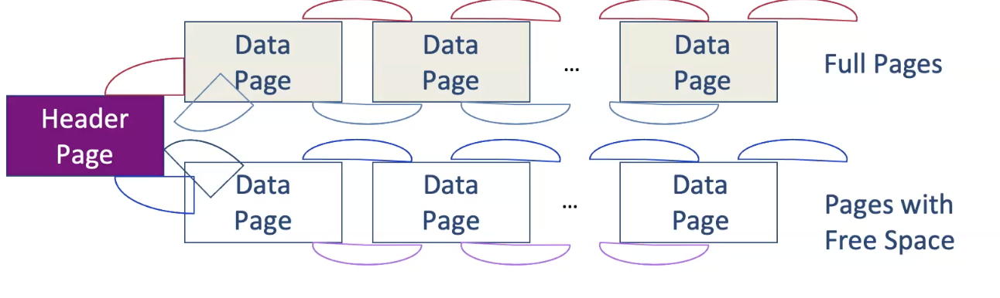

* **Sorted files:** good for retrieval in some order. (fast finding, slow insertion). 
  Organized desk. 

* Index File Organization

Lot of write => heap. Lots of read => sorted. 


Which is better ? Sorted file or Heap file ? 

* Based on IO and considering the **average case** 

  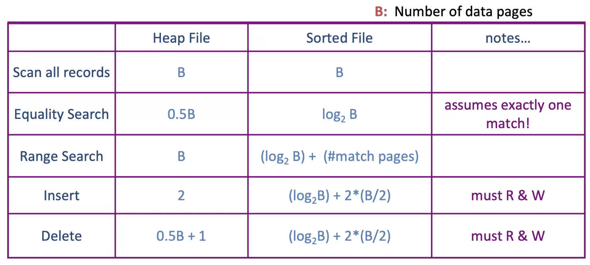

Delete: heap: 0.5B to find + 1 to overwrite / sorted: logb to find + b/2 times read and write to "lift" everything one index up. 


### Indexing

Redundant(need for efficiency not correctness) data structure so that we can search the data in a different order that it is stored in our db. 

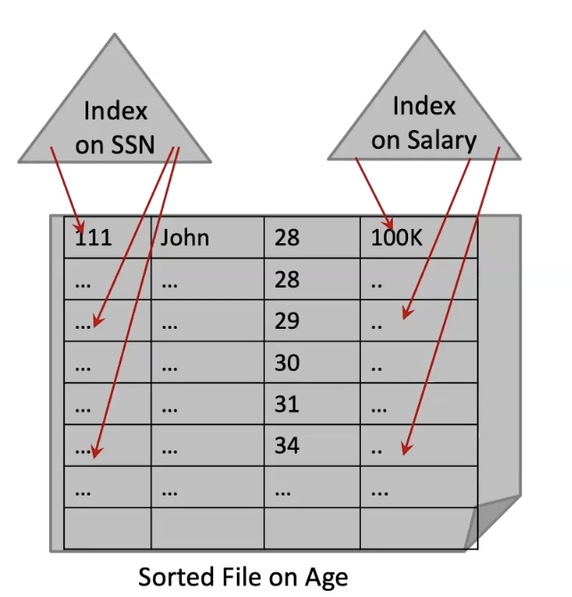

An index on a file speeds up selections on the search key fields for the index 

* The search key is NOT necessarily a key (e.g., no need to be unique)


What to put in leaves ? (Data entries) Assume a data entry **k***

 There are 3 alternative representations: 

1. Actual data record (with key value **k**) 
2. <**k,** matching data record> (uniqueness of search key is needed)
3. <**k**, *list* of rids of matching data records> (like the case above gpa)

**Hash indexing**


**Clustered vs Unclustered**

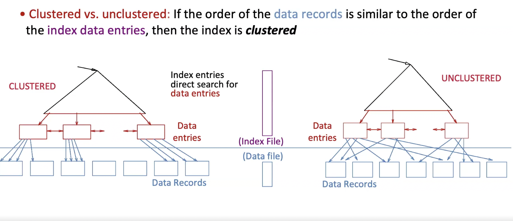

**Dense vs sparse **


**Different types of index** 


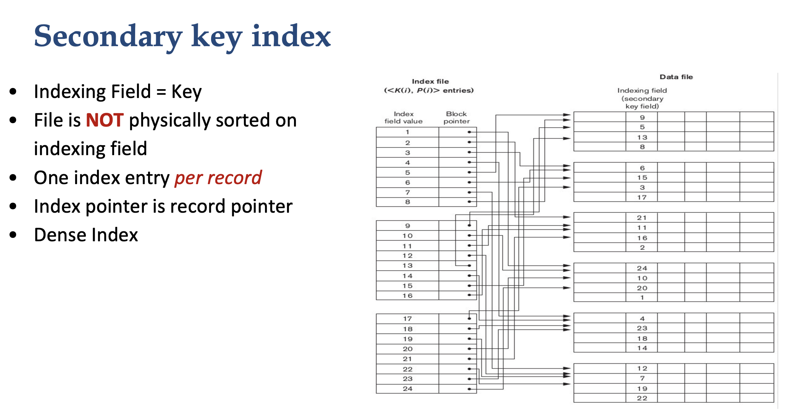

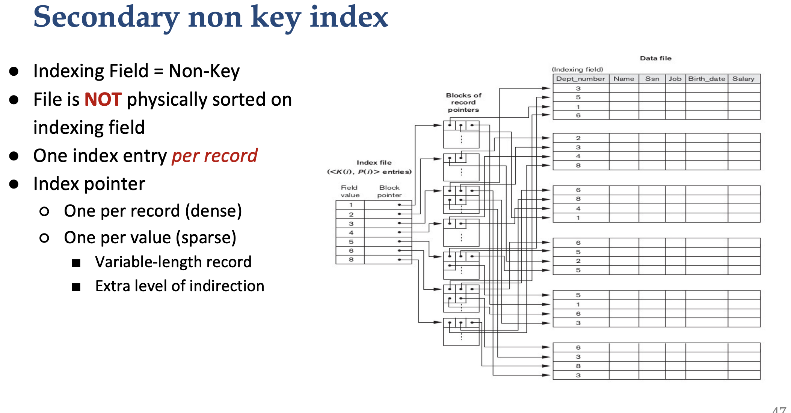

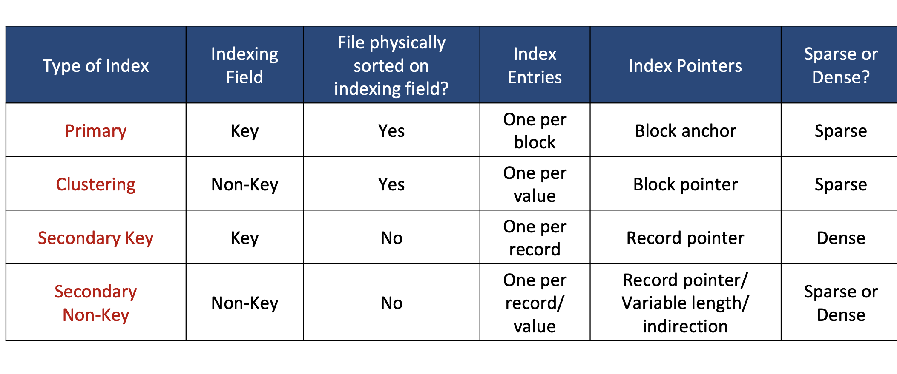

# Week 4: The storage layer 


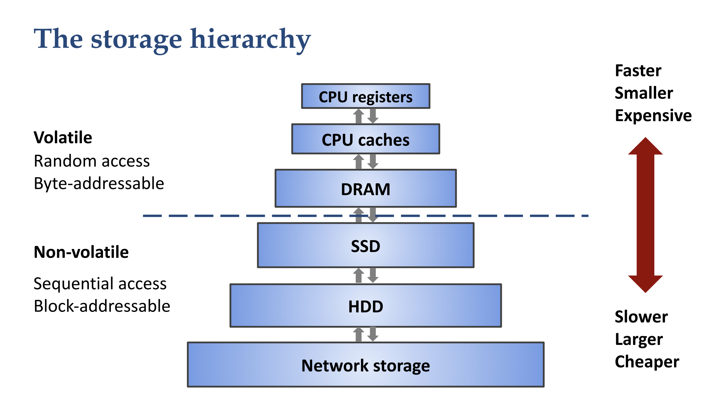

Remark: 

* The non-volatile area is **block-addressable**. It is store in Disks (as opposed to CPU and main memory for volatile area)

DBMS stores information on disks. This has major implications for DBMS design: 

* READ: transfer data from disk to main memory (RAM) 
* WRITE: transfer data from RAM to disk 
* Both are high-cost operations, relative to in-memory operations, so must be planned carefully!

So disks are slow, there are two types of disks, Magnetic disks(hdd) and flash memory(sdd). HDD is cheap, slow for random access and has good performence for streaming. SDD are more expensive and have medium performence for random access. 


### HDD


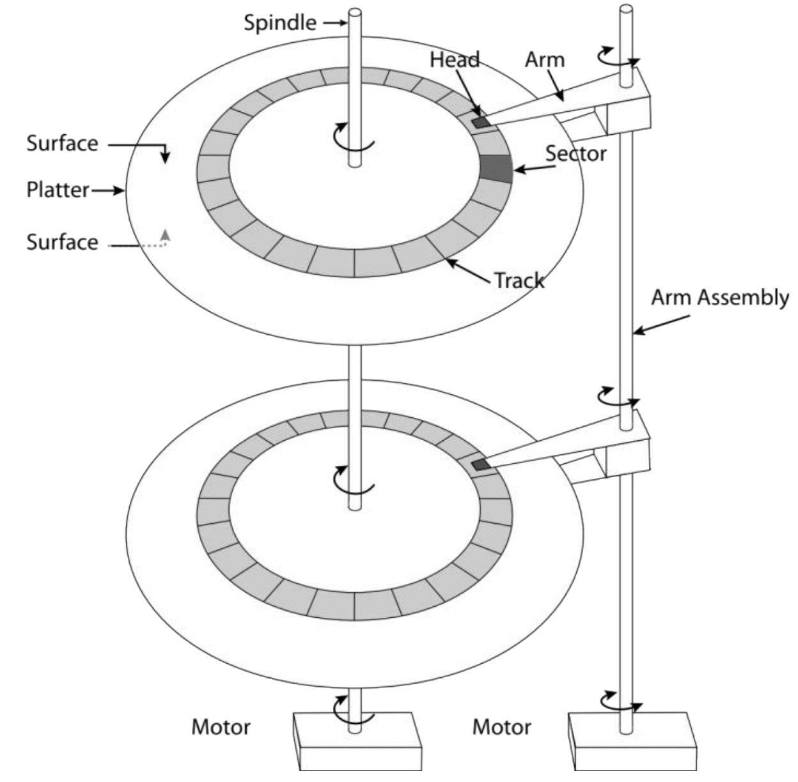

* **Track**: concentric circles on the disk 

* **Sectors**: slice of a track; smallest addressable unit 
* **Cylinder**: All the tracks under the head at a given point on all surfaces

**Disk overhead** 

Disk latency = Seek time + Rotation time + transfer time

*  **Seek**: position the head/arm over the proper track  To get to the track (5–15 ms) 
* **Rotational delay**: Wait for desired sector to rotate under read/write head (4–8 ms) *Only need to wait for half a rotation on average.* 
* **Transfer time**: Transfer a block of bits (sectors) under read/write head (25–50 usec)

Seek cost is usually the highest. 

Using disk efficiently: Minimize seek time and rotational delay. 

### SSD 


Hierchical architecture for better parallelism. 

SDD have a "fast" random access. 


### Redundant Array of Inexpensive Disks (RAID)

 **RAID0**

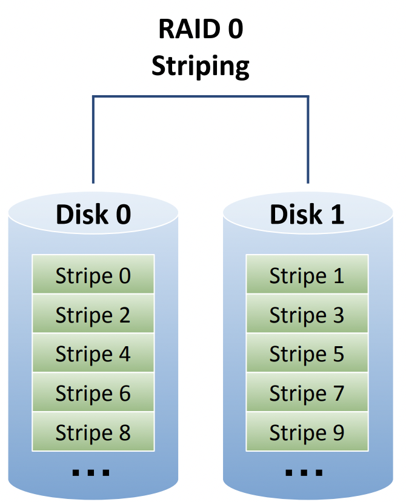

* Best performence (parallel reads/writes)
* No security 
* Total storage capacity: sum of capacities of all disks


**RAID1**

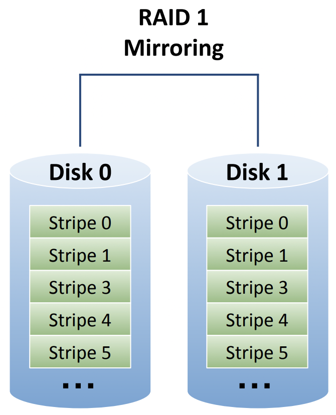

* Deals well with disk loss 

* Does not handle corruption
* Total capacity: capacities of one disk => expensive


**RAID 5**

Parity: Another mechanism for fault tolerance.  $P_{i–j} = S_i ⊕ S_{i+1} ⊕ … S_j $ 

*  If one disk fails, one can reconstruct its data by XOR-ing all remaining drives. 
* Fast: Parallism (3 times faster than one disk, N=4)
* Capacity : $\frac{N-1}{N}$ where N is the number of disks. => Affordable


### Buffer management 

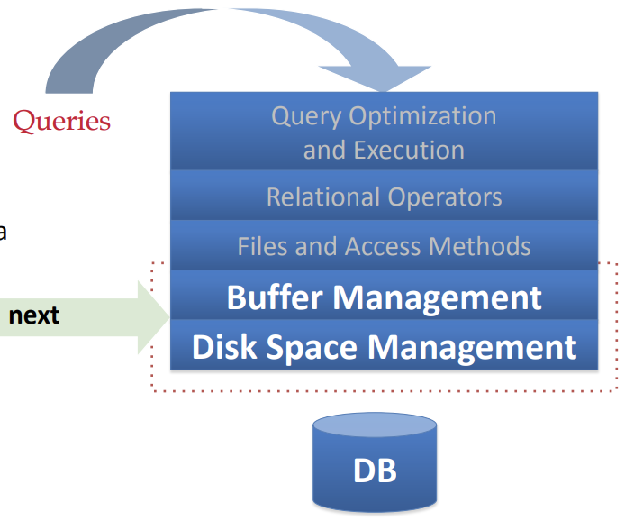

Data lives in the disk. However, we need it to be in DRAM to operate on it. So how do we manage which data to put on DRAM and how ? **buffer manager**

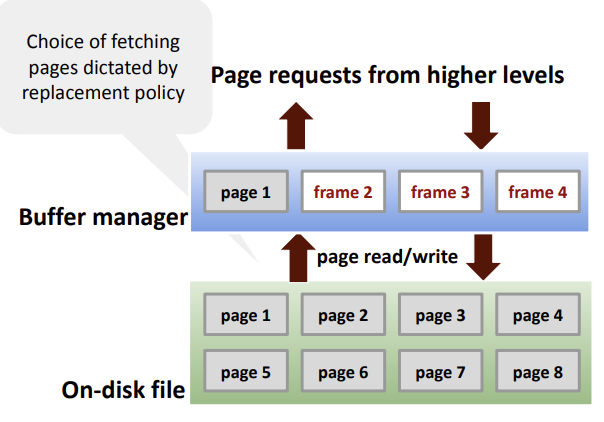

Buffer pool is organized as an array. Each entry of the array is a **frame**. So a frame contains a page along with this page's metadata (information needed by buffer manager e.g dirty bit,pin...)

Each frame holds other information : 

* State : Clean/dirty/new created ... 
  **dirty flag** If page has been modified after it was imported from disk. 
* **Pin/reference counter:** A marker or a counter indicating if a page is being referenced by higher levels of DBMS. 

For faster search in the buffer, we have a page table. 

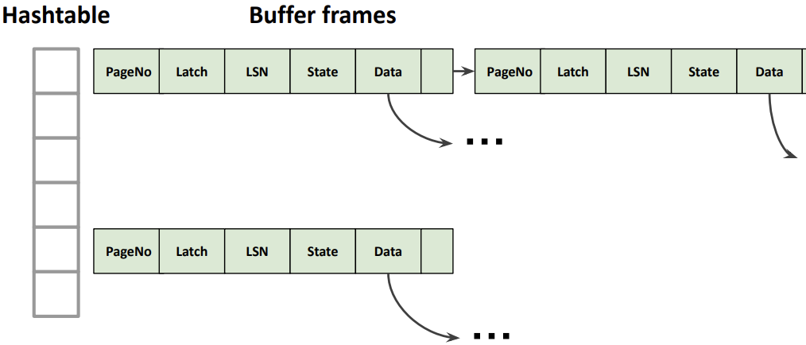


**Getting a page to the pool when requested … **

1. Checks the buffer pool to see if some frame contains the requested page, and if so increments the pin count of that frame. If the page is not in the pool, the buffer manager brings it in as follows:

   (a)  Chooses a frame for replacement, using the replacement policy, and incre- ments its pin count.

   (b)  If the dirty bit for the replacement frame is on, writes the page it contains to disk (that is, the disk copy of the page is overwritten with the contents of the frame).

   (c)  Reads the requested page into the replacement frame.

2. Returns the (main memory) address of the frame containing the requested page to the requestor.

### Replacement policies 

* First in-first out (FIFO)
* Least recently used (LRU)
* Clock

**Clock :** An approximation of LRU that does not need a separate timestamp per page. Each page has a reference bit. When a page is **accessed**, set it to 1. 

Organize the pages in a circular buffer with a “clock hand” : 

* Upon sweeping, check if a page’s bit is set to 1 
*  If yes, set to zero  If no, then evict. 

> **Clock: ** To stay, you must be accessed each circular turn.  


# Week 5: B+ Tree 

A self-balancing (height balanced), ordered tree data structure that allows *searches*, *sequential access*, *insertions,* and *deletions* in $O(log_F N)$. 


* **d** : max number of keys per node (in the above example=2)

* **F** : fanout- # of children of each node (=2 for root node in above example) 

* **Balancing:** To maintain the tree balanced we conserve the following invariant: 

  > *Each node must be atleast half full :* $d ≤ \text{\#keys} ≤ 2d$

**Operations on B+tree**

* Search : Most straighword 
  1. Start with the root node
  2. Is the current node a leaf?
      If yes, return the current page (locate the entry on it)
  3. Find the first entry >= search key (binary search)
  4. If no such entry is found, go to the upper node, otherwise go the corresponding page
  
* Insert : 

  1. Find correct leaf node $L$  

  2. If not empty, insert in the correct (sorted) order.
     Else:  

     ‚Äã	2.1.  Put half of $L$ into a new leaf node $L_2$ 
     ‚Äã	2.2. Insert $L_2$ to the parent of $L$ (so $L$ and 	$L_2$ are at the same level)
     ‚Äã	2.3 This insertion happens the same way recursively

  

  Example : Insert 21: 

  : 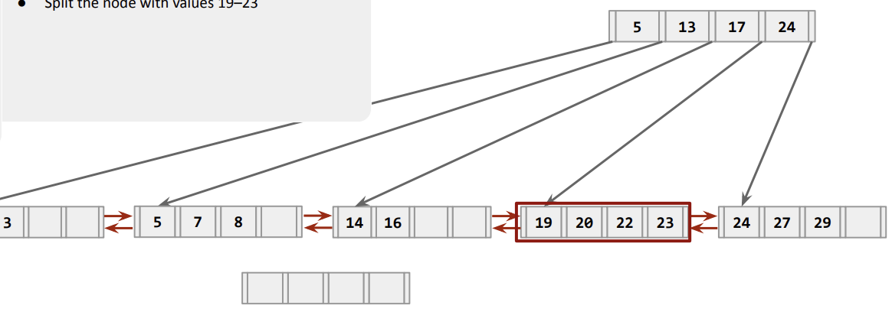

* Delete : 

  1. Find correct leaf node $L$

  2. Remove entry 

     1. if node is atleast half full $\rightarrow$ done 

     2. Otherwise: Borrow from sibling with same parent

        1. If sibling more than half full $\rightarrow$ done 
           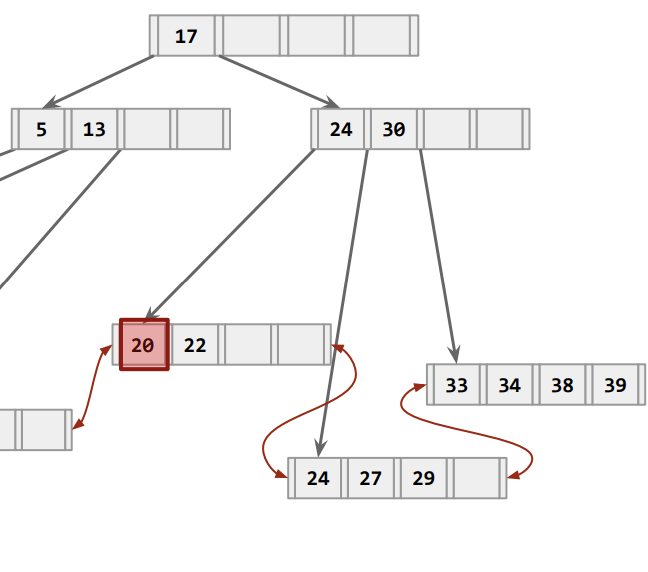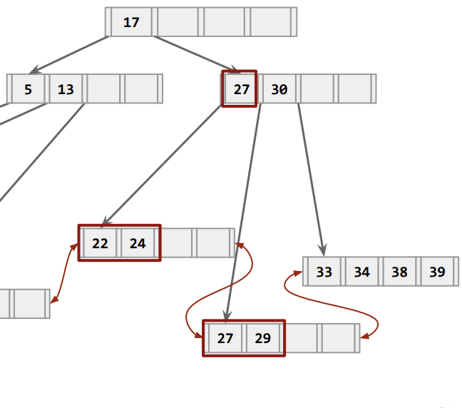

        2. if sibling less than half full $\rightarrow$ Merge  
           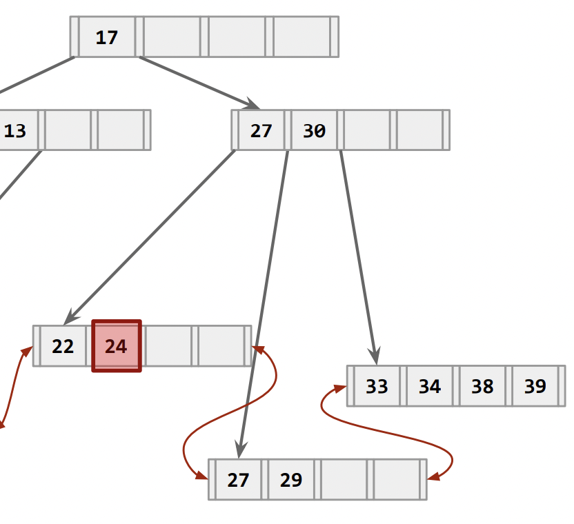 

           We may fidn ourselves in the case were parent is not half full. It this case, we rebalance recursively. 
            $\rightarrow$ 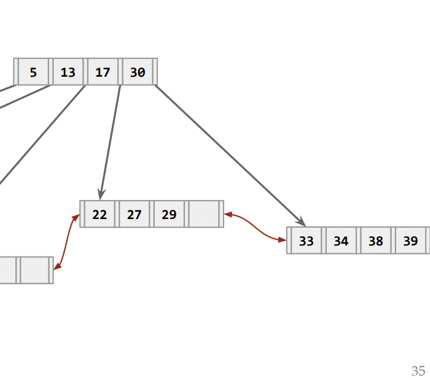
           We can also merge with root. 

**B+Tree design choices**

* Node size : The slower the storage device, the larger the optimal node size for the tree. 
* Merge threshold : In pratice we keep $67\%$  occupancy (insteaf of half). 
* Variable length keys 
* intro-node search : Linear search (performence by simd instruction) or binary search or interpolation. 


**Concurrency on B+Tree **

* Can't just lock node by node because you need to also modify parent 

* **Lock coupling**
  Lock node and parent 
  E.g. Latch the root first, latch the first level, release the root, latch the second level etc

  problem: when you need to propagate up the to the root. 
  Alternative approach: Use restart or optimistic coupling 

  1. First try to insert using simple lock coupling 
  2.  If we do not split the inner node, everything is fine 
  3.  Otherwise, release all latches 
  4. Restart the operation, but now hold all the latches all the way to the root 
  5. All operations can now be executed safely


# Week 8 Hashing and sorting 

In building hash tables, we want datastructures that have average constant time and worst case linear time for operations like insert, delete, search. 


**Aproach 1. Linear probe hashing**

Insertion

* Use the output of hash function $h(key)$ as a index. 
* If that index is full, use check next index and so on. 

Searching is similar to insertion, we search starting from the index  $h(key)$. 

For Deletion, we search for the element, then mark its index as deleted(we call this a *tombstone*). 

‚ùå All operations are O(N) in the worst case. ‚ùå This approach also assumes when know beforehand the maximum size of data we want to store. 


**Approach 2. Chaining** 

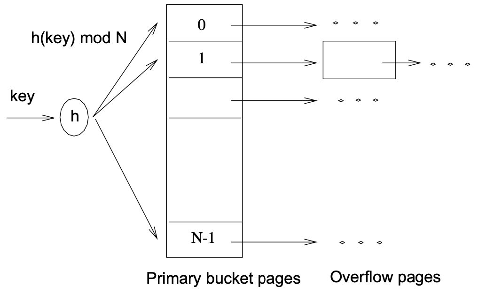

* Choose bucket $h(key)$ , if it is full consider the linked overflow pages. 

The numbef of buckets is **fixed** 

‚Äã	‚ùå  If the file grows a lot, many pages to traverse(and read) to find data. 

‚Äã	‚ùå  If file grows, we waste space and rehashing(rebucketing) is very expensive(read hole file)


Solution **Dynamic hashing**


**Extendible hashing** 

Idea, if a bucket gets too big, we split it. 

So we are in the following setting : 


We save the bucket of each hash values with distinct 2-LSB (2 because it is the global depth). 

For example, we have in total 4 values with 2-lbs = 01 or 11, they all have as lsb 1.  So we save this in same bucket(B), this bucket has element which has the same 1-lsb (so it has local depth 1). 

* if we were to add (a key hashed to) 3, for example, then bucket B would overflow, we would then to split it into two buckets. We use as criteria to decide 2nd lsb. We would get :                                                                                                                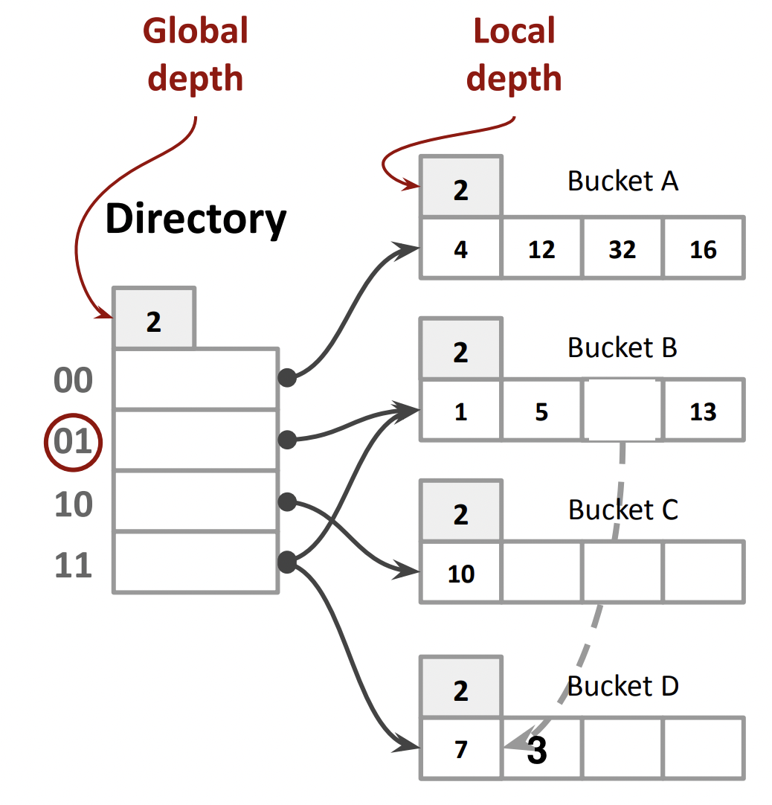      

  Notice that in this case, we do not read to add buckets.

* *When local depth = global depth and we have an overflow* (if we want to add 20 in the below example)
  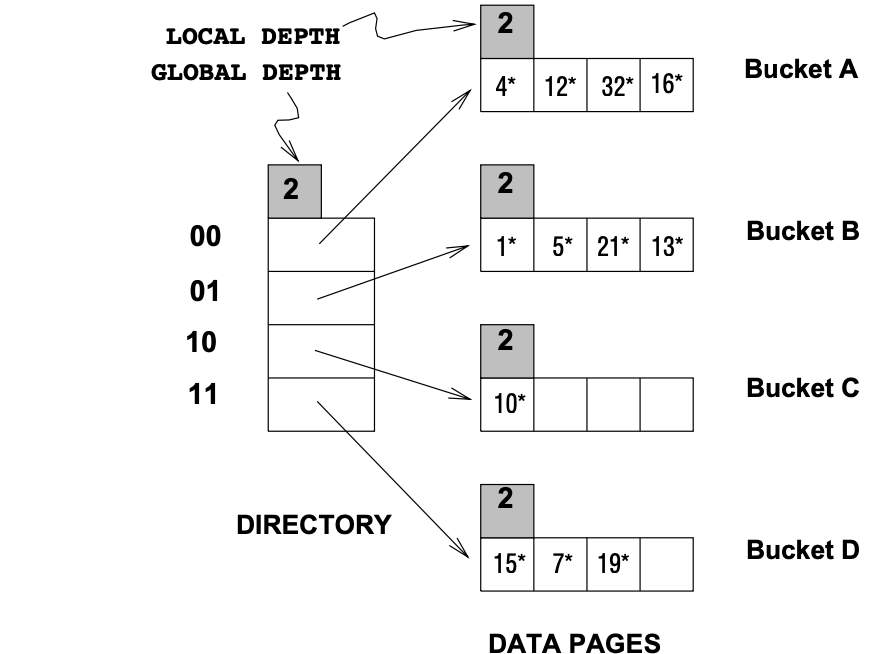
  Then we will need to operate with a local depth of 3. Therefore, we double the number of buckets and increase the global depth. So we get the following :

   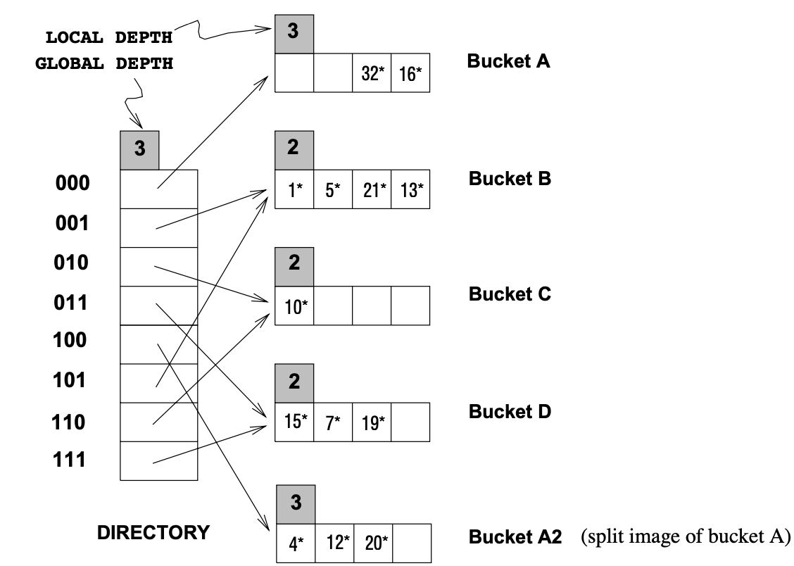

Even if we can have dynamic buckets, we still can have collisions ‚ùå They should be handled seperately (with overflow pages).


**Linear hashing** 

We have many hash functions $h_0 ,h_1 ,h_2 ,h_3...$ such that the range of $h_{i+1}$ is double that of $h_i$, we can image they all "come" from a mother hash function  hash function $h$ : $h_i(x)= h(x) \mod N2^i$


This algorithm proceeds in rounds, let's say we are at round $round$ 

* We say we *split* a bucket, when we create a new bucket and know use $h_{round+1}$ 
* At each round all buckets will be eventually split. 


At each round there are $N2^{round}$ buckets and we keep track of a variable $next$ which represents the next bucket to split. If there is an overflow, we add an *overflow page* and we **split bucket $next$** and increment $next$ . 


So if we have an operation, say insertion, we check if the hash (with is $h_{round}$ )$\leq next$ , in which case this bucket is not split and we can access. If otherwise, meaning $>index$ then it means content of this bucket can be in $h_{round}(x)$ or $2h_{round}(x)$ we know that by looking at $h_{round+1}(x)$ . 


Insert 17 :  

Triggers *split* of bucket $next=0$‚Äã 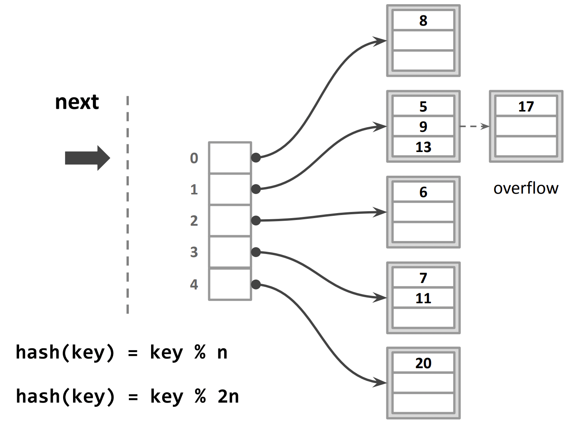

8 and 20 have same output of $h_{round}$ but not $h_{round+1}$ 

‚úÖ avoids directory structure of Extensible hashing. 

‚úÖ In extensilble hashing, when we "split" (and exceed global depth) we need to double buckets. Here we do it much less. 


## Sorting 


**2-way external merge sort**

2-way meaning that in each pass we can only consider two pages. Meaning our buffer will contain 3 pages, 2 for input and one for output. 

Pass 0 : Load page, sort page, repeat $\rightarrow$ we get $N$ sorted pages. 

Pass 1 : Load two pages, merge them, go to next pair $\rightarrow$ $N/2$ sorted pages. 


In 2 way merge sort we do 

> $1+\lceil \log_2(N) \rceil$ **pass** and  the **total IO cost** is $2N(1+\lceil \log_2(N) \rceil)$ (in each pass we read and write $N$ page)

where $N$ is the numbere of pages to sort. 

**B-way exteral merge**

In real life,  we have more than $2$ pages in the buffer, let's say we have $B$  buffers. 

Pass 0 : Load $B$ page, sort them , repeat page $\rightarrow$ we get $\lceil N/B\rceil $ runs of sorted $B$ pages. 

Pass 1 : Load first page of the $$\lceil N/B\rceil $$ runs available(we can only load $B-1$ ), merge these, go to next batch of $B-1$ among the remaining runs $\rightarrow$ we get $\lceil N/B\rceil $$ /(B-1)$ runs ... 


> Passes : $1+\lceil\log_{B-1}\lceil N/B\rceil\rceil $ 
>
> IO Cost : $2N^*(1+\lceil\log_{B-1}\lceil N/B\rceil\rceil)$ 


**Using a B+tree**

If the table that must be sorted *already* has a B + Tree index on the sort attribute(s), then we can use that to accelerate sorting 

• Retrieve records in desired sort order by simply traversing the leaf pages of the tree 

Consider the case: 

* Clustered B+ Tree: Good idea ‚úÖ
* Unclustered B+ Tree: Could be a very bad idea ‚ùå 

# Week 9 Relational operators evaluation (Query processing)

We will see how to implement(evaluate) relational operators like project, select or join. 

However, that is not sufficient to make for optimized query processing. We should also make an efficient query plan. This includes rearranging the operational operations and choosing a physical plan(the actual algorithms that will be excecuted). This will be seen in next chapter. 


A DBMS **processing model** defines how the system executes a query plan. 

Two approaches: 

1. Iterator model 
2. Materialization model 


## Iterator model 

* **Next** each call to next return either a *tuple* or *eof*
* An operator implementating Next will call Next on its children 

Each operator implementation also has Open() and Close() functions Analogous to constructors and destructors, but for operators. 


This process will happen tuple by tuple. 

‚úÖ

* Pull-based: No operator synchronization issues 

* Can save cost of writing intermediate data to disk

* Can save cost of reading intermediate date from disk 

Used by almost every DBMS 

❌  Many operators must block until their children emit all their tuples: • Joins, aggregates, subqueries, order by **overhead**


## Materialization model 

 The operator “materializes” its output as a single result 

* DBMS can push down hints (e.g., LIMITS) to avoid scanning too many tuples 
* Can send either a materialized row or a single column

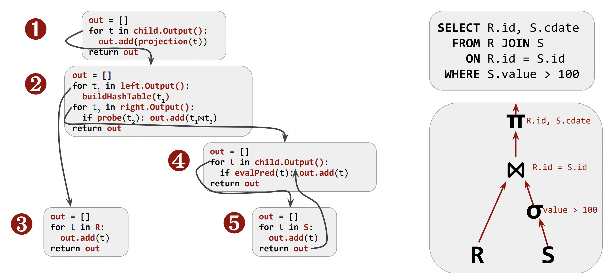

‚úÖ

* Lower execution / coordination overhead

* Fewer function calls

‚ùå  

* Not good for analytical queries with large intermediate results 
* Requires memory and sometimes it won’t be enough


## Access methods 

An access method is the approach how a DBMS accesses the data stored in a table. 


**Simple selection **

```SQL
SELECT *
 FROM Reserves R
 WHERE R.rname < ‘C%’
```

Of the form $\mathbf{\sigma}_\text{R.attr op value }{R}$ 

Size of result approximated as **size of R * reduction factor**

 • Reduction factor also known as selectivity

Methods (we consider relation R with M = 1000 pages and 100K record as example): 

* **No index, unsorted** : Scan the whole relation   Cost is **M** (# pages ) 

* **No index, sorted**:
  * Cost of binary search + number of pages containing results 
  * For reserves = **~10 IO + [selectivity * #pages]** (110 for 10% selectivity)
  * This is rare; most likely an index will definitely exist 
  
* **With an index on selection attribute** 
  * clustered $\approx $ **[selectivity $\times$ #pages]** (100 IO in this case) ‚úÖ 
  * unclustereed $\approx$ **[selectivity $\times$ #*records*]**(10K IO) ‚ùå


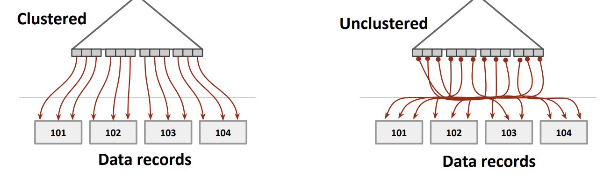

### Selection

We consider `day < 8/9/94  AND bid=5 AND sid=3`

Approach 1.

‚Äã	Assuming we have an **b+tree on day** (or on <day,other_attribute>) 
‚Äã	We can retrieve all records corresponding to `day < 8/9/94`

‚Äã	Then check the other conditions (bid =5 and sid =3)

Approach 2.

‚Äã	If we have more than a **b+tree** on day, for example we **also** have **hash index on sid**

‚Äã	Retrieve from b+tree satisfying `day < 8/9/94`

‚Äã	Retrive from index satisfying `sid=3`

‚Äã	Retrieve records and check `bid=5`


### Projection

```SQL
SELECT DISTINCT
 R.sid, R.bid
 From Reserves R
```

 **I. Basic approach** is to use sorting 

‚Äã	a. Scan R, extract only needed attributes 

‚Äã	b. Sort the resulting set

‚Äã	c. Remove adjacent duplicates

recap about merge sort : 


**Total cost = 2N * #passes** 

Cost: 

‚Äã	a. Keep only needed attributes (25% of pages so 250pages) $\rightarrow$ 1000 reads + 250 writes. 

‚Äã	b. Sorting with 20 buffer page takes 2 passes $\rightarrow$ IO = 2 * #pages * #passes = 2 * 250 * 2 

‚Äã	c. Remove adjacent duplicates $\rightarrow$ 250 to read 

Total is 2500 IO. 


II. Optimization : **modify external sort to project and eliminate duplicate on the fly** 

‚Äã	a. pass0 of external sort also eliminates unwanted attributes. $\rightarrow$ 1000 read + 250 write 

‚Äã	b. Merge the $\lceil N/B\rceil$ runs in  $\lceil\log_{B-1}\lceil N/B\rceil\rceil$ passes and eliminate duplicates while merging $\rightarrow$ 250 ( we don't take final writing into account for some reason)

So total is 1500 IO. 


**III. Projecting with hashing**

We have $B$ buffers and $h_1:keys\rightarrow \{1,...,B-1\}$ , so we will have $B-1$ partition.  

We will work in two phases. 

1. Partioning phase 

   * read R using a buffer 
   * for each tupe: discard unwanted filed **then** apply hash function $h_1$ to send it into one of the $B-1$ partition. 
     * result : $B-1$ partion where tuples in different partitions are  **guaranted** to be different(otherwise $h_1$ would hash them the same)⚠️													

2. duplicate elimination 

   * read partition and build in memory hash table with $h_2 (\neq h_1)$ 
   * do duplicate elimination 
   * üôÅ  If it does not fit in memory partition recursively. 


Assumptions in numbers: 

* $h_1$ distributes tuples uniformly. 

* let $T$ be #pages after projection
* #pages per partition = $T/(B-1)$‚Äã
* A partion fits in memory $\implies$ $B \geq T/(B-1)$  $\implies B > \sqrt T$ 

### Joins 

**I. Simple nested loops**

```pseudocode
foreach tuple r in R do //  R is the outer relation 
 foreach tuple s in S do
 		if ri==sj
then add<r,s> to result
```

* $\color{red}M$ the number of pages in $\color{red}R$ , and $\color{red}p_r$ tuple per page
* $\color{blue}N$ the number of pages in $\color{blue}R$  

IO cost (ignoring output) = $\color{red}M$ + $\color{red}M \times p_r \times \color{blue}N $  

Because for each tuple in $\color{red}R$ ($\color{red}Mp_r$ of them) we read $\color{blue}N$ pages. (assuming only 1 buffer page)

⚠️ choice of inner/outer matters


**II. Index Nested Loops Joins**

If we have an index available, we can use Index nested loops

```pseudocode
foreach tuple r in R do
	foreach tuple s in S where ri== sj do
		add <r, s> to result
```

IO cost :  $\color{red}M$ + $\color{red}M \times p_r \color{black}\times \color{blue}\text {cost of finding matching S tuples}$

The cost of finding S tuples can be : 

* 1 IO for matching **page** of tuples (clustered)
* 1 IO for each matching tuple (unclustered, it would be equivalent to simple nest join) 


**III.Page-Oriented Joins** 

```pseudocode
foreach page pr in R do // R is the outer relation
    foreach page ps in S do // S inner relations
        for each tuple r in pr do // once we loaded two pages,
            for each tuple s in ps do // we read entries off them
                if r == s then
                    add <r, s> to result
```

IO cost (ignoring output) = $\color{red}M$ + $\color{red}M  \color{black}\times \color{blue}N$

We do not read all $ \color{blue}S$ for each tuple in $\color{red}R$ now but for each page. 

⚠️ Choice of inner/outer matters.


**IV. Block nested loops** 

What if we have more main memory buffers ? We can load *blocks* . 

We do not read all $ \color{blue}S$ for each tuple in $\color{red}R$ now but for each *block* . 

IO cost = $\color{red}M$ + $\color{red} \text{\#outer blocks}  \color{black} \times \color{blue}N$ where $\color{red} \text{\#outer blocks} = \lceil \frac{M}{\text{block size}}\rceil $‚Äã 

```pseudocode
foreach block blockR in R do // #outer block 
	foreach page bS in S do  // N 
		foreach tuple r in blockR do 
			foreach tuple s in bS do 
				if ri ==sj then add to result
```

If we have $B$ pages in the buffers, we must use $B-2$ pages per block, so we have an extra page for reading a page from $r$‚Äã and another extra page for the output. 


**IV. Hash join** 

*One pass hash join :*

We can build a hash table on the required attribute. 

```pseudocode
foreach r in R do // R is the outer relation
    add <r.rid,r> to hash table 
foreach s in S do 
		if s.sid in hashtable // (with value r)
			add <r,s> to result 
```

* Cost: $\color{red}M$ (outer scan) + $ \color{blue}N$ (inner scan)

‚Äã	One pass assumption:  Enough memory to store M + hashtable (conditions need to be done in one pass)


*Two pass hash join*

Suppose we have $B$ pages in the buffer. 

1. Partition $R$ and $S$ into $R_1,...,R_k$ and $S_1,...,S_k$ respectively. 
2. Consider $R_i$ and $S_i$‚Äã and do a one pass hash join on them. 

>  ⚠️ Steps 1 and 2 should be done with **different** hash functions.

 

* Cost : $3(\color{red}M$ + $ \color{blue}N)$‚Äã 
  * Partioning 2(M+N)
  * Matching step : M+N 

In step 2, we need a buffer page to read a page from $S_i$ and another page for the ouput. The remaning $B-2$ pages are used for $R_i$ . So $\text {size } R_i = M/k \leq B-2$ . The maximal $k$ we can use is $B-1$ (we need one page to read during partioning phase), so $k=B-1$. 

Meaning $B>\sqrt{f*M}$ where $f$ is a fudge factor (accounts for hashtable size) 


Problem: 

* What if we don't have $B>\sqrt{f*M}$ free buffers ? *recursive partitioning*
* What if a partition exceeds expected size(overflow) ? *repartition with other hash function*


*Utilizing extra memory : Hybrid hash join*


Sometimes we have more that $B>\sqrt{f*M}$‚Äã‚Äã  memory, we can use extra memory to speed up steps 1 and 2. 

*example with one partition left*

Phase 1 (partitioning phase) 

​	• Partition S, but do not write out first partition 

​	• Partition R, directly join first partition R1 with S1 

Phase 2 (probing phase) 

​	• Join remaining k -1 partitions


If we can keep $t$‚Äã partitions in memory, then we save IO by not writing in step1 and not loading in step2 (we save 2 IO for $t/k$ fraction of partitions )


Suppose we will use $k$ partition and $B>fM/k$ , then there are pages left over. 

In fact we can save $t = \lfloor \frac{B-(k+1) }{fM/k} \rfloor $‚Äã extra partions. 

 


**V. Sort merge join** 

* Scan R and sort in main memory 
*  Scan S and sort in main memory 
* Merge R and S

⚠️ Assumptions: One pass if : Enough memory to store M + N.  *Usually not availabe*

**Cost:** Sort R + Sort S + (M+N)   

* M+N if one pass, *usually not the case*
* If we use external merge sort :  2N * (# of passes) +  2M * (# of passes) + N + M 
* Refinement : 
  When we merge a "run" from R and one from S, check for equality of join 

# Week 11 Relational Query Optimization

Problem: Given an SQL query, how to convert it to the most optimal *plan* ? 

*Plan* : physical plan (relational algebra plan and physical plan). 


* Step1. **Query transformation** generate logical plan (query to optimized logical formula)

* Step2. **Optimization** Generate physicial plan from logical plan. 


We consider the following SQL query as example : 

```SQL
SELECT S.sname
FROM Supplier S, Supply U
WHERE S.scity='Seattle'
AND S.sstate='WA'
AND S.sno=U.sno
AND U.pno=2
```

**Query transformation** 

For this query there are many possible *logical* plans (executed from bottom to top) : 
                   

The second plan is better(most of the time), it still depends how it is physicall executed. 

And for each *logical plan* (like the first), there still exsists many *physical plans*(depending on the used algorithms): 

 					


This are the steps of query transformation 

1. Step 1 : break queries into blocks 
   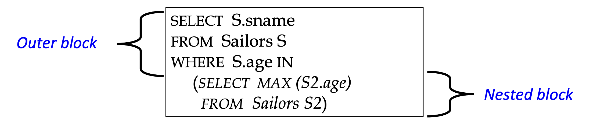

2. Step2: Converting each query block into relational algebra 

   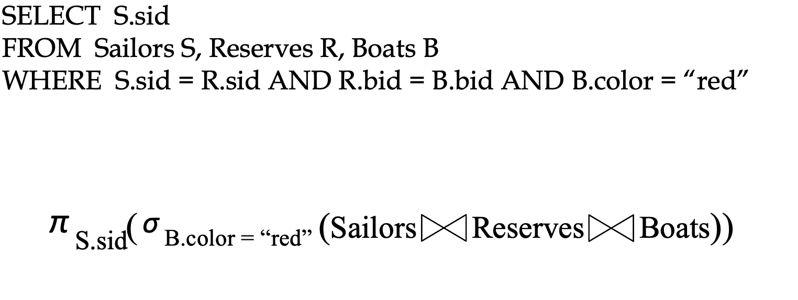

3. Query rewriting : find the best logical plan 

   * Push selection and projection so they are done before join. This is so we reduce the size of the data before joining, which is a costly operation. 

   * *Decorrelation*
     Convert query to *uncorrelated* and "standalone query" $\rightarrow$ nested block can be executed only once. 
     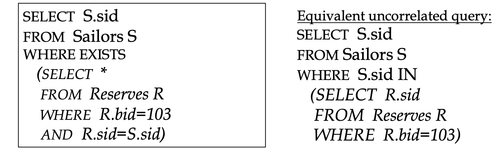

   * *Flattening*

     Rewriting a query so we are able to use a join algorithm 
     

**Query optimization**

Usuall a **query optimizer** works in the following way 

**Cost-based query optimization algorithm** 

1. Enumerate alternative plans (logical and physical) 

2. Compute estimated cost of each plan 
   * Compute number of I/Os 
   * Optionally take into account other resources 
3.  Choose plan with lowest cost


# Week 12 Transaction Management

Ensures : 

1. concurrent database access 
   Databases receive queries from many softwares, we could execute each set of queries in isolation one by one as they arrive. However, we want better throughput. So we need to do some of them at the same time. 
   However, we also want to guarantee *correctness* and *fairness*. 

2. resilience to system failures 
   suppose a query is to substract 10$ from A's bank account and add it to B's bank account. If the system fails after first operation, then bank looses money. 

   $\rightarrow $ Guarantee all-or-nothing execution

Solution is **transactions**  A transaction is a sequence of one or more SQL operations treated as a unit. It should respect the following : 

**ACID properties**

* **Atomicity**: All actions in the transaction happen, or none happen *(“All or nothing”)* 

  > Note that atomicity here is not the same as the one used in the parallelism and concurrency course. 
  >
  > It also implies that if a transaction *aborts* all changes due to this transaction must be *undone*

* **Consistency:** A transaction must preserve consistency if run by itself on a "consistent database". (consistency is defined by user, for a bank transfers in same bank, consistency is the fact that the total amount of money in the bank must remain the same)
* **Isolation:** The execution of a transaction (values read and written), should not be affected by other concurrent transaction. 
* **Durability:** If a transaction commits, its effects should persist, even if a crash happens before writing to disk. 

**Mechanisms to ensure these properties**

**Atomicity**

1. Approach #1: **Logging** 

   * DBMS logs all actions so that it can undo the actions of aborted transactions 

   * Maintain undo records both in memory and on disk

   If an abortion happens, just undo $\rightarrow$‚Äã widely used. 
   Log: list of records with row information, old data and new data. 

   The are two types of log records, update log records and commit log records. 

   A transaction is commited once it adds all log recods (update and commit) to disk. 

   **Write-ahead-logging (WAL)** 

   * ⚠️ Log record must go to disk before updating the page

   * All **log** records(update and commit record) for a transaction must go to disk **before** the transaction is considered commited. 

     

   A log offers an UNDO or REDO operations : 

   * UNDO: Uncommitted data can overwrite stable version of committed data 

   * REDO: Transaction can commit before all its all its updates are on the disk 

   

2. Approach #2: Shadow paging 
   DBMS makes copies of pages, and transactions makes changes to those copies 
   Only when the transaction commits, then page is made visible to others
   Not very used. 


**Isolation**

To ensure Isolation we have **concurrency control** where the  the DBMS decides the proper interleaving of operations from multiple transactions. See next chapter. Strict two-phase locking (S2PL) protocol

**Durability**

How to recover from crash ? 3 steps : 

* Analysis: Scan the log (forward from the most recent checkpoint) to identify all transactions that were active at the time of the crash 
*  Redo: Necessary to ensure than all commited transactions are in main memory. 
* Undo: Undo writes of all transactions that were active at the time of the crash, working backwards in the log

# Week 13 Concurrency Control I 

- **Database:** A fixed set of named data objects (e.g., A, B, C).
- **Transaction:** A sequence of actions (e.g., read(A), write(B), commit, abort).
- **Schedule:** An interleaving of actions from various transactions. 
  example: 
   T1, T2 are transactions. $R_1(x),R_2(X),X=X-20,X=X+10,W_1(X)...$ is an interleaving. 

Schedules : 

* **<u>Serial</u> Schedule:** A schedule that does not interleave the actions of different transactions. $\text{actions}(T_1), \text{actions}(T_2), \text{actions}(T_3)...$‚Äã

  This lock guaratees correctness. However, it is very slow. 

* ***Equivalent* schedules**: two schedules are equivalent if the leave the db at the same state after the execution. 

* **Serializable Schedule:** A schedule that is *equivalent* to some <u>serial</u> execution of the transactions.  

So any serializable schedule,  leaves db at correct state, however, it is not guaranteed that all reads give the correct output. 

Stronger definition 

* **Conflict**:  Two operations **conflict** if: 

  * They are done by different transactions,
  *  And they are done on the same object,
  *  And at least one of them is a write

  example : R1 (A), W2 (A) // W1 (B), W2 (B)

* **Conflict equivalence** : Two schedules are **conflict equivalent** iff: 
  – They involve the same actions of the same transactions, – And every pair of conflicting actions is ordered the same way. 

  example: 
  
  
  
  S1,S2 are conflict equivalent, the only two operation that are not in the same order are R1(B) and W2(A). 
  
  Note that conflict equivalent $\implies$ equivalent. Meaning conflict equivalence is a stronger property. 
  
* **Conflict serializability **: Schedule S is **conflict serializable** if: – S is conflict equivalent to some serial schedule. 
  
  

> A schedule S is **conflict serializable** if: – You are able to transform S into a serial schedule by swapping **consecutive non-conflicting** operations of different transactions. 

*We did an example of this with S1 and S2 above.* 

**Testing for conflict serializability**

We use a *precedence graph* : One node per transaction, connect a transaction $T_i$ to $T_j$ if they have conflicting operations $O_i$ and $O_j$ and $O_i$ comes before $O_j$ . 


> **Theorem:** schedule is conflict serializable $\iff$ acyclic precedence graph

**Two-phase locking(2PL)**


Imagine we have writers and readers. 

```pseudocode
reader(): 															writer(): 
	lock(S) -> now writers can't write			lock(X) -> nothing can do shit
	reading... 															write... 
	unlock(S)																unlock(X)
```

Note that a transaction might read and write. ⚠️In 2PL, all the unlocks happen after all the locks : 

```ps
lock(S(A))
lock(X(B))
write B
unlock(X(B))
read A 
unlock(S(A))
```


*In other words,* A transaction cannot request additional locks once it releases any locks. 

So we can't have the following transaction for example : 

```pseudocode
T1  		T2
R(A) 					-- reads, then releases for write lock to happen 
				W(A) 
				R(B)
W(B) 						-- this is not conflict serializable and cant't happend 
```

> **Theorem:** 2PL guarantees conflict serializability. ‚úÖ 

‚ùå Problem with 2PL : subject to cascading aborts. 

T1: R1(A), W1(A), R1(B), W1(B), 			Abort 

T2: 						R2(A), W2(A)

‚Äã							this read happens when T1 releases X(A) and S(A) but 							not S(B) for example 

The problem is that if T1 aborts before releasing all locks, T2 must also abort and restart. 


To solve cascading aborts use **Strict 2-PL**: Only release locks after transaction finishes and we are sure it will not abort. 

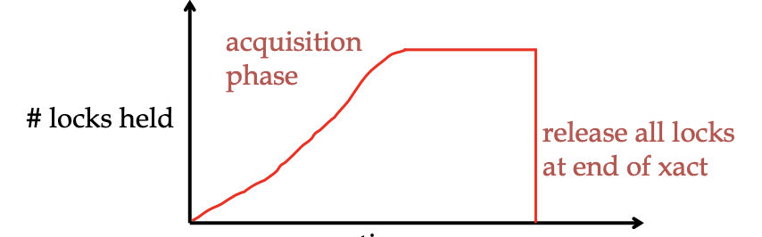

So we only unlock, if we know that either : 

* we commited to disk 
* we know we need to abord (but no other conflicting transaction started,haha)

Comparions : 2PL vs Strict 2PL

 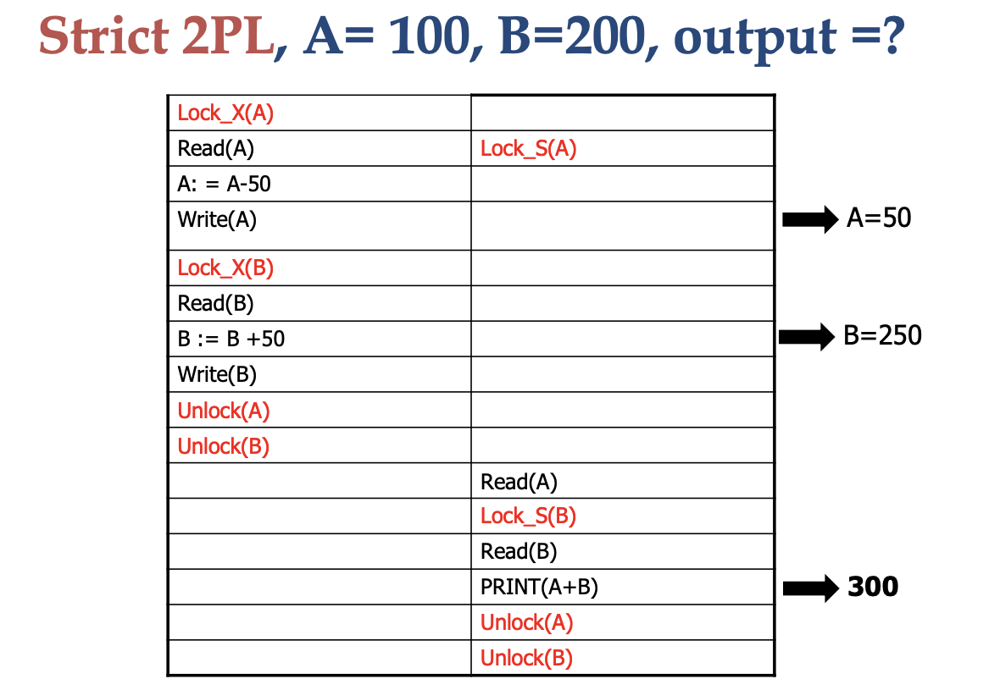


**Lock manager**: handles Lock and unlock requests. 

Lock table entry:  

* Pointer to list of transactions currently holding the lock 

* Type of lock held (shared or exclusive) 

* Pointer to queue of lock requests

  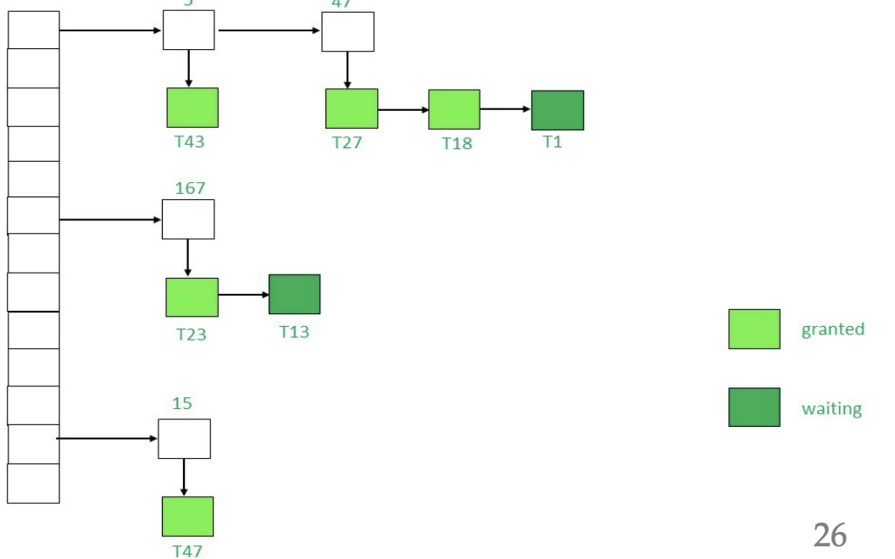

**Deadlocks**

* Deadlock detection 
  Create a waits-for graph:   - Nodes are transactions - Edge from Ti to Tj if Ti is waiting for Tj to release a lock Periodically check for cycles in waits-for graph

* Deadlock Prevention

  * Assign priorities based on timestamp TSi < TSj => priority(i) > priority(j) 

  * Say Ti wants a lock that Tj holds, two policies are possible: 

    **Wait-Die:** If Ti has higher priority than Tj, Ti waits; else Ti aborts(restarts)

    **Wound-Wait:** If Ti has higher priority than Tj, Tj aborts; else Ti waits(restarts)
    ‚úÖ  These schemes guarantee deadlock freedom. 
    ⚠️ Important detail: If a transaction restarts, it must be assigned the original timestamp. 

**Multiple granularity lock**

Transactions are very different. For example a transaction who reads a table, needs an $S$ lock on **all the table**, preventing any other transaction to operate on that table, at the same time. 
However, consider transactions $T_1$ that reads half of the rows of a table, and transaction $T_2$ that writes on the other half of the table, we expect these to be able to run concurrently. For that, we need locks on the **rows** of the table.

$\rightarrow$ we need multiple-granularity(all the db hiearchy) locks. 


The protocol : 

We introduce other "locks": 

* IS – Intent to get S lock(s) at finer granularity 

* IX – Intent to get X lock(s) at finer granularity 
* SIX mode: S & IX at the same time

Each transaction starts from the root of the hierarchy 

* To get S or IS lock on a node, must hold IS or IX on parent node
* To get X or IX or SIX on a node, must hold IX or SIX on parent node 
* Must release locks in bottom-up order

l - Multiple granularity lock matrix  

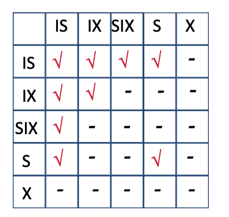

> Notice, that this lock mecanism is theoretically the same as having locks on tuples and then checking that all subgranularities are not locked at each lock trial (check all tuples not S locked if X locking the table). But it makes the lock manager more efficient : 
>
> 1. Early Conflict Detection 2. Reduced Locking Overhead


## Phantom 

Until now, we have been ensuring serializability with S2PL. However, we have been assuming that the database is of *fixed size*, meaning no insertions and deletions are occuring. It is not always the case. 

**Strict2PL ** fails to guarantee serializability with insertions and deletions. 


Example :  Consider T1: “Find oldest sailor” 

* T1 locks all records, and finds oldest sailor (say, age = 71) 
* Next, T2 inserts a new sailor, age = 96 and commits 
* T1 (within the same transaction) checks for the oldest sailor again and finds sailor aged 96!

No serializable scheduling would give that results. We call 96, a *phantom tuple.* 


**Problem: ** We lock all **currently existing** records and not the new records. 


Approach #1: **Re-execute scans** 

‚Äã	*Run queries again* at commit to see whether they produce a different result to identify 	missed changes .

Approach #2: **Predicate locking** 

‚Äã	Logically determine the overlap of *predicates* before queries start running


‚Äã	$\rightarrow$ S/X locks for *predicates*.  

Approach #3: **Index locking** 

‚Äã	Use keys in indexes to protect *ranges*. 


**Isolation levels**

We are always requiring serializability, but this is too strong and limits concurrency. There are different levels of isolation. 


dirty reads : read uncommited data. 

unrepeatable reads : transaction reads same **row** twice and gets different data. 

phanton; read same search query twice and get different(due to addition/deletion)

So from easiest to guarantee to hardest : dirty reads, repeatable, phantom
