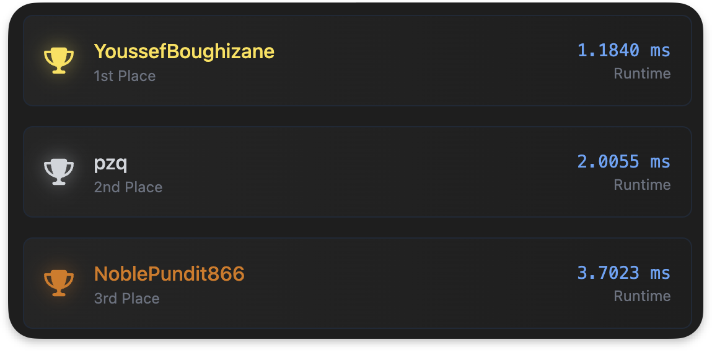
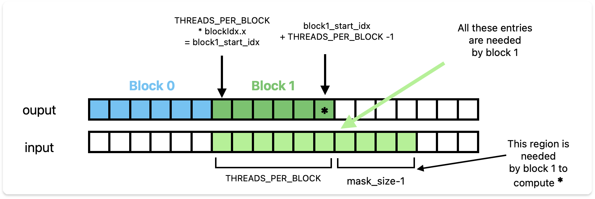
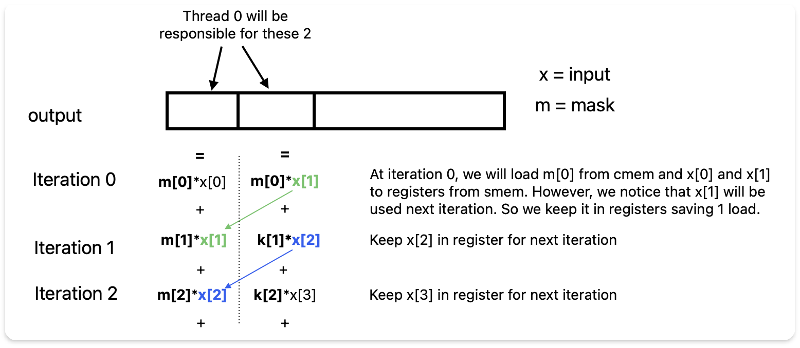

# Fast 1D Convolution in CUDA: Achieving #1 on LeetGPU
<a href="homepage.html" class="home-button">🏠 Home</a>

I have been learning CUDA for the past few months. Recently, I came across LeetGPU, a platform with many CUDA challenges. I spent a few weeks thinking about how to optimize a 1D convolution kernel. After a few weeks of experimenting, debugging, and tuning, I managed to reach the top of the leaderboard on the NVIDIA T4 GPU. 
<center><figure>
 
</figure></center>
In this post, I’ll walk you through how I approached optimizing the 1D convolution kernel, from the initial naive version to the final implementation. I’ll also cover some of the key CUDA concepts and performance tricks that helped along the way. You can find the code on my 
<a href="https://github.com/youssef62/conv1d-cuda" style="text-decoration: none;">
  
  GitHub
</a>.

## Defining the Problem

The task is to compute the convolution of a 1D $\text{input}$ array with a $\text{mask}$ defined as follows:

$$
\text{output}[i] = \sum_{j=0}^{\text{mask\_size}-1} \text{input}[i+j] \cdot \text{mask}[j]        
$$

where $i$ ranges from $0$ to  $\text{input\_size} - \text{mask\_size}$. 

We will try to optimize the kernel for convolution as much as possible on **NVIDIA T4** and benchmarking on a test case with $\text{input\_size} = 1000000$ and $\text{mask\_size} = 2047$. 

## I. The Naive Approach 

The naive approach is to assign each thread to one output element and compute the convolution directly. This results in a kernel that looks like this:

```c++

    // input, mask, and output are stored in global memory 
    int idx = blockIdx.x * blockDim.x + threadIdx.x;
    int output_size = input_size - mask_size + 1;

    if (idx < output_size) {
        float sum = 0.0f;
        for (int j = 0; j < mask_size; ++j) {
            sum += input[idx + j] * mask[j];
        }
        output[idx] = sum;
    }

```

I did a hyperparameter search for the best `THREADS_PER_BLOCK` value, the block size and found that $512$ threads per block is the best. The results are as follows: 
```bash
THREADS_PER_BLOCK=512
naive : 4.57051 ms, 0.895742 GFLOPS
``` 

This kernel does a lot of global memory accesses, which are relatively slow. We can already spot a few inefficiencies:
1. `mask` reads are not coalesced.
2. `input` reads are coalesced, but redundant. The same goes for `mask`.

So we will try next to optimize the memory accesses. But first, let's see another way to arrive at the same conclusion.

### Arithmetic Intensity 

The NVIDIA T4 GPU has a peak performance of $8.1408\ \text{TFLOPs/s}$ (FP32) and a memory bandwidth of $320.06\ \text{GB/s}$. This means that for each byte read from memory, the hardware can ideally perform  
$$
\frac{8.1408 \times 10^{12}}{320.06 \times 10^9} = 25.44\ \text{FLOPs}.
$$

Next, let’s look at how many FLOPs our naive kernel does per byte read—this is called the **arithmetic intensity** (AI).

Our kernel reads $2 \cdot \text{mask\_size}$ floats per output element (one for `input`, one for `mask`), so a total of $8 \cdot \text{mask\_size}$ bytes. It performs $2 \cdot \text{mask\_size}$ FLOPs (one multiply and one add per input-mask pair). So the arithmetic intensity is:

$$
\text{AI} = \frac{2 \cdot \text{mask\_size}}{8 \cdot \text{mask\_size}} = \frac{1}{4}.
$$

This means the kernel does only $0.25\ \text{FLOPs}$ per byte read—far below the hardware limit of $25.44$. In other words, performance is limited by memory throughput, not    computation. This is a **memory-bound** kernel. To improve performence, we need to increase the arithmetic intensity by reducing memory accesses or increasing computation per access. 


## II. Using shared and constant Memory

To optimize memory accesses, we will use two techniques: 

**1. Constant memory**  The $\text{mask}$ array is small and constant throught the kernel execution. We can store it in **constant memory**, which is cached in a read-only cache. To use constant memory, we just need to declare mask as follows: 

```c++
__constant__ float cmem_mask[MASK_SIZE];
```
and copy the date to it from `mask` using 
```c++
cudaMemcpyToSymbol(cmem_mask, mask_data, sizeof(float) * mask_size);
```

**2. Shared memory**  Shared memory is shared among all threads in a block. It is on-chip memory and is much faster than global memory (faster than L1 cache with proper access). We will use it to cache the needed input data and then have fast reads during the convolution computation. All threads in a block will collaborate and load the needed data from input into shared memory, in a **coalesced manner**. Altought a block is responsible for `THREADS_PER_BLOCK` output elements, it needs `THREADS_PER_BLOCK + mask_size - 1` input elements to compute them. See figure below for a visual representation of this :

<figure style="text-align: center;">
  
  <figcaption>A block responsible for region output[i:j] it needs to access input[i:j+mask_size]</figcaption>
</figure>


**Can we fit that many data in shared memory?** Yes ! Each SM has 64Kb of shared memory, that's 16K floats. And each SM can launch 1024 threads at a time. If we choose a block size of 1024, we will need to store `1024 + 2047 - 1 = 3070`. So we can store more than 4 times that in shared memory. Meaning we can also do block sizes of 512, 256.

The interesting parts of the code become as follows: 
```c++
 // idx of the first output element that the block is responsible for
const size_t block_start =  blockDim.x * blockIdx.x ; 
// idx of the output element that this thread is responsible for
const size_t tid = threadIdx.x + block_start ; 

extern __shared__ float smem_input[]; // shared memory 

const size_t smem_len = blockDim.x + kernel_size - 1; // block region + halo region

// all threads collaborate to load data from gmem to smem 
for (size_t i = threadIdx.x; i < smem_len ; i += blockDim.x) {
    size_t global_idx = block_start + i;
    if (global_idx < input_size) 
        smem_input[i] = input[global_idx];
}

// wait for all threads to finish the transfer
__syncthreads(); 

if (tid > input_size - kernel_size)
    return; 

// compute the convolution
float sum = 0 ; 
for(size_t i = 0 ; i < kernel_size ; i++){
    sum += smem_input[threadIdx.x +i] * cmem_kernel[i]; 
}
// save the result to global memory
output[tid] = sum ; 
```

Note that in the transfer from gmem to smem, we are using a **coalesced access pattern** : consecutive threads in a warp, read consecutive elements from global memory. 

The best block size is still 512, and the runtime is now :  
```
naive : 4.60465 ms, 0.889101 GFLOPS
smem  : 4.67256 ms, 0.876179 GFLOPS
```

This is disappointing. The shared memory kernel is slightly slower than the naive one. To understand why, we need to profile both our kernels with `ncu` : 

```bash
ncu --set full ./benchmark naive
ncu --set full ./benchmark smem
```
This shows us a lot of information, let's scroll down to the memory section and look at the L1 and L2 hit rates

| Kernel Type | L1 Hit Rate | L2 Hit Rate |
|-------------|-------------|-------------|
| Naive       | 99.67%      | 89.77%      |
| Shared Mem  | 99.21%      | 74.78%      |


We can see that the naive kernel makes a really good use the caches. As the L2 cache is 6MB it probibly fits the whole input array. The `mask` array also must reside in the L2 cache and is loaded once per SM to the L1 and then is always fetched from there. 

But **shared memory is typically faster than L1 cache, so why is the shared memory kernel slower?** Let's look at other metrics:

| Kernel Type                | naive    | smem      |
|---------------------------|----------|-----------|
| Executed Instructions      | 225,949,855 | 355,003,467 |
| Warp Cycles Per Issued Instruction | 38.41    | 24.18     |
| Instructions Per Cycle     | 0.82     | 1.28      |

Let's analyze and understand these numbers. **Warp Cycles Per Issued Instruction** tells us how many cycles it takes for a warp to issue an instruction. A higher value means the warp spends more time waiting between instructions, indicating potential inefficiencies.

Both kernels spend a significant number of cycles waiting between instructions, but the shared memory (smem) kernel spends less time waiting (24.18 cycles/instruction) compared to the naive kernel (38.41 cycles/instruction) a factor of 1.59 improvement. However, the smem kernel executes significantly more instructions (355M vs 225M) a factor of 1.57 ! Which cancels out the improvement and result in similar runtimes. 

This is consistent with the fact that the **Instructions Per Cycle** (IPC) is higher for the smem kernel (1.28) than for the naive kernel (0.82), indicating that the smem kernel is utilizing the GPU more efficiently per cycle, even though it performs more work overall.

Finally, for the smem solution, the profiler indicates that shared memory loads account for 40% of the kernel's waiting time between instructions. This is likely due to the presence of many **bank conflicts**, which can significantly increase shared memory access latency.

All these hints us to what we need to do : Less shared memory reads and more computation.

## III. Register Blocking 

We need to do more computation per element loaded from shared memory to reduce shared memory read overhead. To achieve this, each thread will compute **two output elements at once**. 

Instead of loading entries from `input` multiple times, each thread will load the necessary values from shared memory into registers once and use them to compute two output elements. This approach will **halve the number of shared memory reads** and reduce bank conflicts.

<center><figure>
    
    <figcaption style="text-align: center;">The sliding window approach for register blocking with 2 outputs per thread. At each iteration, we reuse one input element from the registers and load a new one from smem</figcaption>
  </figure></center>


To understand this better, consider how `mask[0]` contributes to the outputs:

- `mask[0]` contributes to `output[0]` as `input[0] * mask[0]`
- `mask[0]` contributes to `output[1]` as `input[1] * mask[0]`

Similarly, `mask[1]` contributes:

- to `output[0]` as `input[1] * mask[1]`
- to `output[1]` as `input[2] * mask[1]`

We observe that `input[1]` is used in computing both outputs and can be loaded once into registers. Only `input[2]` needs to be loaded additionally. 

We repeat this sliding window pattern for `mask_size` iterations, we effectively compute two outputs with twice fewer shared memory loads.

The diagram below illustrates this approach:


The code for this is : 
```c++
const size_t block_output_idx_start = 
    (size_t)blockIdx.x * blockDim.x * OUTPUTS_PER_THREAD;
const size_t thread_output_idx_start = 
    block_output_idx_start + threadIdx.x * OUTPUTS_PER_THREAD;

// GMEM to SMEM transfer happens like in previous kernel
// We just need to adapt the indexing.
__syncthreads(); 

if (thread_output_idx_start >= output_size) {
    return;
}

float reg_output[2] = {}; // output registers
float reg_input[2]; // input registers 

// load first two elements into input registers
reg_input[0] = shared_input[threadIdx.x * 2 ] ; 
reg_input[1] = shared_input[threadIdx.x * 2 + 1] ; 

for (int k = 0; k < kernel_size; ++k) {
    const float k_val = cmem_mask[k] ;
    reg_output[0] += k_val * reg_input[0]; // update first output register
    reg_output[1] += k_val * reg_input[1]; // update second output register 

    reg_input[0] = reg_input[1] ; // shift input registers to reuse next iteration
    reg_input[1] = shared_input[threadIdx.x * 2 + k + 2]; // load new element from smem 
}

// write output from registers to gmem
output[thread_output_idx_start] = reg_output[0] ; 
if (thread_output_idx_start + 1 < output_size )
    output[thread_output_idx_start + 1] = reg_output[1]; 
```

Now that you got the idea, let's generalize this to compute `OUTPUTS_PER_THREAD` outputs per thread. This results in the the code below : 

```c++
const size_t block_output_idx_start = 
    (size_t)blockIdx.x * blockDim.x * OUTPUTS_PER_THREAD;
const size_t thread_output_idx_start = 
    block_output_idx_start + threadIdx.x * OUTPUTS_PER_THREAD;

// GMEM to SMEM transfer happens like in previous kernel
__syncthreads();

if (thread_output_idx_start >= output_size) {
    return;
}

float reg_output[OUTPUTS_PER_THREAD] = {}; // output registers 
float reg_input[OUTPUTS_PER_THREAD]; // input registers 

// filling input registers from smem
#pragma unroll
for (int n = 0; n < OUTPUTS_PER_THREAD; ++n) 
    if (threadIdx.x * OUTPUTS_PER_THREAD + n < smem_size )
        reg_input[n] = smem_input[threadIdx.x * OUTPUTS_PER_THREAD + n] ; 

for (int k = 0; k < kernel_size; ++k) {
    const float k_val = cmem_kernel[k];

    #pragma unroll 
    for (int n = 0; n < OUTPUTS_PER_THREAD; ++n){
        reg_output[n] += k_val * reg_input[n]; // updating output registers  
    }

    #pragma unroll
    for (int n = 0; n < OUTPUTS_PER_THREAD-1; ++n){
        reg_input[n] = reg_input[n+1]; // shifting registers
    }
    
    reg_input[OUTPUTS_PER_THREAD-1] = // load new element from smem 
        smem_input[threadIdx.x * OUTPUTS_PER_THREAD + k + OUTPUTS_PER_THREAD]; 
}

#pragma unroll
for (int n = 0; n < OUTPUTS_PER_THREAD; ++n) {
    if (thread_output_idx_start + n < output_size) {
        // write output from registers to gmem 
        output[thread_output_idx_start + n] = reg_output[n]; 
    }
}
```

We just need to set `OUTPUTS_PER_THREAD` to 8 and do the hyperparameter search again over block size. We get the following results : 
```
naive     : 4.60465 ms, 0.889101 GFLOPS
smem      : 4.67256 ms, 0.876179 GFLOPS
reg_block : 0.894524 ms, 4.57673 GFLOPS
```
A factor of approximaly **5.16x** improvement over the naive kernel and a factor of **5.24x** over the shared memory kernel! 

## Micro-optimizations 
First, all the kernels above initialize `cmem_mask` to a size of 2048 instead of 2047. I noticed it improves the perfermance slightly.

These are the *micro-optimizations* I added to the previous kernels and that worked :
 
- Using `__ldg(input+global_idx)` instead of `input[global_idx]` to read from global memory. This uses a read-only cache that can improve performance for our constant data. 
- `__align__(64) float cmem_mask[MASK_SIZE];` to align the constant memory to 64 bytes. This is the size of a cache line, and it can improve cache performance. I am not an expert on this, if you know more about this or have good resources, please let me know. 

With these additions, we get the following results : 
```
naive     : 4.60465 ms, 0.889101 GFLOPS
smem      : 4.67256 ms, 0.876179 GFLOPS
reg_block : 0.894524 ms, 4.57673 GFLOPS
micro_opt : 0.868636 ms, 4.71314 GFLOPS
```

I also tried vectorizing the kernel using `float4` types, but it didn't improve performance. I don't know the reason for that. The code is on my github. If you have any insights, please let me know. 

## Conclusion 
Shared memory does not always improve performance. In these cases, profiling is key to understand the bottlenecks. In memory-bound kernels, increases the computation per memory access is the way to go. 


