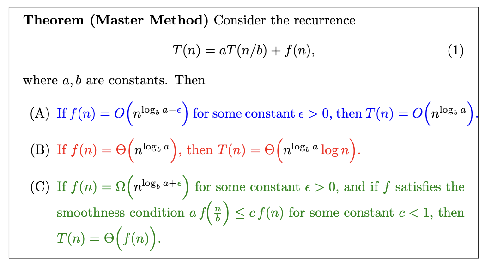

# Master Theorem: An Intuition 

If you are taking a course in algorithms, you have probably encountered the Master Theorem. It is a tool that helps you compute the time complexity of a divide-and-conquer algorithm of the form : 

* Given a problem of size $n$: 
    1. Divide the problem into $\color{red}a$ subproblems of size $n/\color{blue}b$. 
    2. Solve each subproblem recursively.  
    3. Combine the solution of the subproblems .  

More formally, if the running time of the algorithm is denoted by $T(n)$, then the Master Theorem considers recurrences of the form:
$$T(n) = \color{red}{a}\color{black}T(n/\color{blue}{b}\color{black}) + \color{green}f(n)$$
where $\color{red}a$ and $\color{blue}{b}$ are constants, and $\color{green}f$ represents the running time of combining the solutions of the subproblems (step 3 above). 

You probably also remember the Master Theorem as a set of 3 rules that you need to either memorize or look up every time you need to use it. In this post, I will try to give you an intuition behind the Master Theorem. It will help you understand and remember the theorem. But the intuition will also useful on its own, *to find the time complexity of algorithms that do not fit the form of the Master Theorem*. More on that later.

First, let's state the Master Theorem: 

This statement can be a bit intimidating at first. But let's break it down. 

* We have 3 cases, each corresponding to a different relationship between $f(n)$ and $n^{\log_b a}$.

* There's a quantity that comes up in each case: $n^{\log_b a}$. 

It is critical to understand what the quantity $n^{\log_b a}$ represents. 
To understand it, let's start by computing the number of leaf node in the computational tree. Each node in this tree represents a subproblem (a function call). This tree is represented in the figure below where $a=2$. 

The height of this tree is $\log_b(n)$ and each node has $a$ children. So the number of leaves is $a^{\log_b(n)}$. Now if we massage this expression a bit, we get : 
$$ \color{red}a\color{black}^{\log_b(n)} = \left( \color{red} b^{\log_b a} \color{black} \right)^{\log_b(n)} = \left( b^{\log_b(n)} \right)^{\log_b a} = n^{\log_b a}$$
where the first equality comes from the identity $a = b^{\log_b a}$ and the second from swapping the exponents. 
So $n^{\log_b a}$ is nothing but the number of leaves in the computational tree ! 

<!-- Let's go back to the 3 cases of the Master theorem, starting with the first case. -->

<!-- 
  If $f(n) = O(n^{\log_b a - \epsilon})$ for some constant $\epsilon > 0$, then the running time of the algorithm is $T(n) = \Theta(n^{\log_b a})$.

 -->

Let's observe that the first function call (**the root of the tree**) takes $f(n)$ time ($f(n)$ time for combining the results and the rest is done by the other recursive calls). The very last function calls (**leaves**) do just a constant amount of work, so their total time would be $\text{#leaves} \times \text{constant}$ i.e $\Theta(n^{\log_b a})$. So : 

* Root : $f(n)$ time total. 
* Leaves : $n^{\log_b a}$ time total. 

<!-- The first case assumes that $f(n) = O(n^{\log_b a - \epsilon})$, meaning that $f$ is asymptotically smaller that $n^{\log_b a}$. This intuitively means that *the work done is concentrated at the leaves*. So total runtime will be the total runtime *of the leaves*. And this is indeed the case, as the master theorem gives us that $T(n) = \Theta(n^{\log_b a})$.  -->

Provided with this, we can give an intuitive, unformal, statement of the master theorem : 

  <table style="width: 100%; table-layout: fixed;">
    <tr>
      <td style="vertical-align: top;">
        1. If the <b>work is concentrated at the leaves</b>, then the <b>total runtime is the total runtime of the leaves</b>.  
      </td>
      <td style="padding: 0 10%; vertical-align: top;">
        <b>work is concentrated at the leaves</b> 
        $f(n)$ is $O(n^{\log_b a - \epsilon})$, so the work done at the root is "less" than the total runtime. 
        <b>total runtime is the total runtime of the leaves</b> 
        $T(n) = \Theta(n^{\log_b a})$  
      </td>
    </tr>
    <tr>
      <td style="vertical-align: top;"> 
        2. If the <b>work at each level of the tree is the same</b>, then the total runtime is equal to: $$\textbf{work per level} \times \textbf{height}$$  
      </td>
      <td style="padding: 0 10%; vertical-align: top;">
        <b>work at each level of the tree is the same</b> 
        work at root = work at leaf 
        $f(n) = \Theta(n^{\log_b a})$  
        $\textbf{work per level} \times \textbf{height}$ 
        $n^{\log_b a} \times \log_b(n)$  
      </td>
    </tr>
       
    <tr>
      <td style="vertical-align: top;">
        3. If the <b>work is concentrated at the root</b>, then the <b>total runtime is the total runtime of the root</b>.  
      </td>
      <td style="padding: 0 10%; vertical-align: top;">
        <b>work is concentrated at the root</b> 
        $f(n) = \Omega(n^{\log_b a + \epsilon})$, so it's "more" than the leaves' total runtime. 
        <b>total runtime is the total runtime of the root</b> 
        $T(n) = \Theta(f(n))$  
      </td>
    </tr>
  </table>

                    
      
Basically, each case of the master theorem is a comparison between the work done at the root and the work done at the leaves. The three cases correspond to when the leaves dominate, when both are equal, and when the root dominates. And the total runtime is the total runtime of the dominating part (or $\text{height}\times \text{work per level}$ when they are equal).

